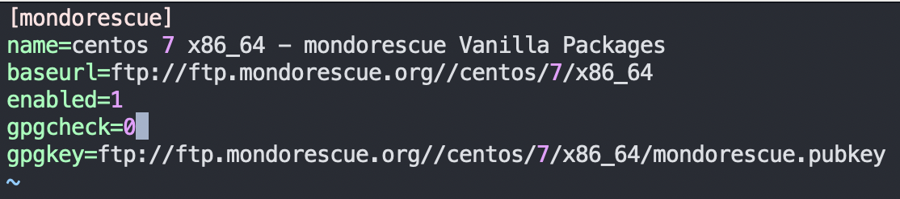
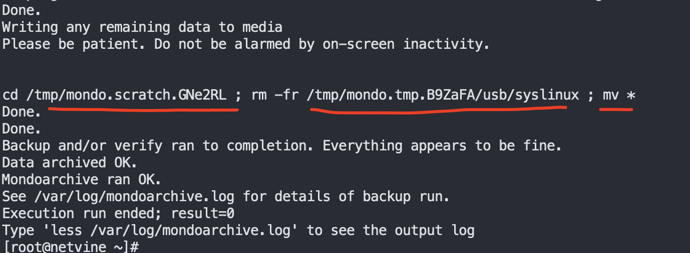
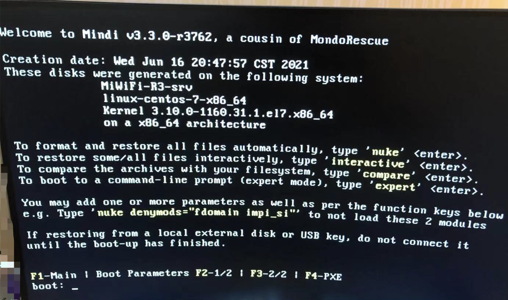
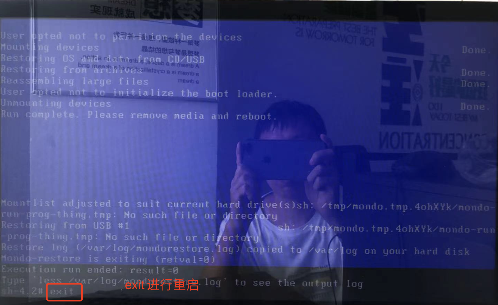
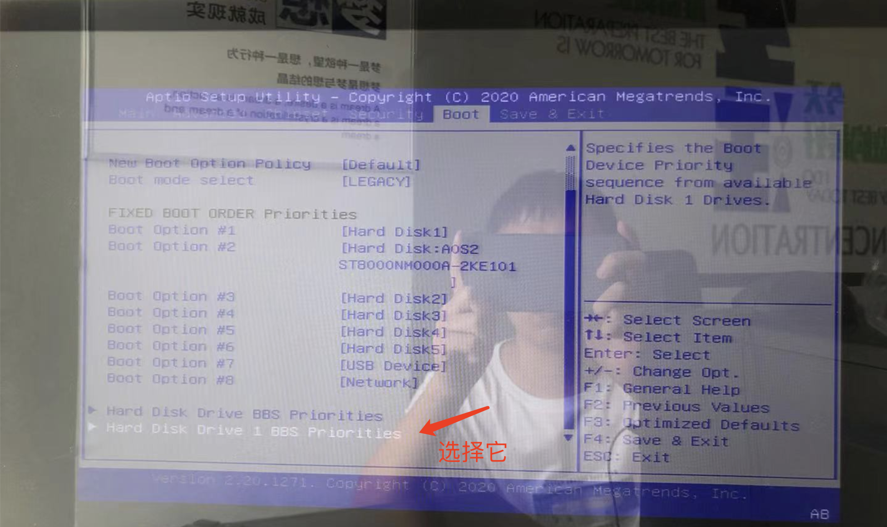
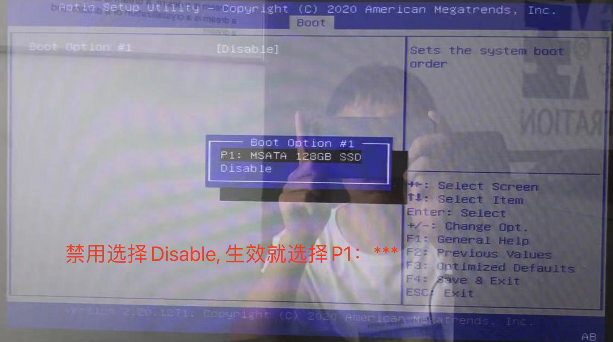

### linux系统备份
#### 软件安装
官网地址:http://www.mondorescue.org/downloads.shtml  
cd /etc/yum.repos.d/ 下载repo文件,注意当前系统版本
wget ftp://ftp.mondorescue.org/centos/7/x86_64/mondorescue.repo  

修改gpgcheck为0  
</img>


安装软件  
sudo yum install mondo

#### U盘备份+启动盘
备份模式有多种，如果选择ISO镜像备份，后期需要自己制作U盘启动盘，并且会有多个镜像文件，还需要合并。这里使用U盘备份，并使用mondo制作U盘启动盘  

如果U盘在window系统使用或格式化过，需要重新分区并格式化.  
```
# 重新分区 m帮助 d删除分区 n新建分区 w写入
sudo fdisk  /dev/sdd

#格式化为FAT32，dd1分区
mkdosfs -F 32 /dev/sdd1

#制作启动盘+备份，注意是/dev/sdd逻辑盘
# -G gzip
# -O CD/ISO/NTFS
# -U USB
# -s U盘大小
mondoarchive -OU -d /dev/sdd -s 64g -G
```

制作完成后信息(一定要确保完成) :sob:  
</img>  
  
### linux系统还原
插入USB制作的备份及启动盘，在启动界面多次点击Del键，进入BIOS界面，通过BIOS界面选择USB盘启动，也可以禁用硬盘启动，等还原完成后再恢复。启动界面如下  
</img>  

目前平台的系统备份分为两部分，一部分是系统盘，另一部分是数据盘。**需要先还原系统盘，再还原数据盘。**  
> 后来发现，逻辑盘的也可以备份还原，就只需要一个备份盘，一个指令:nuke 就可以搞定 :ghost:


#### 系统盘还原
系统盘包含除/data分区以外的所有数据，所以只需要在mindi的启动界面输入nuke,格式化并还原系统盘

> boot: nuke

还原完成后，拔出系统U盘，在shell界面输入:exit 进行重启。在启动界面，选择启动盘就行了。:sunglasses:
  
***

1. 重启指令界面  
  
</img> 

这时可以进入BIOS界面禁用系统盘启动，禁用后，设备重启，数据盘的还原界面可以直接打开了。等到数据盘还原后再恢复就行了  

</img> 

</img> 

2. 逻辑分区的制作  
  
等待加载完成后，就可以进行数据盘合并了(把两个8T的硬盘合并为16T的大盘)  
可以手动指定命令，也可以执行脚本进行数据盘的合并。脚本路径/opt/netvine/shell/create_lvm.sh  

```
mkdir /data

#创建物理卷 pvscan 查看创建列表信息 pvremove 
pvcreate /dev/sdb
pvcreate /dev/sdc

#创建卷组 vgscan查看卷组信息 vgremove
vgcreate DATA_LVM /dev/sdb
vgextend DATA_LVM /dev/sdc

#创建逻辑卷 lvcreate -L[自定义分区大小] -n[自定义分区名称] [vg名称]  删除指令是pvremove DATA_LVM/DATA,  16T只是一般值，具体根据free space为准
lvcreate -L16T -n DATA  DATA_LVM

#格式化分区，默认回车就行
mkfs.ext4 /dev/DATA_LVM/DATA

#挂载
mount /dev/DATA_LVM/DATA /data
```


