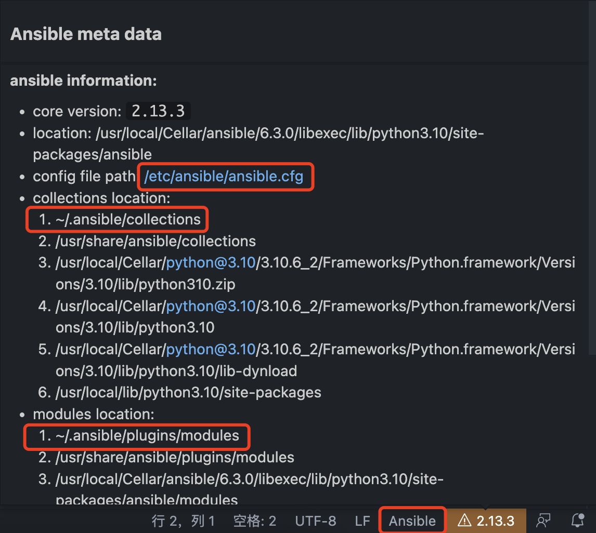
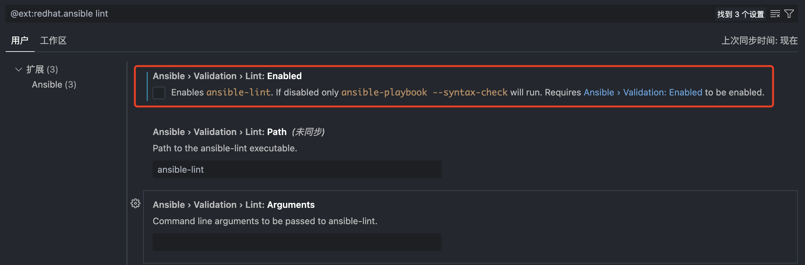

- # Ansible自动化部署
- ## [Ansible中文权威指南](http://www.ansible.com.cn/index.html) 

- [环境搭建](#环境搭建)
  - [linux系统](#linux系统)
    - [在 Control Machine 上安装 Ansible](#在-control-machine-上安装-ansible)
    - [在Managed Node 安装 OpenSSH server 和 Python](#在managed-node-安装-openssh-server-和-python)
    - [设定Ansible](#设定ansible)
  - [docker](#docker)


# 环境搭建
## linux系统
[参考文章](https://www.w3cschool.cn/automate_with_ansible/automate_with_ansible-1khc27p1.html)  
#### 在 Control Machine 上安装 Ansible
- #### Ubuntu (Apt)
安装 add-apt-repository 必要套件
```sh
sudo apt-get install -y python-software-properties software-properties-common
```

使用 Ansible 官方的 PPA 套件来源
```sh
sudo add-apt-repository -y ppa:ansible/ansible; sudo apt-get update
```

安装 Ansible
```sh
sudo apt-get install -y ansible
```

- #### CentOS (Yum)
新增 epel-release 第三方套件来源
```sh
sudo yum install -y epel-release
```

安装 Ansible
```sh
sudo yum install -y ansible
```

- #### macos
```sh
brew install ansible
```

- #### pip安装
```sh
# Debian, Ubuntu
$ sudo apt-get install -y python-pip

# CentOS
$ sudo yum install -y python-pip

# macOS
$ sudo easy_install pip
```

升级pip及ansible  
```sh
# 升级
sudo pip install -U pip

# 安装ansible
sudo pip install ansible
```

macos ansible配置
```sh
▶ ansible --version
ansible [core 2.13.3]
  config file = None
  configured module search path = ['/Users/ymm/.ansible/plugins/modules', '/usr/share/ansible/plugins/modules']
  ansible python module location = /usr/local/Cellar/ansible/6.3.0/libexec/lib/python3.10/site-packages/ansible
  ansible collection location = /Users/ymm/.ansible/collections:/usr/share/ansible/collections
  executable location = /usr/local/bin/ansible
  python version = 3.10.6 (main, Aug 30 2022, 05:11:14) [Clang 13.0.0 (clang-1300.0.29.30)]
  jinja version = 3.1.2
  libyaml = True
```

#### 在Managed Node 安装 OpenSSH server 和 Python
```sh
# ubuntu
sudo apt-get install -y openssh-server python2.7

# centos
sudo yum install -y openssh-server python
```

#### 设定Ansible  
我们可以借由 `·`ansible.cfg` 来设定预设的 `inventory` 档案的路径、远端使用者名称和 SSH 金钥路径等相关设定

- 安装好 `Ansible` 后，我们可以在 `/etc/ansible/` 的目录底下找到 `Ansible` 的设定档
- 通常我们较偏爱把 `ansible.cfg` 和 `hosts` 这两个档案与其它的 Playbooks 放在同个专案目录底下，然后通过版本控制系统 (例如 Git) 把它们一起储存起来，以实现 Ansible 的 Infrastructure as Code！

inventory 是什么？
`inventory` 就单字本身有详细目录、清单和列表的意思。在这里我们可以把它当成是一份主机列表，我们可通过它对定义每个 Managed Node 的代号、IP 位址、连线相关资讯和群组。  


- 若有对 Control Machine 本机操作的需求，建议于 `/etc/ansible/hosts` 补上 `local` 的设定。  

```sh
# For root user.
$ /bin/echo -e "[local]\nlocalhost ansible_connection=local" >> /etc/ansible/hosts

# For sudo user.
$ sudo su -c '/bin/echo -e "[local]\nlocalhost ansible_connection=local" >> /etc/ansible/hosts'
```

当已上的设置都完成了，您可以试著在终端机里用 Ansible 呼叫本机印出 Hello World

```sh
$ ansible localhost -m command -a 'echo Hello World.'
localhost | SUCCESS | rc=0 >>
Hello World.
```


## docker

```sh
# 下载镜像
docker pull chusiang/ansible-managed-node:ubuntu-20.04

# 创建容器
docker run -itd --name ansible-test -P chusiang/ansible-managed-node:ubuntu-20.04

# 进入容器
docker exec -it ansible-test bash
```

安装软件
```sh
apt-get update
apt-get upgrade

apt install vim
apt install sudo
apt-get install bash-completion

# 设置root密码, 密码为root
passwd

sudo apt-get install -y openssh-server python2.7

# 修改sshd配置
vim /etc/ssh/sshd_config
#PermitRootLogin prohibit-password
PermitRootLogin yes


```

查看镜像
```sh
$ docker ps
CONTAINER ID   IMAGE                                        COMMAND               CREATED          STATUS              PORTS                   NAMES
027f952a8890   chusiang/ansible-managed-node:ubuntu-20.04   "/usr/sbin/sshd -D"   11 minutes ago   Up About a minute   0.0.0.0:55000->22/tcp   ansible-test
```


增加配置文件
`/etc/ansible/ansible.cfg`
```sh
[defaults]

hostfile = hosts
remote_user = docker
host_key_checking = False
```

`/etc/ansible/hosts`
```sh
server1  ansible_ssh_host=127.0.0.1  ansible_ssh_port=55000

[local]
server1
```

测试
```sh
ansible all -m command -a 'echo Hello World on Docker.'
server1 | SUCCESS | rc=0 >>
Hello World on Docker.
```

```sh
ansible server1 -m ping
server1 | SUCCESS => {
    "ansible_facts": {
        "discovered_interpreter_python": "/usr/bin/python3"
    },
    "changed": false,
    "ping": "pong"
}
```

# Ansible使用 
[ansible自动化运维详细教程及playbook详解](https://juejin.cn/post/6844903631066513421)  
[练手脚本](../code/ansible/firewall-env.yml)  

## vscode 安装ansible插件
插件名称为`ansible`, [官方地址](https://marketplace.visualstudio.com/items?itemName=redhat.ansible)  

使用方法:  
对于在编辑器窗口中打开的 `Ansible` 文件，请确保将语言模式设置为`Ansible`（VS 代码窗口的右下角）  

插件信息:
<div align=center>
</img>
</div>

安装`ansible-lint`  
```sh
brew install ansible-lint
```

提示错误:  
> Ansible-lint is not available. Kindly check the path or disable validation using ansible-lint  

<div align=center>
</img>
</div>

## 常用模块

## Playbook
执行指令  `ansible-playbook playbook.yml [--step | --start-at="task name"]`  
> --step 这样ansible在每个任务前会自动停止,并询问是否应该执行该任务
> --start-at 以上命令就会在名为”task name”的任务开始执行你的playbook.  

常用组件
- tasks：任务
- variables：变量
- templates：模板
- handlers：处理器
- roles：角色

### 详细日志
增加参数`-vvv`  

```json
The full traceback is:
WARNING: The below traceback may *not* be related to the actual failure.
  File "/tmp/ansible_mysql_db_payload_iH7xCz/ansible_mysql_db_payload.zip/ansible_collections/community/mysql/plugins/modules/mysql_db.py", line 680, in main
  File "/tmp/ansible_mysql_db_payload_iH7xCz/ansible_mysql_db_payload.zip/ansible_collections/community/mysql/plugins/module_utils/mysql.py", line 106, in mysql_connect
    db_connection = mysql_driver.connect(autocommit=autocommit, **config)
  File "/usr/local/lib/python2.7/dist-packages/pymysql/__init__.py", line 94, in Connect
    return Connection(*args, **kwargs)
  File "/usr/local/lib/python2.7/dist-packages/pymysql/connections.py", line 327, in __init__
    self.connect()
  File "/usr/local/lib/python2.7/dist-packages/pymysql/connections.py", line 588, in connect
    self._request_authentication()
  File "/usr/local/lib/python2.7/dist-packages/pymysql/connections.py", line 853, in _request_authentication
    auth_packet = self._read_packet()
  File "/usr/local/lib/python2.7/dist-packages/pymysql/connections.py", line 676, in _read_packet
    packet.raise_for_error()
  File "/usr/local/lib/python2.7/dist-packages/pymysql/protocol.py", line 223, in raise_for_error
    err.raise_mysql_exception(self._data)
  File "/usr/local/lib/python2.7/dist-packages/pymysql/err.py", line 107, in raise_mysql_exception
    raise errorclass(errno, errval)
fatal: [server1]: FAILED! => {
    "changed": false,
    "invocation": {
        "module_args": {
            "ca_cert": null,
            "chdir": null,
            "check_hostname": null,
            "check_implicit_admin": false,
            "client_cert": null,
            "client_key": null,
            "collation": "",
            "config_file": "/root/.my.cnf",
            "config_overrides_defaults": false,
            "connect_timeout": 30,
            "dump_extra_args": null,
            "encoding": "",
            "force": false,
            "hex_blob": false,
            "ignore_tables": [],
            "login_host": "localhost",
            "login_password": null,
            "login_port": 3306,
            "login_unix_socket": null,
            "login_user": "root",
            "master_data": 0,
            "name": [
                "firewall"
            ],
            "pipefail": false,
            "quick": true,
            "restrict_config_file": false,
            "single_transaction": false,
            "skip_lock_tables": false,
            "state": "present",
            "target": null,
            "unsafe_login_password": false,
            "use_shell": false
        }
    },
    "msg": "unable to find /root/.my.cnf. Exception message: (1045, u\"Access denied for user 'root'@'localhost' (using password: NO)\")"
}
```

## [Demo实例](../code/ansible/main.yml)  

# 常用操作
## 安装组件

```sh
ERROR! couldn't resolve module/action 'mysql_db'. This often indicates a misspelling, missing collection, or incorrect module path.

ERROR! couldn't resolve module/action 'timezone'
```

```sh
# mysql
ansible-galaxy collection install community.mysql

# 安装常用模块
ansible-galaxy collection install rjlasko.ansible
```

## ssh配置
`/etc/ssh/ssh_config`
```sh
   StrictHostKeyChecking no
```