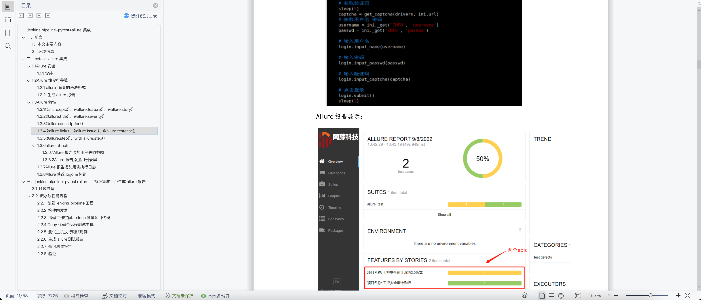

- # 搭建自动化测试:jenkins+python+allure

- [整体流程](#整体流程)
- [效果预览](#效果预览)
- [功能实现](#功能实现)
  - [webui测试](#webui测试)
  - [jenkins pipeline](#jenkins-pipeline)
  - [截图及录屏](#截图及录屏)
  - [测试报告](#测试报告)

[lqy同事写的详细文档](../resources/files/devops/jenkins-pipeline+pytest+allure.doc)      

</img>

## 整体流程

## 效果预览

## 功能实现
### webui测试
### jenkins pipeline
### 截图及录屏
### 测试报告
