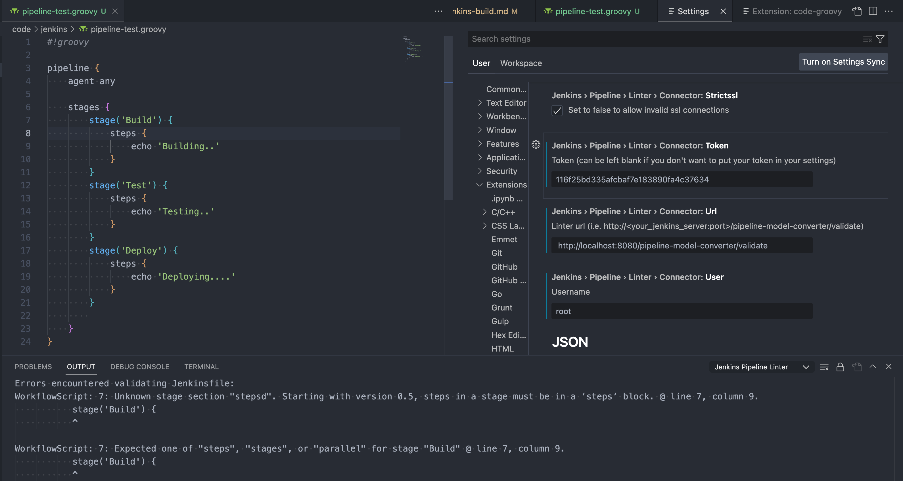
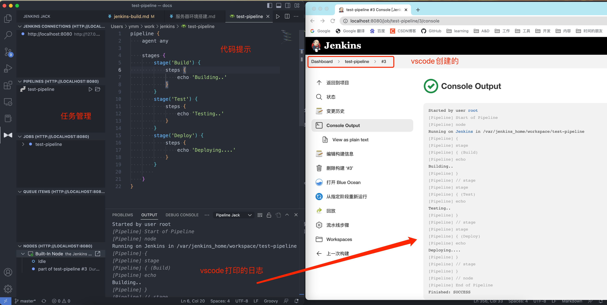

- # jenkins构建

- [增加节点](#增加节点)
  - [认证方式](#认证方式)
  - [安装JDK8](#安装jdk8)
- [开发调试](#开发调试)
  - [vscode shell脚本](#vscode-shell脚本)
  - [vscode sftp](#vscode-sftp)
  - [指令提示补全](#指令提示补全)
  - [升级git](#升级git)
  - [shell脚本之间引用](#shell脚本之间引用)
  - [npm安装](#npm安装)
- [jenkins任务构建](#jenkins任务构建)
  - [参数](#参数)
  - [gitlab-token](#gitlab-token)
  - [通过脚本获取数据作为参数](#通过脚本获取数据作为参数)
  - [工作空间及编译结果](#工作空间及编译结果)
  - [远程访问](#远程访问)
- [pipeline使用及调试](#pipeline使用及调试)
  - [环境搭建](#环境搭建)
  - [vscode jenkins pipeline debug](#vscode-jenkins-pipeline-debug)
  - [jenkins jack(微软)](#jenkins-jack微软)
- [bash](#bash)
  - [引用脚本](#引用脚本)


## 增加节点
### 认证方式
- Launch agents via SSH 使用ssh协议，从master向slave发起连接，由master主动发起请求
- Non verifying Verification Strategy 

### 安装JDK8

```shell
yum install java-1.8.0-openjdk
```

## 开发调试
### vscode shell脚本
需要安装`Bash Debug`插件调试shell, `shellman`插件自动补全功能 ,`shell-format`shell格式化`format document`  

> 需要安装`https://github.com/mvdan/sh`,使用指令`go install mvdan.cc/sh/v3/cmd/shfmt@latest` 安装即可  

可以增加文件保存自动格式化:
```json
"[shellscript]": {
        "editor.formatOnSave": true,
        "files.eol": "\n"
    },
```

shell debug
```json
{
    // 使用 IntelliSense 了解相关属性。 
    // 悬停以查看现有属性的描述。
    // 欲了解更多信息，请访问: https://go.microsoft.com/fwlink/?linkid=830387
    "version": "0.2.0",
    "configurations": [
        {
            "type": "bashdb",
            "request": "launch",
            "name": "Bash-Debug (simplest configuration)",
            "program": "${workspaceFolder}/build.sh"
        }
    ]
}
```

### vscode sftp
安装`SFTP`插件

`> SFTP: config` 打开sftp配置  


Debug插件
Debug
    Open User Settings.

On Windows/Linux - File > Preferences > Settings
- On `macOS` - `Code` > `Preferences` > `Settings`
- Set `sftp.debug` to true and reload vscode.

View the `logs` in `View` > `Output` > `sftp`.


- #### centos7 配置sftp 

```
# vim /etc/ssh/sshd_config

#注释掉原有Subsystem，添加新的Sbusystem配置
#Subsystem  sftp    /usr/libexec/openssh/sftp-server                 
Subsystem sftp internal-sftp

#在添加如下配置
Match User taxue,root
ChrootDirectory /          # 这里需要配置根目录，如果不配置根目录，ssh登录时找不到/bin/bash

# 打开ssh、sftp
AllowTcpForwarding yes      # 设置为yes,否则ssh无法登陆
#ForceCommand internal-sftp
```

`systemctl restart sshd` 重启

> 如果重启sshd失败，可以把配置放在最后面试试  

测试登录:
```
sftp root@ip
sftp> ls -l
-rw-r--r--    1 0        0              30 Jul 30 03:43 a.sh
drwxr-xr-x   10 0        0            4096 Jul 19 04:09 allow-list
drwxr-xr-x    3 0        0            4096 Jul 29 13:30 audit
drwxr-xr-x    2 0        0            4096 Jul 23 06:05 audit-log
sftp> exit
```

vscode sftp配置
```json
{
    "name": "gs6",
    "host": "10.25.10.126",
    "protocol": "sftp",
    "port": 22,
    "username": "root",
    "password": "Netvine123",
    "remotePath": "/data/work/build-scripts",
    "connectTimeout": 20000,
    "uploadOnSave": true
}
```

提示`Timed out while waiting for handshake`，可能是超时时间太短了，需要增加`"connectTimeout": 20000,`  

`remotePath`是一个相对路径，比如说设置sftp的路径为`/data`,需要这里` "remotePath": "/work",`, 那就相当于访问`/data/work`  


如图:  
<div align=center>
</img>
</div>

### 指令提示补全
```shell
yum install -y bash-completion
```

### 升级git
```shell
wget https://www.kernel.org/pub/software/scm/git/git-2.14.0.tar.gz --no-check-certificate
tar -zxvf git-2.14.0.tar.gz
```

安装
```shell
cd git-2.14.0
./configure --prefix=/usr/local/git all
make -j4 && make install

# 配置环境变量
ln -s /usr/local/git/bin/git /usr/bin/git
```

### shell脚本之间引用
可以通过`source`、`.filename`指令引入。但是需要确定被引入的脚本**具备可执行权限**`chmod +x`  

### npm安装
```shell
yum install nodejs npm 
```

但是需要安装指定版本`yum remove nodejs npm`
```shell
node --version
v12.22.12

npm --version
6.14.16
```

安装指定版本
```shell
curl -sL https://rpm.nodesource.com/setup_12.x | sudo bash -
sudo yum install –y nodejs npm 
node –version  # node v12.22.12 , npm 6.14.16
```

## jenkins任务构建
- ### [jenkins handbook](https://www.jenkins.io/doc/book/)  
### 参数
[官方文档](https://plugins.jenkins.io/uno-choice/) 

多选参数，需要安装`Extended Choice Parameter` 插件
<div align=center>
</img>
</div>

这里分隔符使用空格，方便把参数传递给脚本

### gitlab-token

<div align=center>
</img>
</div>

使用凭据
git 插件支持Jenkins 凭证插件提供的`用户名/密码凭证`和`私钥凭证`。它不支持其他凭证类型，如秘密文本、秘密文件或证书。  

当使用HTTP 或 HTTPS 协议访问远程存储库时，插件需要用户名/密码凭据。其他凭证类型不适用于 HTTP 或 HTTPS 协议。  

当使用ssh 协议访问远程存储库时，插件需要`ssh 私钥凭证`。其他凭证类型不适用于 ssh 协议。  

### 通过脚本获取数据作为参数
目前的需求是通过jenkins界面选择升级包的路径，升级包路径在服务器，需要通过指令列举指定路径下所有文件夹

### 工作空间及编译结果  
每个Jenkins都有工作空间`WorkSpace`, 可以通过编译后的操作`Archive the artifacts`,过滤出自己需要展示并下载的文件 

<div align=center>
</img>
</div>

> jenkins执行结果，需要依赖脚本返回值，只要返回值为非0就是失败的。  


### 远程访问  
Jobs with parameters
You merely need to perform an HTTP POST on `JENKINS_URL/job/JOBNAME/build`. 


Jobs with parameters  
```shell
# String Parameters
curl JENKINS_URL/job/JOB_NAME/buildWithParameters \
  --user USER:TOKEN \
  --data id=123 --data verbosity=high

# File Parameter
curl JENKINS_URL/job/JOB_NAME/buildWithParameters \
  --user USER:PASSWORD \
  --form FILE_LOCATION_AS_SET_IN_JENKINS=@PATH_TO_FILE
```

## pipeline使用及调试

### 环境搭建

[jenkins安装官方文档](https://www.jenkins.io/zh/doc/book/installing/) 

```sh
# 本地创建jenkins目录
# 备份数据 docker cp $ID:/var/jenkins_home, 如果想使用本地数据:  -v jenkins:/var/jenkins_home
docker run -p 8080:8080 -p 50000:50000 --name jenkins -itd jenkinsci/blueocean 
```

访问网址``
查看密码
```sh
docker exec -it jenkins cat /var/jenkins_home/secrets/initialAdminPassword
a21fab6d39014246803f2a81ef446bf4
```

安装插件后重启即可。  


### vscode jenkins pipeline debug

> Pipeline是Jenkins2.X的最核心的特性，帮助Jenkins实现从CI到CD与DevOps的转变。Pipeline是一组插件，让Jenkins可以实现持续交付管道的落地和实施。  
- 安装groovy插件 `code-groovy`  
- `Jenkinsfile Support`  
- `Jenkins Pipeline Linter Connector`  


- ### https://github.com/jenkinsci/pipeline-examples  

获取jenkins 用户和密码  
打开jenkins server -> 个人中心 -> 设置 -> API token
拿到user id 和 api token  
```sh
vscode 116f25bd335afcbaf7e183890fa4c37634
```

配置`linter`插件的参数，连接`jenkins`的server 做校验
command + ',' 打开 settings 搜索 jenkins 插件配置
配置以下几部分内容
```sh
user = root
token = 116f25bd335afcbaf7e183890fa4c37634
url =  http://localhost:8080/pipeline-model-converter/validate
```

<div align=center>
</img>
</div>

在Jenkins JACK中打开脚本，编写完后，直接运行  

编写groovy
- pipeline文件名称选择 .groovy结尾
- 在文件首行声明 groovy解释器 #!groovy  

```groovy
pipeline {
    agent any

    stages {
        stage('Build') {
            steps {
                echo 'Building..'
            }
        }
        stage('Test') {
            steps {
                echo 'Testing..'
            }
        }
        stage('Deploy') {
            steps {
                echo 'Deploying....'
            }
        }
    }
}
```

### jenkins jack(微软)  

可以在vscode的中管理jenkins，比如创建流水线，运行及调试等。  
另外文件是保存到本地的，会上传到jenkins中，另外也可以下载jenkins任务的脚本，保存到本地，还是挺方便的。  

<div align=center>
</img>
</div>

> 脚本运行错误，需要允许。系统管理—>In-process Script Approval

## bash 
### 引用脚本
`build.sh`通过相对路径引用其他脚本文件
```shell
source config/config.sh
source git/git_utils.sh
source build/build_soft.sh
```

通过jenkins调用时
```shell
bash /path/to/build.sh
```

> 提示错误找不到`/config/config.sh`, 因为运行的根目录不在`build.sh`根目录，所以会提示错误。  

修改为:
```shell
source $(dirname "$0")/config/config.sh
source $(dirname "$0")/git/git_utils.sh
source $(dirname "$0")/build/build_soft.sh
```

`$(dirname "$0")` 运行的根目录。

但是还存在另一个问题,如果其他脚本再引用`config/config.sh`,如何引用,`config`文件夹在`build`之外，按照常理应该为`source ./../config/config.sh`
```shell
source $(dirname "$0")/../config/config.sh
```

目录结构如下:
```shell
build-scripts/
├── build
│   └── build_soft.sh
├── build.sh
├── config
│   └── config.sh
├── git
│   └── git_utils.sh
└── README.md
```

但是还是找不到。因为目前是`build.sh`引用的`source $(dirname "$0")/build/build_soft.sh`, 相当于把`build_soft.sh`脚本内容放到`build.sh`,还需要改为`source $(dirname "$0")/config/config.sh`  

> `source` `.` 相当于把其他脚本文件内容直接放到引用脚本内。所以工具类都不要引用脚本文件，全由`调用脚本`引用。  


最终调用
```shell
bash /data/jenkins-audit/build-scripts/update_script.sh
bash /data/jenkins-audit/build-scripts/build.sh $device_ips
```


