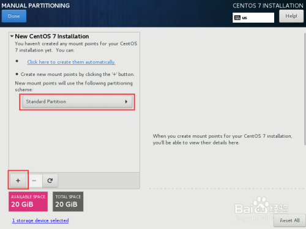
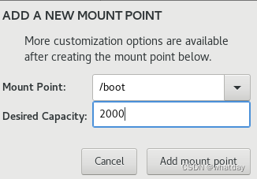
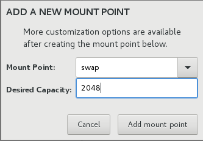
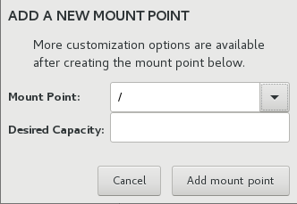
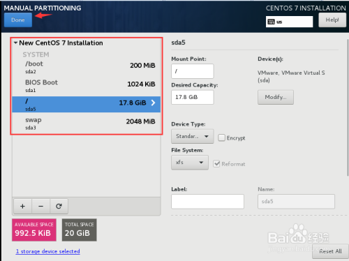

- # Linux系统安装

- [手动安装](#手动安装)
  - [定制分区](#定制分区)
  - [设备类型](#设备类型)
  - [文件系统](#文件系统)
- [PXE无人值守系统安装](#pxe无人值守系统安装)


## 手动安装
[参考文章](https://blog.csdn.net/whatday/article/details/104819819) 

1. 在安装系统的界面中，选择"INSTALLATION DESTINATION"，进入到系统的分区界面  
2. 在安装系统的界面中，选择"INSTALLATION DESTINATION"，进入到系统的分区界面  
3. 选择如何分区硬盘的方式"Standard Partition"，并点击下方"+"符号创建自定义磁盘空间  

<br>
<div align=center>
</img>
</div>

4. 第一步：创建/boot空间，大小设置为2000，单位默认为MB，在实际的工作中可针对服务器的作用和性能调节此值的大小  

<br>
<div align=center>
</img>
</div>

5. 第二步：创建swap的使用量，大小设置为2048，单位默认为MB，在实际的工作中可针对服务器的作用和性能调节此值的大小

<br>
<div align=center>
</img>
</div>

6. 最后一步：创建/空间，大小设置为空，将划分余下的所有空间给/分区，在实际的工作中可针对服务器的作用和性能调节此值的大小  

<br>
<div align=center>
</img>
</div>

7. 设置完成后可检查最后的设置情况，最后点击“Done”进入安装系统的下一步  

<br>
<div align=center>
</img>
</div>

### 定制分区

- 挂载点 - 输入分区的挂载点。例如：如果这个分区应该是 root 分区，请输入 /；如果是 /boot 分区，请输入 /boot ，等等。对于 swap 分区，则不应该设置挂载点 - 将文件系统类型设置为 swap 就足够了。

- 所需容量 - 输入该分区所需大小。您可以使用 KB、MB 或者 GB 为单位。如果您未指定单位，则默认使用 MB。

- 设备类型 - 请选择以下类型之一：标准分区，BTRFS，LVM，LVM 精简配置 或者BTRFS。选中随附的 加密 复选框以便加密该分区。稍后还会提示您设置密码。只有选择两个或者两个以上磁盘进行分区方可使用 RAID。同时，如果选择此类型，还可以设定 RAID 等级。同样，如果选择 LVM，则可以指定 卷组。

- 文件系统 - 在下拉菜单中为这个分区选择正确的文件系统类型。选中旁边的 重新格式化 复选框格式化现有分区，或者不选择该复选框保留您的数据。注：必须重新格式化新创建的分区，且在此情况下无法取消选择该复选框。

- 标签 - 为该分区分配标签。使用标签是为了方便您识别并处理单独的分区。

- 名称 - 为 LVM 或者 Btrfs 卷分配名称。注：标准分区都是在生成那些分区时自动命名，且其名称无法编辑，比如将 /home 命名为 sda1。

### 设备类型

- 标准分区 - 标准分区可包含文件系统或者 swap 空间，也可为软件 RAID 或者 LVM 物理卷提供容器。

- 逻辑卷（LVM） – 创建 LVM 分区可自动生成 LVM 逻辑卷。LVM 可在使用物理磁盘时提高性能。有关如何生成逻辑卷的详情请查看 第 15.15.3.3 节 “创建 LVM 逻辑卷”。有关 LVM 的详情请查看 Red Hat Enterprise Linux 逻辑卷管理程序管理。

- LVM 精简配置 – 使用精简配置，您可以管理可用空间的存储池，也称精简池，可在程序需要时将其分配给任意数量的设备。可在需要时动态扩展精简池以便有效分配存储空间。

- BTRFS - Btrfs 是有多个类设备功能的文件系统。相比 ext2、ext3 和 ext4 文件系统，它可以处理并管理更多文件、更大型的文件以及更大的卷。要生成 Btrfs 卷并了解更多信息，请查看 第 15.15.3.4 节 “创建 Btrfs 子卷”。

- 软件 RAID - 创建两个或多个软件 RAID 分区，以便创建 RAID 设备。为该系统中的每个磁盘分配一个 RAID 分区。要创建 RAID 设备，请查看 第 15.15.3.2 节 “创建软件 RAID”。有关 RAID 的详情，请参阅《Red Hat Enterprise Linux 逻辑卷管理程序管理》。  

### 文件系统

- xfs - XFS 是高度灵活性的高性能文件系统，最大可支持 16 EB（大约一千六百万 TB）的文件系统，大小为 8EB 的文件（大约八百万 TB），同时目录结构包含千百万条目。XFS 支持元数据日志，它可提高崩溃恢复速度。XFS 文件系统还可在挂载和激活的情况下清除磁盘碎片并重新定义大小。默认选择并推荐使用这个文件系统。有关如何将常用命令从之前使用的 ext4 文件系统转移为 XFS 文件系统的详情，请查看 附录 E, ext4 和 XFS 命令参考表。

- XFS 最大支持分区大小为 500 TB。

- ext4 - ext4 是基于 ext3 文件系统，并有大量改进。这些改进包括支持大文件系统和大文件；更迅速、有效的磁盘空间分配；目录中无限的子目录数；更快速的文件系统检查及更强大的日志功能。

  Red Hat Enterprise Linux 7 中目前支持的最大 ext4 文件系统为 50 TB。

- ext3- ext3 文件系统是基于 ext2 文件系统，其主要优点是日志功能（journaling）。使用记录日志的文件系统可减少崩溃后恢复文件系统所需时间，因为它不需要在每次发生崩溃时都运行 fsck 程序检查文件系统元数据一致性。

- ext2 - ext2 文件系统支持标准的 Unix 文件类型，包括常规文件、目录、符号链接等等。可分配长文件名，最多有 255 个字符。  

- vfat - VFAT 文件系统是一个 Linux 文件系统，它兼容 FAT 文件系统中的微软 Windows 长文件名。  

- swap - Swap 分区被用来支持虚拟内存。换句话说，当内存不足以贮存系统正在处理的数据时，会将其写入 swap 分区。  

> 分区的文件类型不是固定的，比如`swap`可以使用`标准分区`，也可以使用`LVM`,根目录文件系统可以使用`xfs`，也可以使用`ext4`  

最后的分区详情
```shell
#
# /etc/fstab
# Created by anaconda on Tue Aug 23 04:51:14 2022
#
# Accessible filesystems, by reference, are maintained under '/dev/disk'
# See man pages fstab(5), findfs(8), mount(8) and/or blkid(8) for more info
#
/dev/mapper/centos-root /                       xfs     defaults        0 0
UUID=2e3e7b3b-9501-4664-9b84-98ded37d3dc7 /boot                   xfs     defaults        0 0
/dev/mapper/centos-swap swap                    swap    defaults        0 0
/dev/mapper/DATA_LVM-DATA /data                 ext4    defaults        0 0
```


## PXE无人值守系统安装  
[参考文章](https://blog.csdn.net/ghost_leader/article/details/52985811)  


