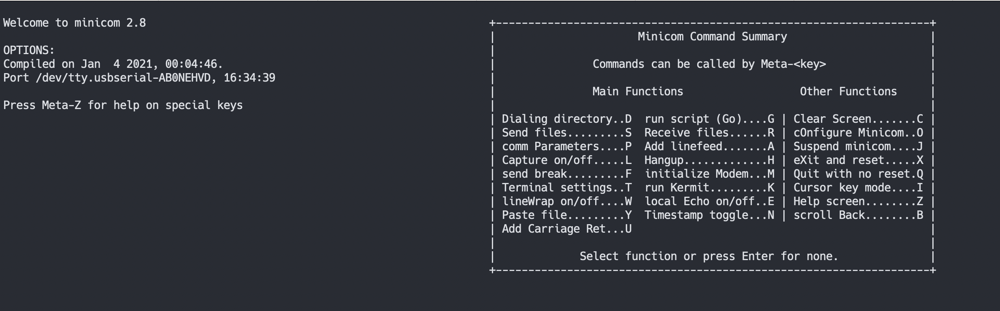

- # minicom 

- [macos 使用](#macos-使用)
  - [设置波特率](#设置波特率)


## macos 使用
安装`brew install minicom`  

macos 的串口设备`/dev/tty.usbserial-AB0NEHVD`  

启动`minicom -D /dev/tty.usbserial-AB0NEHVD`  

<div align=center>
</img>
</div>

> ` Meta-Z`就是esc+z  


### 设置波特率  
`cOnfigure Minicom..O`  

```shell
            +-----[configuration]------+                     
            | Filenames and paths      |                     
            | File transfer protocols  |                     
            | Serial port setup        |
            | Modem and dialing        |
            | Screen and keyboard      |
            | Save setup as dfl        |
            | Save setup as..          |
            | Exit                     |
            +--------------------------+  
```

`Serial port setup`  
```shell
    +-----------------------------------------------------------------------+ 
    | A -    Serial Device      : /dev/tty.usbserial-AB0NEHVD               |                      
    | B - Lockfile Location     : /usr/local/Cellar/minicom/2.8/var         |     
    | C -   Callin Program      :                                           | 
    | D -  Callout Program      :                                           | 
    | E -    Bps/Par/Bits       : 115200 8N1                                |       
    | F - Hardware Flow Control : No                                       |        
    | G - Software Flow Control : No                                        |         
    | H -     RS485 Enable      : No                                        |         
    | I -   RS485 Rts On Send   : No                                        |            
    | J -  RS485 Rts After Send : No                                        |           
    | K -  RS485 Rx During Tx   : No                                        |          
    | L -  RS485 Terminate Bus  : No                                        |            
    | M - RS485 Delay Rts Before: 0                                         |             
    | N - RS485 Delay Rts After : 0                                         |              
    |                                                                       |
    |    Change which setting?                                              |
    +-----------------------------------------------------------------------+ 
```

> Hardware Flow Control: No  

然后保存为默认，退出即可。  


