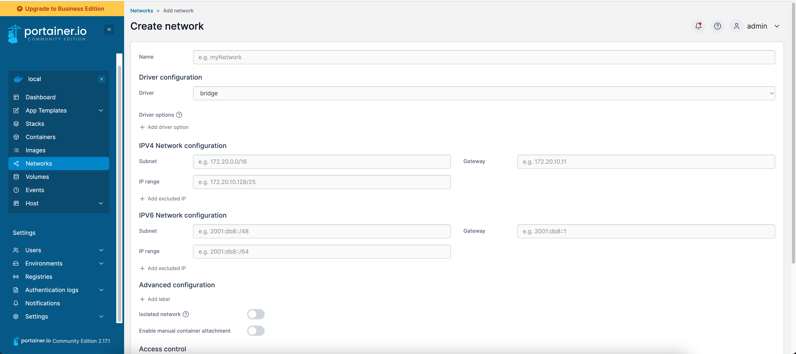
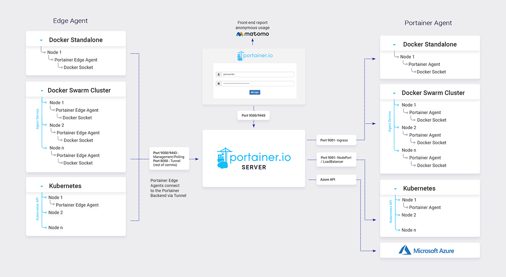

- # portainer=>docker/Kubernetes管理

- [环境搭建](#环境搭建)
- [docker管理](#docker管理)
  - [模版管理](#模版管理)
  - [网络配置](#网络配置)
  - [容器服务管理](#容器服务管理)
  - [存储管理](#存储管理)
- [运维管理](#运维管理)
  - [用户管理](#用户管理)
  - [环境配置](#环境配置)
  - [镜像仓库管理](#镜像仓库管理)


## 环境搭建
[github官方地址](https://github.com/portainer/portainer)  
[官方安装地址](https://docs.portainer.io/start/install-ce)  

```sh
# create the volume that Portainer Server will use to store its database
docker volume create portainer_data

# download and install the Portainer Server container:
docker run -d -p 8000:8000 -p 9443:9443 --name portainer --restart=always -v /var/run/docker.sock:/var/run/docker.sock -v portainer_data:/data portainer/portainer-ce:latest

# 登录
https://localhost:9443
```

<div align=center>
  </img>
</div>

[官方文档](https://docs.portainer.io/)  


整体架构:  
<div align=center>
  </img>
</div>

## docker管理
### 模版管理

### 网络配置

### 容器服务管理

### 存储管理

## 运维管理
### 用户管理

### 环境配置

### 镜像仓库管理


