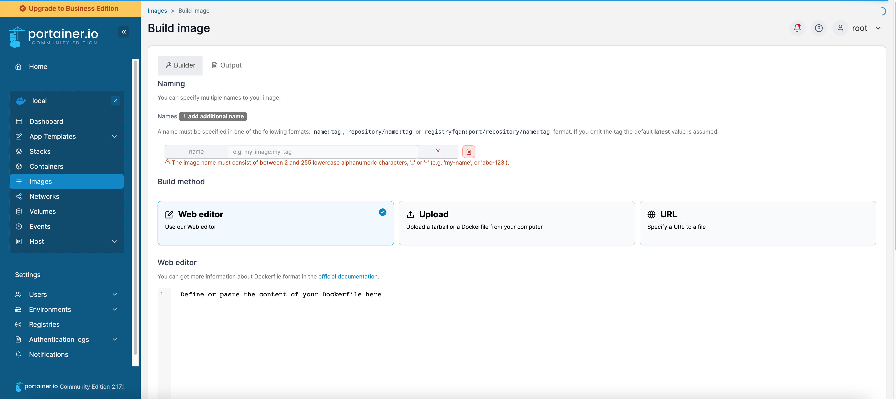

- # portainer=>docker/Kubernetes管理

- [环境搭建](#环境搭建)
- [docker管理](#docker管理)
  - [模版管理](#模版管理)
  - [网络配置](#网络配置)
  - [容器服务管理](#容器服务管理)
  - [存储管理](#存储管理)
- [运维管理](#运维管理)
  - [用户管理](#用户管理)
  - [环境配置](#环境配置)
  - [镜像仓库管理](#镜像仓库管理)


## 环境搭建
[github官方地址](https://github.com/portainer/portainer)  
[官方安装地址](https://docs.portainer.io/start/install-ce)  

```sh
# create the volume that Portainer Server will use to store its database
docker volume create portainer_data

# download and install the Portainer Server container:
docker run -d -p 8000:8000 -p 9443:9443 --name portainer --restart=always -v /var/run/docker.sock:/var/run/docker.sock -v portainer_data:/data portainer/portainer-ce:latest

# 登录
https://localhost:9443

# 删除
docker stop portainer && docker rm portainer
docker volume rm portainer_data

```

<div align=center>
  </img>
</div>

[官方文档](https://docs.portainer.io/)  


整体架构:  
<div align=center>
  </img>
</div>

## docker 服务化
目前的想法是把docker镜像当做虚拟机用，想启用以下服务，比如ssh、systemctl、supervisor等

### ubuntu20.04 
```sh
apt-get update
apt-get install openssh-server

# 修改时区
tzselect # 这里我们选择亚洲 Asia，确认之后选择中国（China)，最后选择北京(Beijing)
rm -fr /etc/timezone
ln -s /usr/share/zoneinfo/Asia/Shanghai /etc/timezone

apt-get install net-tools
netstat -apn | grep ssh

# 生成
ssh-keygen -t rsa

# 启动之前需手动创建/var/run/sshd，不然启动sshd的时候会报错
mkdir -p /var/run/sshd
sed -i 's+PermitRootLogin prohibit-password+PermitRootLogin yes' /etc/ssh/sshd-config

# 守护进程启动
/usr/sbin/sshd -D &
```


## docker管理
### 镜像管理

<div align=center>
  </img>
</div>

#### ssh ubuntu
比如构建ubuntu:20.04，拥有ssh服务并且以`/usr/sbin/init`启动的
```dockerfile
FROM ubuntu:20.04

# 替换镜像
# ADD sources.list /etc/apt/sources.list.d/aliyun.list

# 更新
RUN apt-get update

# 安装ssh服务
RUN apt-get install -y openssh-server
RUN apt-get install -y python2.7

RUN apt-get install -y net-tools bash-completion
RUN apt-get install -y iputils-ping
RUN apt-get install -y tree
RUN apt-get install -y bridge-utils
RUN apt-get install -y vim

RUN mkdir -p /var/run/sshd
RUN mkdir -p /root/.ssh/

# 修改root密码，便于远程登录
RUN echo root:123456 | chpasswd

# 将key生成在指定文件内
RUN rm -fr /etc/ssh/ssh_host_rsa_key
RUN ssh-keygen -q -t rsa -b 2048 -f /etc/ssh/ssh_host_rsa_key -P '' -N ''

# 配置ssh可以使用root登陆
RUN sed -i 's/#PermitRootLogin prohibit-password/PermitRootLogin yes/' /etc/ssh/sshd_config

# 时区 
RUN rm -fr /etc/localtime && cp /usr/share/zoneinfo/Asia/Shanghai /etc/localtime && echo 'Asia/Shanghai' >/etc/timezone

# 开放22端口
EXPOSE 22

ENTRYPOINT [ "/usr/sbin/init"]
```

构建镜像`docker build -t ssh-ubuntu:20.04 .`
```sh
REPOSITORY               TAG       IMAGE ID       CREATED          SIZE
ssh-ubuntu               20.04     5fdf944573df   33 seconds ago   284MB
```

运行镜像: `docker run --privileged=true -itd --name ssh-ubuntu -p 222:22 -v /data:/data ssh-ubuntu:20.04`  
删除配置`docker stop ssh-ubuntu && docker rm ssh-ubuntu`  
```sh
CONTAINER ID   IMAGE                           COMMAND            CREATED         STATUS         PORTS                                                                                            NAMES
c220e8a272b7   ssh-ubuntu:20.04                "/usr/sbin/init"   5 seconds ago   Up 4 seconds   0.0.0.0:222->22/tcp, :::222->22/tcp                                                              ssh-ubuntu 
```

`docker exec -it ssh-ubuntu bash`  
查看ip配置`docker exec -it ssh-ubuntu ifconfig`

连接ssh`ssh -p 222 root@localhost`, 也可以使用`222`端口连接宿主机`ssh -p 222 root@ud1`.  

通过ansible控制自动化, host配置
```sh
tmp ansible_ssh_host=ud1  ansible_ssh_port=222  ansible_ssh_pass='123456'

[target]
tmp
```

#### ssh centos

```dockerfile
FROM centos:centos7.9.2009

RUN yum install -y openssh openssh-server openssh-clients
RUN yum install -y vim python python3 tree net-tools bash-completion
RUN mkdir -p /var/run/sshd
RUN ssh-keygen -t rsa -f /etc/ssh/ssh_host_rsa_key
RUN ssh-keygen -t dsa -f /etc/ssh/ssh_host_dsa_key
RUN /bin/echo 'root:123456' |chpasswd

# 将key生成在指定文件内
RUN rm -fr /etc/ssh/ssh_host_rsa_key
RUN ssh-keygen -q -t rsa -b 2048 -f /etc/ssh/ssh_host_rsa_key -P '' -N ''

# 配置ssh可以使用root登陆
RUN sed -i 's/#PermitRootLogin prohibit-password/PermitRootLogin yes/' /etc/ssh/sshd_config

# 时区 
RUN rm -fr /etc/localtime && cp /usr/share/zoneinfo/Asia/Shanghai /etc/localtime && echo 'Asia/Shanghai' >/etc/timezone

# 开放22端口
EXPOSE 22
# 系统服务
ENTRYPOINT [ "/usr/sbin/init"]
```

构建镜像`docker build -t ssh-centos:7.9 .`
```sh
REPOSITORY               TAG       IMAGE ID       CREATED          SIZE
ssh-ubuntu               20.04     5fdf944573df   33 seconds ago   284MB
```

运行镜像: `docker run --privileged=true -itd --name ssh-centos -p 2222:22 -v /data:/data ssh-centos:7.9`  
删除配置`docker stop ssh-centos && docker rm ssh-centos`  
```sh
CONTAINER ID   IMAGE                           COMMAND            CREATED         STATUS         PORTS                                                                                            NAMES
c220e8a272b7   ssh-centos:7.9                "/usr/sbin/init"   5 seconds ago   Up 4 seconds   0.0.0.0:222->22/tcp, :::222->22/tcp                                                              ssh-ubuntu 

# 查看服务状态
docker exec -it ssh-centos bash
[root@817a8e98c5c0 /]# systemctl status sshd
● sshd.service - OpenSSH server daemon
   Loaded: loaded (/usr/lib/systemd/system/sshd.service; enabled; vendor preset: enabled)
   Active: active (running) since Fri 2023-03-17 14:37:22 UTC; 18s ago
     Docs: man:sshd(8)
           man:sshd_config(5)
 Main PID: 78 (sshd)
   CGroup: /docker/817a8e98c5c0f1d657cb1f9a18a1ea86379339d8a72ddd9e89c5f9b29dcfa1c7/system.slice/sshd.service
           └─78 /usr/sbin/sshd -D
           ‣ 78 /usr/sbin/sshd -D

Mar 17 14:37:22 817a8e98c5c0 systemd[1]: Starting OpenSSH server daemon...
Mar 17 14:37:22 817a8e98c5c0 sshd[78]: Server listening on 0.0.0.0 port 22.
Mar 17 14:37:22 817a8e98c5c0 sshd[78]: Server listening on :: port 22.
Mar 17 14:37:22 817a8e98c5c0 systemd[1]: Started OpenSSH server daemon.
```

`docker exec -it ssh-centos bash`  
查看ip配置`docker exec -it ssh-centos ifconfig`

连接ssh`ssh -p 2222 root@localhost`, 也可以使用`2222`端口连接宿主机`ssh -p 2222 root@ud1`.  

通过ansible控制自动化, host配置
```sh
tmp ansible_ssh_host=ud1  ansible_ssh_port=2222 ansible_ssh_pass='123456'
```

### 模版管理

### 网络配置

### 容器服务管理

### 存储管理

## 运维管理
### 用户管理

### 环境配置

### 镜像仓库管理

## docker镜像仓库


