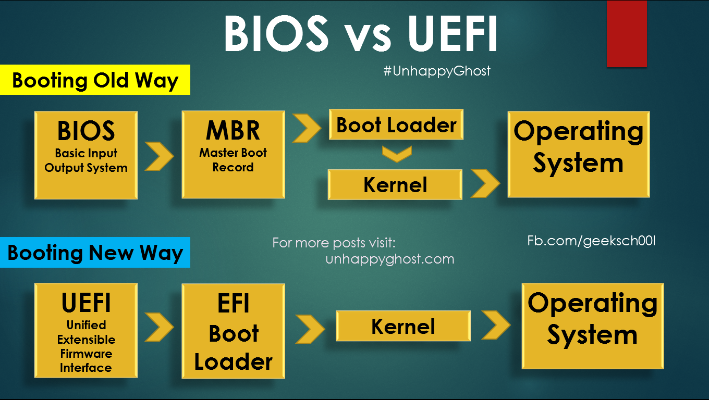

- # Ubuntu 系统自动安装及部署

- [镜像文件](#镜像文件)
- [启动流程](#启动流程)
  - [BIOS](#bios)
  - [UEFI](#uefi)
- [制作自定义镜像](#制作自定义镜像)
  - [手动ISO提取及打包](#手动iso提取及打包)
  - [脚本制作镜像 user-data](#脚本制作镜像-user-data)
  - [脚本制作镜像 preseed](#脚本制作镜像-preseed)


## 镜像文件  
`ubuntu-20.04.5-live-server-amd64.iso`镜像文件内容  
```sh
total 56
drwxr-xr-x    4 ymm  staff    128  4 18 11:08 EFI
drwxr-xr-x    4 ymm  staff    128  4 18 11:08 boot
drwxr-xr-x   13 ymm  staff    416  4 18 11:08 casper
drwxr-xr-x    4 ymm  staff    128  4 18 11:08 dists
drwxr-xr-x    3 ymm  staff     96  4 18 11:08 install
drwxr-xr-x  287 ymm  staff   9184  4 18 11:08 isolinux
-rw-r--r--@   1 ymm  staff  27389  8 31  2022 md5sum.txt
drwxr-xr-x    4 ymm  staff    128  4 18 11:09 pool
drwxr-xr-x   13 ymm  staff    416  4 19 18:08 preseed
```

通过BIOS/EFI启动后，当前安装系统也是一个图形界面系统，镜像的所有内容挂载到`/cdrom`目录下。  

另外还存在一个`/cdrom/ubuntu`指向当前根目录  

- ISO的启动项要正确  
- 要有引导  

## 启动流程  


<div align=center>
  </img>
</div>

### BIOS 


### UEFI

## 制作自定义镜像  

### 手动ISO提取及打包  

安装提取工具
```sh
sudo apt-get install p7zip-full p7zip-rar 
```

解压
```sh
7z x ubuntu-16.10-server-amd64.iso
```


修改完成后，再重新制作镜像`apt install genisoimage`  
```sh
mkisofs -iso-level 3 -D -r -V "ubuntu-20.04-custom-amd64" -cache-inodes -J -l -b isolinux/isolinux.bin -c isolinux/boot.cat -no-emul-boot -boot-load-size 4 -boot-info-table -o ../custom.iso .
```

安装镜像启动后，可以通过`option + command + F2` 进入命令行模式进行调试。  

`cat /proc/cmdline` 可以查看启动模式  
```sh
initrd	/casper/initrd quiet  ---
```

### 脚本制作镜像 user-data  

安装依赖
```sh
apt install -y xorriso  sed curl gpg isolinux
```

https://github.com/ymm135/ubuntu-autoinstall-generator  

### 脚本制作镜像 preseed  

https://github.com/covertsh/ubuntu-preseed-iso-generator


