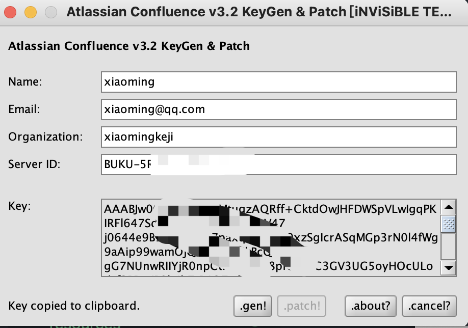

- ### Cento系统安装

- [开发环境搭建](#开发环境搭建)
  - [docker](#docker)
  - [gitlab](#gitlab)
  - [jira/wiki](#jirawiki)
  - [jenkins](#jenkins)


#### centos7 更换yum源
wget -O /etc/yum.repos.d/CentOS-Base.repo http://mirrors.aliyun.com/repo/Centos-7.repo  

yum clean all  
yum makecache  


------
#### 修改为静态IP  
服务器IP: 192.168.0.200
系统版本: CentOS 7.9
用户名: root
密码: root

网络配置修改
```
BOOTPROTO=static
ONBOOT=yes
IPADDR=192.168.0.200
NETMASK=255.255.255.0
GATEWAY=192.168.2.1
DNS1=114.114.114.114
```

### 开发环境搭建
> 所有应用配置约定如下:
/etc 配置文件目录
/data 应用程序数据目录。比如dcoker的数据存储于/data/docker
/var/log 应用日志目录

#### docker
[Install Docker Engine on CentOS](https://docs.docker.com/engine/install/centos/)

```
#先停止docker服务
$ systemctl stop docker docker.socket

#修改docker data目录
$ mkdir /data
$ vim /etc/docker/daemon.json
增加如下内容
{ 
   "data-root": "/data/docker" 
}

#启动服务
systemctl start docker

#查看data目录
$ docker info | grep "Docker Root Dir"
Docker Root Dir: /data/docker

#开机自启动
systemctl enable docker

```

#### gitlab
管理员账号: root root

安装方式
```
#可选 关闭Selinux
$ vi /etc/selinux/config
将SELINUX=enforcing改为SELINUX=disabled

#重启生效
$ reboot

#安装gitlab
$ sudo docker run --detach \
  --hostname 192.168.0.200 \
  --publish 192.168.0.200:443:443 \
  --publish 192.168.0.200:8090:80 \
  --publish 192.168.0.200:2290:22 \
  --net=none \
  --name gitlab \
  --restart always \
  --volume /etc/gitlab:/etc/gitlab \
  --volume /var/log/gitlab:/var/log/gitlab \
  --volume /data/docker/gitlab:/var/opt/gitlab \
  gitlab/gitlab-ee:latest
  
  
# ssh端口不同，需要修改
# /etc/gitlab/gitlab.rb
gitlab_rails['gitlab_shell_ssh_port'] = 2290

#刷新配置
gitlab-ctl reconfigure

```
#docker需要独立
首先需要 [创建网桥](https://www.cnblogs.com/chengkanghua/p/11378854.html)


#创建网桥配置文件
> UUID=`uuidgen`
cat <<EOF > /etc/sysconfig/network-scripts/ifcfg-br0
TYPE="Bridge"
UUID="${UUID}"
DEVICE="br0"
ONBOOT="yes"
EOF

#修改原有网卡配置文件
> cat <<EOF > /etc/sysconfig/network-scripts/ifcfg-eth0
TYPE="Ethernet"
DEVICE="eth0"
ONBOOT="yes"
BRIDGE=br0           
EOF

#配置静态IP地址
> cat <<EOF >> /etc/sysconfig/network-scripts/ifcfg-br0
BOOTPROTO="static"
IPADDR="192.168.2.230"
NETMASK="255.255.255.0"
GATEWAY="192.168.1.1"
EOF

#重启网卡service network restart
service network restart

#brctl show

| bridge name | bridge id | STP enabled | interfaces |
| :---------: |:---------: |:---------: |:---------: |
| br0 | 8000.20040fedf871 | no | em2 |
| docker0 | 8000.0242f181de6f | no | veth0427f15 |
| | | | veth0ca1754 |
| | | | vethf044312 |
							
#使用pipework分配ip

> git clone https://github.com/jpetazzo/pipework.git
sudo cp pipework/pipework /usr/local/bin/
docker run -itd --name con1 --net=none ubuntu:14.04 bash
pipework br0 gitlab 192.168.2.225/24
这时docker容器中就增加一个网卡设置,ip为独立IP


#### jira/wiki
[参考文章](https://blog.csdn.net/wangshui898/article/details/117381018)

mysql安装

#创建应用目录
````
mkdir -pv /data/atlassian/mysql/{data,mysql-files,conf,logs}; \
mkdir -pv /data/atlassian/confluence/{data,logs}; \
mkdir -pv /data/atlassian/jira/{data,logs}; \
chown 999.999 /data/atlassian/mysql -R; \
chown 2002.2002 /data/atlassian/confluence -R; \
chown 2001.2001 /data/atlassian/jira/{data,logs} -R; 
````

#创建docker-compose配置文件目录
````
mkdir -pv /data/docker-compose/atlassian/{mysql,jira,confluence}
````

#my.cnf配置文件
````
cat > /data/atlassian/mysql/conf/my.cnf << 'EOF'
[client]
port = 3306
socket = /var/run/mysqld/mysqld.sock
default-character-set = utf8mb4

>[mysql]
prompt="\u@mysqldb \R:\m:\s [\d]> "
no-auto-rehash
default-character-set = utf8mb4

[mysqld]
user = mysql
port = 3306
skip-name-resolve

# for confluence
character-set-server = utf8mb4
collation-server = utf8mb4_bin
transaction-isolation = READ-COMMITTED

max_connections       = 1024
max_connect_errors    = 100
wait_timeout          = 100
max_allowed_packet    = 128M
table_open_cache      = 2048
back_log              = 600

default-storage-engine = innodb
log_bin_trust_function_creators = 1

# Log
general_log=off
general_log_file =  /data/mysql/logs/mysql.log
log-error = /data/mysql/logs/error.log

#slowlog慢查询日志
slow_query_log = 1
slow_query_log_file = /data/mysql/logs/slow.log
long_query_time = 2
log_output = FILE
log_queries_not_using_indexes = 0

#global_buffers
innodb_buffer_pool_size = 2G
innodb_log_buffer_size = 16M
innodb_flush_log_at_trx_commit = 2
key_buffer_size = 64M

innodb_log_file_size = 512M
innodb_log_file_size = 2G
innodb_log_files_in_group = 2
innodb_data_file_path = ibdata1:20M:autoextend

secure_file_priv = /var/lib/mysql
sql_mode = STRICT_TRANS_TABLES,NO_ZERO_IN_DATE,NO_ZERO_DATE,ERROR_FOR_DIVISION_BY_ZERO,NO_ENGINE_SUBSTITUTION

[mysqldump]
quick
max_allowed_packet = 32M
EOF
````
#修改权限
````
chown 999.999 /data/atlassian/mysql/conf/my.cnf
````

#mysql docker-compose配置
````
cat > /data/docker-compose/atlassian/mysql/docker-compose.yml << EOF
version: "3"
services:
  atlassian_db:
    container_name: atlassian_db
    image: mysql:8.0
    ports:
      - 4306:3306
    restart: always
    # docker安全验证
    security_opt:
      - seccomp:unconfined
    volumes:
      - /etc/localtime:/etc/localtime
      - /data/atlassian/mysql/data:/var/lib/mysql
      - /data/atlassian/mysql/mysql-files:/var/lib/mysql-files/
      - /data/atlassian/mysql/logs/:/data/mysql/logs/
      - /data/atlassian/mysql/conf/my.cnf:/etc/mysql/my.cnf
    environment:
      MYSQL_ROOT_PASSWORD: root
    command: --default-authentication-plugin=mysql_native_password --skip-name-resolve
    networks:
      - atlassian
networks:
  atlassian:
EOF
````

#启动
```
docker-compose -f /data/docker-compose/atlassian/mysql/docker-compose.yml up -d
```

#创建数据库并授权
```
# 进入容器
docker-compose exec atlassian_db /bin/bash
# 登录数据库
mysql -uroot -p root
# 为jira创建数据库并授权
create database jira;
create user "jira"@"%" identified by "jira";
grant all privileges on jira.* to "jira"@"%";
flush privileges;
# 为confluence创建数据库并授权
create database confluence;
create user "confluence"@"%" identified by "confluence";
grant all privileges on confluence.* to "confluence"@"%";
flush privileges;

```
#jira docker-compose.yml

```
cat > /data/docker-compose/atlassian/jira/docker-compose.yml << EOF
version: "3"
services:
  jira:
    container_name: jira
    image: atlassian/jira-software:8.14
    restart: always
    ports:
      - 8092:8080
    volumes:
      - /etc/localtime:/etc/localtime
      - /data/atlassian/jira/data:/var/atlassian/application-data/jira
      - /data/atlassian/jira/logs:/opt/atlassian/jira/logs

    environment:
      JVM_MINIMUM_MEMORY: 1024m
      JVM_MAXIMUM_MEMORY: 2048m
      JVM_RESERVED_CODE_CACHE_SIZE: 512m
    deploy:
      resources:
        limits:
           memory: 4G
        reservations:
           memory: 1G
    networks:
      - atlassian
networks:
  atlassian:
EOF
```

#启动jira
```
docker-compose -f /data/docker-compose/atlassian/jira/docker-compose.yml up -d
```

#上传mysql驱动及破解文件
```
wget https://dev.mysql.com/get/Downloads/Connector-J/mysql-connector-java-8.0.25.tar.gz

tar -zxf mysql-connector-java-8.0.25.tar.gz

docker cp mysql-connector-java-8.0.25/mysql-connector-java-8.0.25.jar jira:/opt/atlassian/jira/atlassian-jira/WEB-INF/lib/

docker exec jira chmod +r /opt/atlassian/jira/atlassian-jira/WEB-INF/lib/mysql-connector-java-8.0.25.jar

docker cp /root/work/jiraconfluence/atlassian-extras-3.2.jar jira:/opt/atlassian/jira/atlassian-jira/WEB-INF/lib/atlassian-extras-3.2.jar; \
docker exec jira chmod +r /opt/atlassian/jira/atlassian-jira/WEB-INF/lib/atlassian-extras-3.2.jar; \
docker exec jira ls /opt/atlassian/jira/atlassian-jira/WEB-INF/lib/atlassian-extras-3.2.jar -l

#重启一下
docker-compose -f /data/docker-compose/atlassian/jira/docker-compose.yml restart jira

```

#Confluence部署
docker-compose配置
```
cat > /data/docker-compose/atlassian/confluence/docker-compose.yml << EOF
version: "3"
services:
  confluence:
    container_name: confluence
    image: atlassian/confluence-server:7.13.0-m03
    restart: always
    ports:
      - 8093:8090
      - 8094:8091
    volumes:
      - /etc/localtime:/etc/localtime
      - /data/atlassian/confluence/data:/var/atlassian/application-data/confluence
      - /data/atlassian/confluence/logs:/opt/atlassian/confluence/logs
    environment:
      JVM_MINIMUM_MEMORY: 1024m
      JVM_MAXIMUM_MEMORY: 2048m
      JVM_RESERVED_CODE_CACHE_SIZE: 512m
    deploy:
      resources:
        limits:
           memory: 4G
        reservations:
           memory: 1G
    networks:
      - atlassian
networks:
  atlassian:
EOF

```

#启动
```
docker-compose -f /data/docker-compose/atlassian/confluence/docker-compose.yml up -d
```

#上传驱动
```
docker cp mysql-connector-java-8.0.25/mysql-connector-java-8.0.25.jar confluence:/opt/atlassian/confluence/confluence/WEB-INF/lib/; \
docker exec confluence chmod +r /opt/atlassian/confluence/confluence/WEB-INF/lib/mysql-connector-java-8.0.25.jar; \
docker exec confluence ls -l /opt/atlassian/confluence/confluence/WEB-INF/lib/mysql-connector-java-8.0.25.jar; 

```

#PJ
```
#首先拷贝出jar包
从docker容器导出到服务器,并重命名为atlassian-extras-2.4.jar
docker cp confluence:/opt/atlassian/confluence/confluence/WEB-INF/lib/atlassian-extras-decoder-v2-3.4.1.jar atlassian-extras-2.4.jar
从服务器导出到windows环境
将atlassian-extras-2.4.jar拷贝到系统环境(已经安装了jdk环境windows/mac)，使用注册机破解
jar -jar confluence_keygen.jar
弹出框中输入NAME和ServerID(就是授权页面中的服务器ID)
然后点击patch,选择atlassian-extras-2.4.jar,点击gen生成授权码,将授权码保存; 生成授权码后会将原来的atlassian-extras-2.4.jar备份,然后生成一个新的atlassian-extras-2.4.jar

#通过注册机生成破解文件，然后把破解文件保存到镜像内
docker cp atlassian-extras-2.4.jar confluence:/opt/atlassian/confluence/confluence/WEB-INF/lib/atlassian-extras-decoder-v2-3.4.1.jar; \
docker exec confluence chmod +r /opt/atlassian/confluence/confluence/WEB-INF/lib/atlassian-extras-decoder-v2-3.4.1.jar; \
docker exec confluence ls -l /opt/atlassian/confluence/confluence/WEB-INF/lib/atlassian-extras-decoder-v2-3.4.1.jar; 

#重启生效
docker-compose -f /data/docker-compose/atlassian/confluence/docker-compose.yml restart confluence

#重启docker容器(加载新导入的jar包),重复上面的登录操作,进入到授权页面,输入上面保存的授权码,点击下一步
```

<div align=center>
  </img>
</div>

> 如果因为破解问题服务起不来，可以通过查看配置文件，冲洗破解，修改license。  
> 配置文件中包含ServiceID及licence信息
```
/data/atlassian/confluence/data/confluence.cfg.xml
<property name="confluence.setup.server.id">BUKU-5R1M-L25U-XXXX</property>
<property name="atlassian.license.message"></property>  # 填充注册机的Key信息
```

#配置confluence的数据库
```
Hostname: 192.168.0.200
Port: 4306
Database name: confluence
Username: confluence
Password: confluence
```

安装界面有提示连接jira
> Manage Users and Groups with Jira
Connect to Jira

出现错误:cannot create application in Jira. Status Code =401

[confluence使用jira用户管理](https://confluence.atlassian.com/doc/connecting-to-crowd-or-jira-for-user-management-229838465.html)

#首先配置JIRA与Confluence互联及用户对接
jira管理员账号 jira jira
confluence管理员账号 confluence confluence

#互相添加应用程序
> 登录Confluence:
管理->应用程序链接,在此处根据提示添加jira的的配置,本地验证模式选择为-OAuth（模拟）
根据提示,切换到jira,添加Confluence的配置

Jira用户配置
> 添加Jira用户服务器
管理->用户管理->Jira用户服务器->添加应用程序->根据提示输入应用程序名称和密码
如果有不清楚的，可以点击问号，查看官方文档！

jira用户管理>>用户目录
>确保jira的用户目录第一位是jira内部目录，并禁用掉ldap，如果ladp提示不能操作，需要退出并用jira内部数据中的管理员账户登录。


#### jenkins
> jenkins管理员账号: jenkins jenkins

```
docker run -itd -p 8096:8080 -p 50000:50000 --name jenkins -v /data/jenkins:/var/jenkins_home -v /etc/localtime:/etc/localtime jenkins/jenkins

```

下载不了插件的问题
```
vim /data/jenkins/hudson.model.UpdateCenter.xml

修改升级站点为: https://mirrors.tuna.tsinghua.edu.cn/jenkins/updates/update-center.json

```
