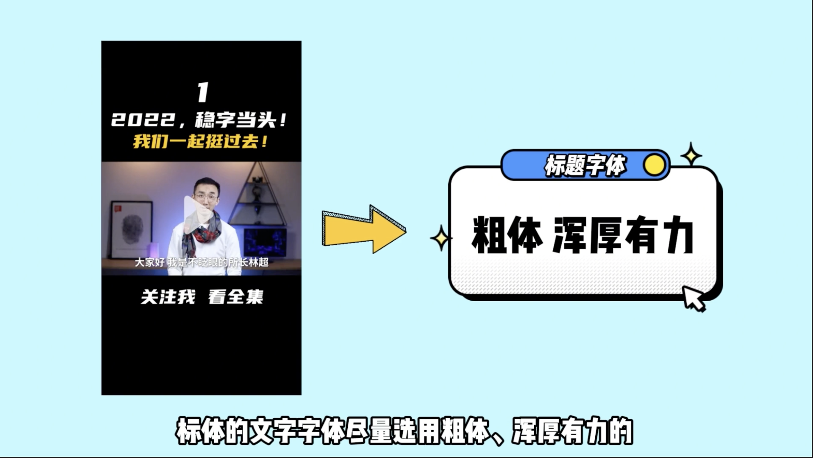

- # We-Media

## 记录美好生活(抖音)
- #### [西瓜新手入门](https://daxue.ixigua.com/topic/6839604131330523662)  

### 保持账号活跃
大家记住一定要留痕迹，活跃账号，在分享的同时也给别人的分享点赞。  

### 横屏转竖屏 

</img>

### [拍摄选题](https://www.ixigua.com/6839604131330523662?utm_source=xiguadaxue&id=6799969044242891272)  
首先明白账号定位,确定自己喜欢并且擅长的领域。兴趣是创作的动力。只有做自己喜欢并且感兴趣的事情，才会有持续的动力。  

1，账号定位：选择自己喜欢的领域；  
2，思考目标观众  
3，拍摄灵感（
  a,创作来源于生活，且高于生活  
  b,关注时下热点  
  c,建立选题日历  
  d,学习借鉴，同行是最好的老师）  
E,在悟空问答找到自己相关领域，查看热门问答，学习积累，也可以为创作选题积累素材  

### #西瓜大学# 三种拍摄技巧，瞬间提升自己的拍摄水平
⭐️1.万物稳为先：手持拍摄时保持画面稳定  
拍摄时用双手大拇指和食指加紧手机，然后中指无名指顶住手机底部夹紧双臂，把身体想象成支架，在稳定的过程中，身体要稳定，不要大幅度上下的颠簸，有条件的可以购买三脚架和稳定器。  
⭐️2.增强画面美感：拍摄时考虑合适的画面构图  
使用三分构图法，人物可以放在画面的1/3处，使画面显得更加的自然，注意在头顶的上方预留一部分空间，切记不要“切头”。  
⭐️3.镜头组成的艺术：拍摄时添加适当的镜头运动  
常用的有推、拉、摇、移。  

### #西瓜大学# 西瓜新人创作攻略，快速上手5大技巧  
这节课六六老师主要讲了西瓜新人快速上手的5大攻略:  
一是横屏原创视频；    
二是视频时长大于一分钟。  
三是多发文，每周至少3篇以上。  
四是封面注意事项，要突出亮点和重点，适当配贴纸，抠图，压字。  
五是标题注意事项，突出关键信息，提现重点亮点，以便机器抓取关键信息，提高推荐！  

### 手机制作视频  

</img>

### 如何克服镜头恐惧症？几个小技巧帮助你在镜头面前更加自然
这是一个全民自媒体时代，要勇敢表达自己。以下为课堂笔记：  
1、	培养镜头感和镜头对话；自媒体做的是内容，长相真的不重要，克服这样的心态；有时候想得越多就会做得越少  
2、	克服出境恐惧的心理障碍，厚脸皮是后期练出来的  
3、	培养镜头感，和镜头沟通对话，在镜头前更加流畅表达自己分享的内容和观点等，幻想和镜头交朋友讲故事，不要呆呆坐在那里，保持交流感  
4、	回看很重要，习惯自己出现在镜头的样子，慢慢找到适合自己神态、表情、动作，然后就会接受自己、爱上镜头前的自己  
5、	不要害怕在公共场合拍视频，可以用耳机收音，还是同期配音效果会比较好    

