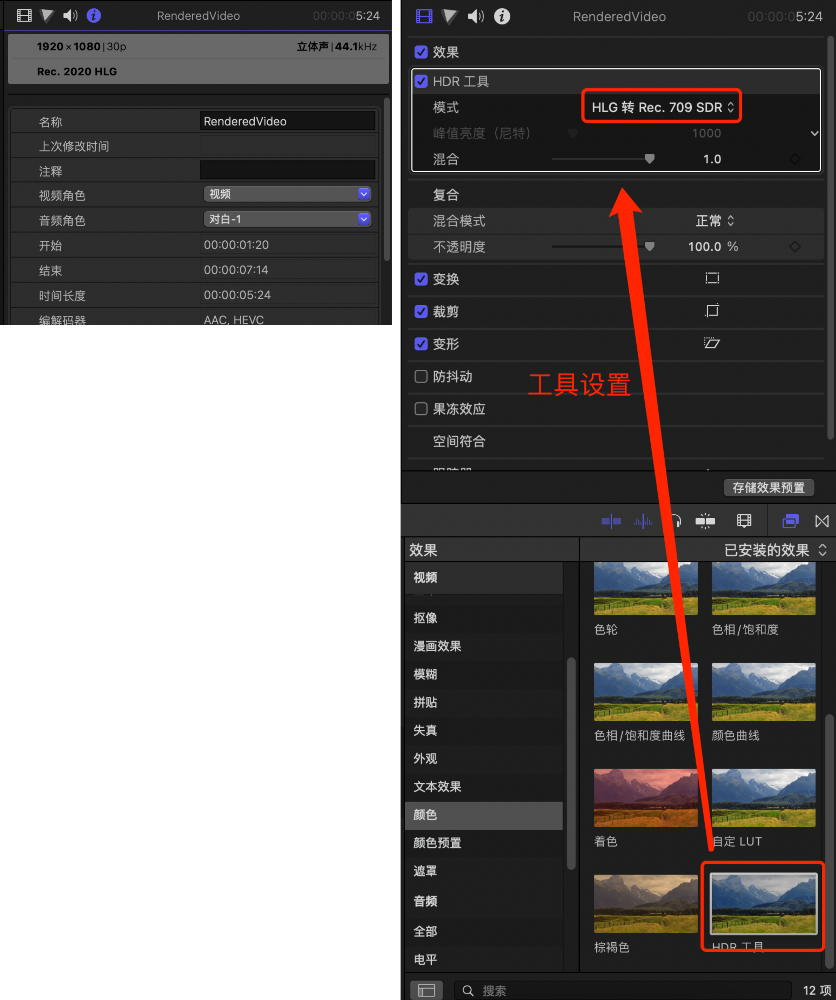

- # Final Cut Pro 使用

## HDR工具  

High Dynamic Range (HDR) is the next generation of color clarity and realism in images and videos. Ideal for media that require high contrast or mix light and shadows, HDR preserves the clarity better than Standard Dynamic Range (SDR).  

HDR转SDR  

</img>

## 自动生成字幕  

[blibli教程](https://www.bilibili.com/video/BV1wq4y1f76a/?vd_source=dc948f9711ac4b8904200dc545cd72d7)  

通过剪映自动识别字幕，导出视频。到final cut中选择融合方式为“相加”。  

## 转场
可以通过遮罩转场  

## 变速  

选择切割速度，然后选择速度   

## 编辑字幕  

在字幕中选择“基础字幕”

## 声音处理
[教程](https://www.youtube.com/watch?v=d1LSyKAYGZM)  

首先是响度要满足`-16LUFS`的标准  

- 电平 限制器
- 电平 Noise Gate
- 专用 MultiMeter  

## 导出视频

导出为MP4

