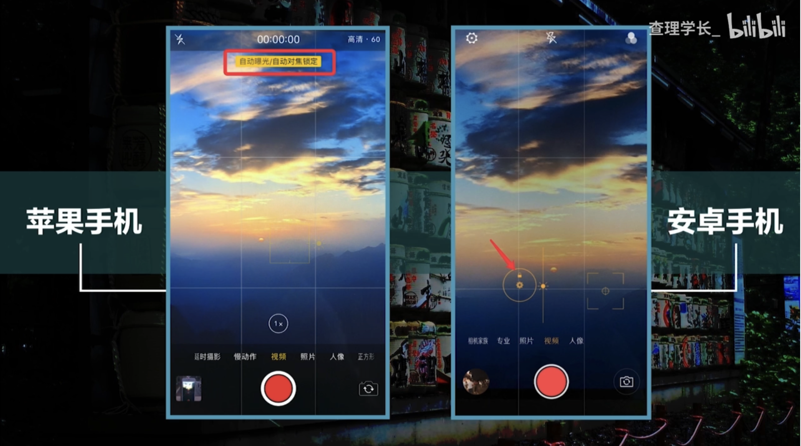

- # 手机摄影

## 入门介绍

### part 1 基础拍摄技巧
动态物体，镜头不动  
如行人车流 运动的人物  
静态物体 镜头单路线运动  
如推 拉 左 右 上 下  

### Part2 拍摄内容提示
简单/冷静/有条不紊/vlog完整性  
开头结尾场景切换连接  
开头 出门前准备 路程中 到达目的地/vlog重心 结尾  

### Part3 后期剪辑
Step1导入素材  
Step2剪掉多余画面  
Step3加入标题字幕  
step4添加转场  
step5添加音乐  
step6添加贴图  
step7叠加滤镜  
step8编辑片尾  

## 理论学习

### 清晰度
先让视频拍稳，拍清晰  

#### 稳定器
[稳定器/云台的应用](https://www.bilibili.com/video/BV1R44y1B7Ad?spm_id_from=333.337.search-card.all.click&vd_source=dc948f9711ac4b8904200dc545cd72d7)    

[smoth5官方教程](https://www.zhiyun-tech.com/cn/service/support/492?type=website&page=services_product&source=service#/pages/index/support/videoPage)

[安装调平](https://www.zhiyun-tech.com/cn/service/support/492?type=website&page=services_product&source=service#/pages/index/support/videoPage)  

安装及调平
1. 打开机身背面的航向轴锁扣  
2. 分别打开横滚轴锁扣和俯仰轴锁扣  
3. 横滚轴平衡调节
4. 俯仰轴平衡调节 
5. 完成调平后，长按机身侧面电源键开机
6. 长按带有灯光的按键打开补光灯
7. 单机MDDE键切换模式  

模式介绍:
- 航向跟随模式PF  俯仰轴和横滚轴的电机全部锁定，航向轴电机跟随手柄转动  适合环绕镜头，人物永远处于画面中心  
- 锁定模式L 三个电机全部锁定  固定角度的长镜头跟拍  
- 全跟随模式F  横滚轴电机锁定，航向点击和俯仰轴电机随云台手柄移动  适合上摇和下摇模式  
- POV模式 三个电机全部跟随云台移动  适合翻转镜头，转场镜头等
- GO疯狗模式  按住扳机键不放，俯仰轴电机锁定，横滚轴电机和航向轴电机随云台手柄转动  适合快速镜头转场时
- V三维梦境模式  可通过云台摇杆控制航向轴转动  360度三维梦幻画面  

[视频学习1](https://www.bilibili.com/video/BV1Vd4y1m7Yb?spm_id_from=333.337.search-card.all.click&vd_source=dc948f9711ac4b8904200dc545cd72d7)  
[视频学习2](https://www.bilibili.com/video/BV15L4y1q7Vd?spm_id_from=333.337.search-card.all.click&vd_source=dc948f9711ac4b8904200dc545cd72d7)  

 

#### 关闭自动对焦  
苹果手机长按屏幕三秒，关闭自动对焦  

</img>

### 视角/角度  
- 水平视角 最有代入感的视角  
- 儿童视角 
- 蚂蚁视角 形成视角反差，让人印象深刻
- 上帝视角 俯瞰一切，一览无余

#### 景别
被拍摄的主题在画面中展现的多少
- 远景
- 大全景
- 中景
- 中近景
- 近景
- 特写
- 大特写

</img>

### 运镜技巧  
- 推  从远到近，逐渐放大，起到聚焦的作用，比如人的情绪、细节  
- 拉  由近及远，逐渐缩小，
- 转  比如旋转360度的，可以用于旋转切换、转场
- 移  可以先选择前景，移动到主景中
- 穿  可以体现远景和近景，更有空间感。尽量寻找前景  

### 构图
- 中心构图  比较适合单人  
- 九宫格构图  注意主题和周边环境的关系 
- 

