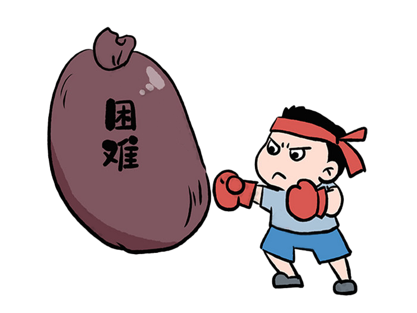

- # photoshop  

## 快捷按键  
https://helpx.adobe.com/cn/photoshop/using/default-keyboard-shortcuts.html  

Option + Shift + Command + K (Mac)  

- `cmd+-` 或者`opt+滚轮` 放大缩小  
- 滚轮上下移动，`cmd+滚轮`左右移动  
- `[]` 画刷大小调整  
- `X`前景色与背景色切换， `D`默认前景色与背景色  
- `/` 前景拾取器，自定义的快捷键    
- `opt+左键` 前景拾取器
## 抠图  
原图: 
 

  </img>

### 选择并遮住  
https://helpx.adobe.com/cn/photoshop/using/select-mask.html  

首先使用`对象选择工具`快速选择，如果有些细节问题，使用快速选择工具进行进行修正,选好选区后，可以在创建一个图层，使用遮罩即可。

> 选择选区，右击选择取消选区  

  </img>

## 去除水印 
### 内容填充  
首先使用选择工具，选择水印区域，使用`选择->色彩范围`选择水印的色彩范围，再使用`选择->修改->拓展`扩大选中范围，最终选择`编辑->填充->内容识别`去除水印，残留的地方需要使用`修复工具`。  

### 画笔工具  

使用`/`拾取前景色，通过`[]`调整画笔大小，再去覆盖水印。  

  </img>

## 图层  
