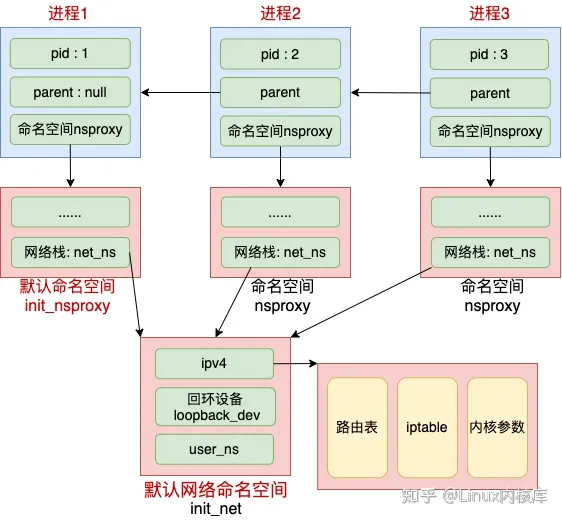

- # cgroup / namespace  

## 入门  
对于容器技术而言，它实现资源层面上的`限制`和`隔离`，依赖于 Linux 内核所提供的 `cgroup` 和 `namespace` 技术。  

我们先对这两项技术的作用做个概括：

- `cgroup` 的主要作用：管理资源的分配、限制；
- `namespace` 的主要作用：封装抽象，限制，隔离，使命名空间内的进程看起来拥有他们自己的全局资源；  

## cgroup  

cgroup 是 Linux 内核的一个功能，用来限制、控制与分离一个进程组的资源（如CPU、内存、磁盘输入输出等）。它是由 Google 的两位工程师进行开发的，自 2008 年 1 月正式发布的 Linux 内核 v2.6.24 开始提供此能力。  

### cgroup 的归属和迁移
系统中的每个进程都属于一个 `cgroup`，一个进程的所有线程都属于同一个 `cgroup`。一个进程可以从一个 `cgroup` 迁移到另一个 `cgroup` 。进程的迁移不会影响现有的后代进程所属的 cgroup。  


## namespace 
namespace 是 Linux 内核的一项特性，它可以对内核资源进行分区，使得一组进程可以看到一组资源；而另一组进程可以看到另一组不同的资源。该功能的原理是为一组资源和进程使用相同的 namespace，但是这些 namespace 实际上引用的是不同的资源。  

namespace 的早期提出及使用要追溯到 Plan 9 from Bell Labs ，贝尔实验室的 Plan 9。这是一个分布式操作系统，由贝尔实验室的计算科学研究中心在八几年至02年开发的（02年发布了稳定的第四版，距离92年发布的第一个公开版本已10年打磨），现在仍然被操作系统的研究者和爱好者开发使用。在 Plan 9 的设计与实现中，我们着重提以下3点内容：  

- 文件系统：所有系统资源都列在文件系统中，以 Node 标识。所有的接口也作为文件系统的一部分呈现。
- Namespace：能更好的应用及展示文件系统的层次结构，它实现了所谓的 “分离”和“独立”。
- 标准通信协议：9P协议（Styx/9P2000）。  

查看所有类型的`namespace`
```sh
lsns
        NS TYPE   NPROCS   PID USER             COMMAND
4026531835 cgroup    150     1 root             /sbin/init
4026531836 pid       150     1 root             /sbin/init
4026531837 user      150     1 root             /sbin/init
4026531838 uts       147     1 root             /sbin/init
4026531839 ipc       150     1 root             /sbin/init
4026531840 mnt       140     1 root             /sbin/init
4026531860 mnt         1    22 root             kdevtmpfs
4026531992 net       150     1 root             /sbin/init
4026532248 mnt         1   440 root             /lib/systemd/systemd-udevd
4026532249 uts         1   440 root             /lib/systemd/systemd-udevd
4026532299 mnt         1 33366 systemd-timesync /lib/systemd/systemd-timesyncd
4026532300 uts         1 33366 systemd-timesync /lib/systemd/systemd-timesyncd
4026532301 mnt         1 35936 systemd-network  /lib/systemd/systemd-networkd
4026532302 mnt         1 35957 systemd-resolve  /lib/systemd/systemd-resolved
4026532306 mnt         2   752 root             dockerd --group docker --exec-root=/run/snap.docker --data-root=/var/snap/docker/common/var-lib-docker --pidfile=/run/snap.docker/docker.pid --config-file=/var/snap/docker/2343/conf
4026532365 mnt         1   747 root             /usr/sbin/irqbalance --foreground
4026532366 mnt         1   757 root             /lib/systemd/systemd-logind
4026532367 uts         1   757 root             /lib/systemd/systemd-logind
4026532368 mnt         1   798 root             /usr/sbin/ModemManager
```

> 4026531992 net       150     1 root             /sbin/init 网络的命名空间  


### namespace类型 
| namespace名称 | 使用的标识 - Flag | 控制内容| 
| ------------ | ---------------- | ------ |
| Cgroup | CLONE_NEWCGROUP| Cgroup root directory cgroup 根目录 | 
| IPC| CLONE_NEWIPC| ystem V IPC, POSIX message queues信号量，消息队列 | 
| Network| CLONE_NEWNET| Network devices, stacks, ports, etc.网络设备，协议栈，端口等等 | 
| Mount| CLONE_NEWNS| Mount points挂载点 | 
| PID| CLONE_NEWPID| Process IDs进程号 | 
| Time| CLONE_NEWTIME| 时钟 | 
| User| CLONE_NEWUSER| 用户和组 ID | 
| UTS| CLONE_NEWUTS| 系统主机名和 NIS(Network Information Service) 主机名（有时称为域名） | 

### Pid Namespace

查看进程的pid空间:  
```sh
ps -ef | grep -i ping
root       37834   37630  0 07:54 pts/7    00:00:00 bash ./ping_tool.sh
root       37835   37834  0 07:54 pts/7    00:00:03 ping baidu.com
root       38007   37993  0 09:02 pts/7    00:00:00 grep --color=auto -i ping

root@matrix:~/work# ps -p 37835 -o pid,pidns
    PID      PIDNS
  37835 4026531836
```

系统调用unshare用于创建新的(PID)namespace，setns用于将进程加入到已经存在的namespace(/proc//ns/pid)。但值得注意的是，调用者(caller)不会加入到新的(指定的)namespace，只有调用者的子进程才会进入新的(指定的)namespace。  


### Network Namespace 
Network Namespace 是实现网络虚拟化的重要功能，它能创建多个隔离的网络空间，它们有独自的网络栈信息。不管是虚拟机还是容器，运行的时候仿佛自己就在独立的网络中。  

Network Namespace 是 Linux 内核提供的功能，可以借助 IP 命令来完成各种操作。IP 命令来自于 iproute2 安装包，一般系统会默认安装。  

```sh
ip netns help
Usage:	ip netns list
	ip netns add NAME
	ip netns attach NAME PID
	ip netns set NAME NETNSID
	ip [-all] netns delete [NAME]
	ip netns identify [PID]
	ip netns pids NAME
	ip [-all] netns exec [NAME] cmd ...
	ip netns monitor
	ip netns list-id [target-nsid POSITIVE-INT] [nsid POSITIVE-INT]
NETNSID := auto | POSITIVE-INT
```

创建网络空间
```sh
$ ip netns add ns-demo
$ ip netns list
ns-demo
```

创建的网络空间在`/var/run/netns/`目录下,如果需要管理其他不是 ip netns 创建的 Network Namespace，只要在这个目录下创建一个指向对应 Network Namespace 文件的链接就行。   

```sh
$ ls -l /var/run/netns/
total 0
-r--r--r-- 1 root root 0 Feb 24 07:31 ns-demo
```

对网络空间进行操作`ip netns exec`:  
```sh
$ ip netns exec ns-demo ip addr
1: lo: <LOOPBACK> mtu 65536 qdisc noop state DOWN group default qlen 1000
    link/loopback 00:00:00:00:00:00 brd 00:00:00:00:00:00
```

也可以进入该空间进行操作`ip netns exec ns-demo bash`  
```sh
root@matrix:~# ip netns exec ns-demo bash
root@matrix:~# ip addr
1: lo: <LOOPBACK> mtu 65536 qdisc noop state DOWN group default qlen 1000
    link/loopback 00:00:00:00:00:00 brd 00:00:00:00:00:00
root@matrix:~# exit
exit
```

执行ping
```sh
$ ip netns exec ns-demo ping 127.0.0.1
ping: connect: Network is unreachable
```

#### 网络空间之间通信

#### 使用网络空间实现进程隔离  

- 进程与网络命名空间？  
Linux 上存在一个默认的网络命名空间，Linux 中的 `1` 号进程初始使用该默认空间。Linux 上其它所有进程都是由 `1` 号进程派生出来的，在派生 `clone` 的时候如果没有额外特别指定，所有的进程都将共享这个默认网络空间。  

首先来考虑的就是我们熟悉的 `socket`。其实每个 `socket` 都是归属于某一个网络命名空间的，这个关联关系在上面的 2.1 小节提到过。

到底归属那个 `netns`，这是由创建这个 `socket` 的进程所属的 `netns` 来决定。当在某个进程里创建 `socket` 的时候，内核就会把当前进程的 `nsproxy->net_ns` 找出来，并把它赋值给 socket 上的网络命名空间成员 `skc_net`


<div align=center>
</img>
</div>

在 clone 里可以指定创建新进程时的 flag，都是 CLONE_ 开头的。和 namespace 有的的标志位有 CLONE_NEWIPC、`CLONE_NEWNET`、CLONE_NEWNS、CLONE_NEWPID 等等。如果在创建进程时指定了 `CLONE_NEWNET` 标记位，那么该进程将会创建并使用新的 netns。  

其实内核提供了三种操作命名空间的方式，分别是 clone、setns 和 unshare。本文中我们只用 clone 来举例，ip netns add 使用的是 unshare，原理和 clone 是类似的。  

> 在默认下，我们创建的 socket 都属于默认的网络命名空间 init_net  

ping_tool.sh
```sh
#!/usr/bin/env bash

echo 'start ping tool'
addr=$1

if [[ "${addr}" == "" ]]; then
    addr="baidu.com"
fi

ping $addr
```

启动命令`nohup ./ping_tool.sh > ping.log 2>&1 &`  


查看命名空间的进程:
```sh
ip netns pids NAME
```

> ip netns delete NAME, 添加进程: 


```sh
cp `which unshare` ./
setcap 'cap_sys_admin+ep' ./unshare

# 创建pid namespace
unshare --pid --mount-proc --fork bash
$ ps -ef
UID          PID    PPID  C STIME TTY          TIME CMD
root           1       0  0 08:51 pts/8    00:00:00 bash
root           8       1  0 08:51 pts/8    00:00:00 ps -ef
```

查看创建的pid空间
```sh
$ ps -ef | grep unshare
root       37946   37748  0 08:51 pts/8    00:00:00 unshare --pid --mount-proc --fork bash
root       37958   37630  0 08:53 pts/7    00:00:00 grep --color=auto unshare

$ pstree -p 37946
unshare(37946)───bash(37947)
```

```sh
cat /etc/lsb-release 
DISTRIB_ID=Ubuntu
DISTRIB_RELEASE=20.04
DISTRIB_CODENAME=focal
DISTRIB_DESCRIPTION="Ubuntu 20.04.5 LTS"
```


