- # 网络模拟工具GNS3学习  

- [环境搭建](#环境搭建)
  - [安装镜像](#安装镜像)
  - [添加模版](#添加模版)
- [demo学习](#demo学习)
  - [telnet指令](#telnet指令)
    - [帮助文档](#帮助文档)
    - [ip 操作](#ip-操作)
  - [交换机](#交换机)
    - [默认交换机](#默认交换机)
    - [GNS3交换机模拟](#gns3交换机模拟)
    - [使用三层交换机IOU](#使用三层交换机iou)
    - [使用交换机模拟路由器](#使用交换机模拟路由器)
  - [路由器](#路由器)
  - [常用指令](#常用指令)
    - [模式](#模式)
    - [修改主机名](#修改主机名)
  - [查看常用指令](#查看常用指令)
    - [vlan操作](#vlan操作)
  - [设备间配置](#设备间配置)
  - [动态路由配置](#动态路由配置)
- [设备操作](#设备操作)
  - [华为交换机操作界面](#华为交换机操作界面)
- [思科指令汇总](#思科指令汇总)


- [网络二层基础讲解 pdf](../resources/files/network/网络二层基础讲解.pdf)  
- [网络三层基础讲解 pdf ](../resources/files/network/网络三层路由讲解.pdf) 
## 环境搭建 

安装界面

<div align=center>
</img>
</div>

<div align=center>
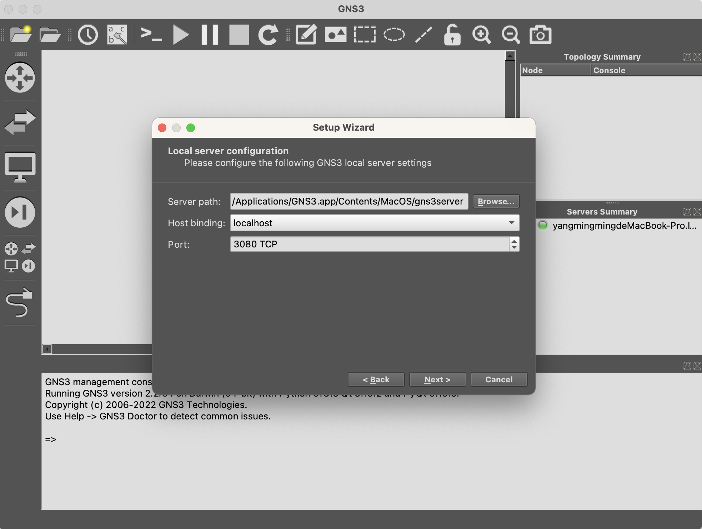</img>
</div>

下载GNS3 VM https://www.gns3.com/software/download-vm  

<div align=center>
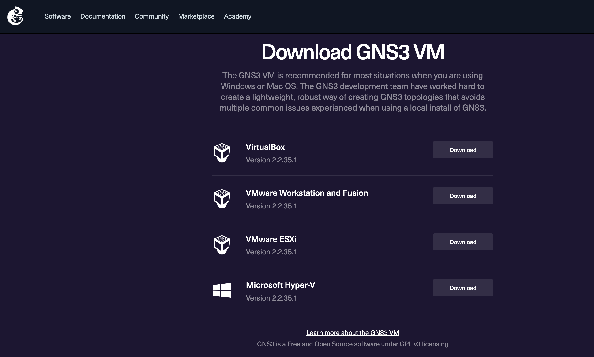</img>
</div>

> 文件名: GNS3.VM.VMware.Workstation.2.2.35.1.zip  

```shell
ls -l /Users/ymm/work/vmware/GNS3\ VM
total 1953656
-rw-r--r--@ 1 ymm  staff        272 11 10 22:56 GNS3 VM.mf
-rw-r--r--@ 1 ymm  staff       8292 11 10 22:56 GNS3 VM.ovf
-rw-r--r--@ 1 ymm  staff  989713920 11 10 22:57 GNS3_VM-disk1.vmdk
-rw-r--r--@ 1 ymm  staff    1951744 11 10 22:59 GNS3_VM-disk2.vmdk
```

<div align=center>
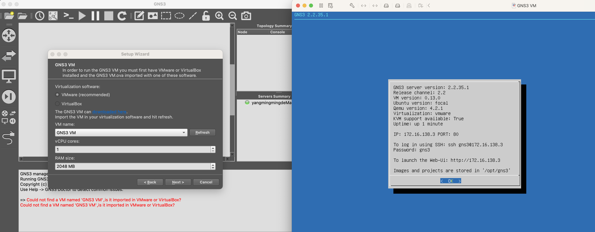</img>
</div>

可以直接访问web界面  

<div align=center>
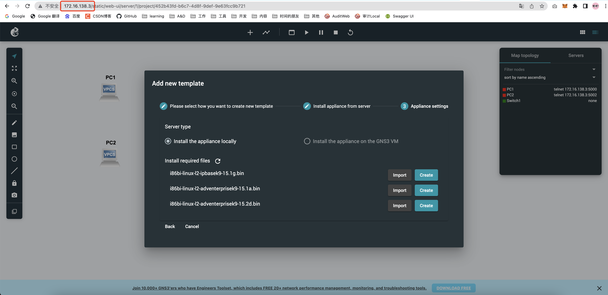</img>
</div>

### 安装镜像
华为的需要使用ensp, 指定虚拟机版本，现在更新需要授权，还是使用cisco的镜像吧!  


### 添加模版  

<div align=center>
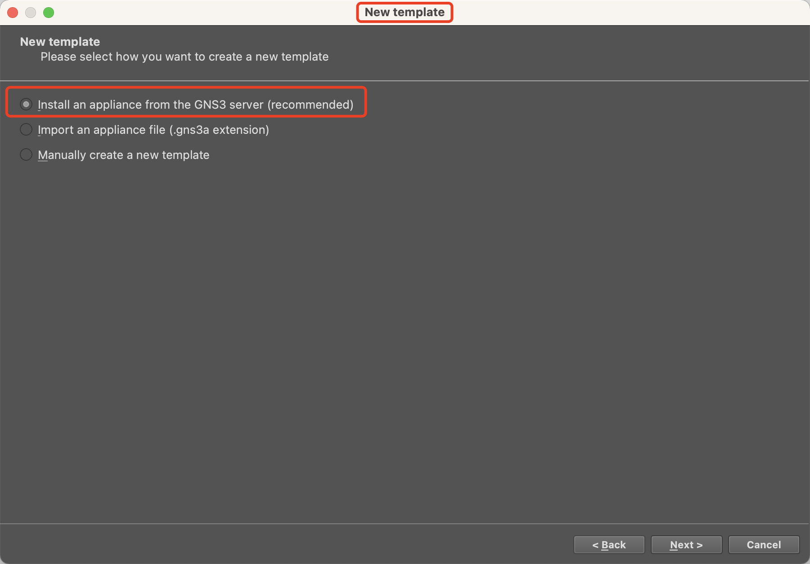</img>
</div>


<div align=center>
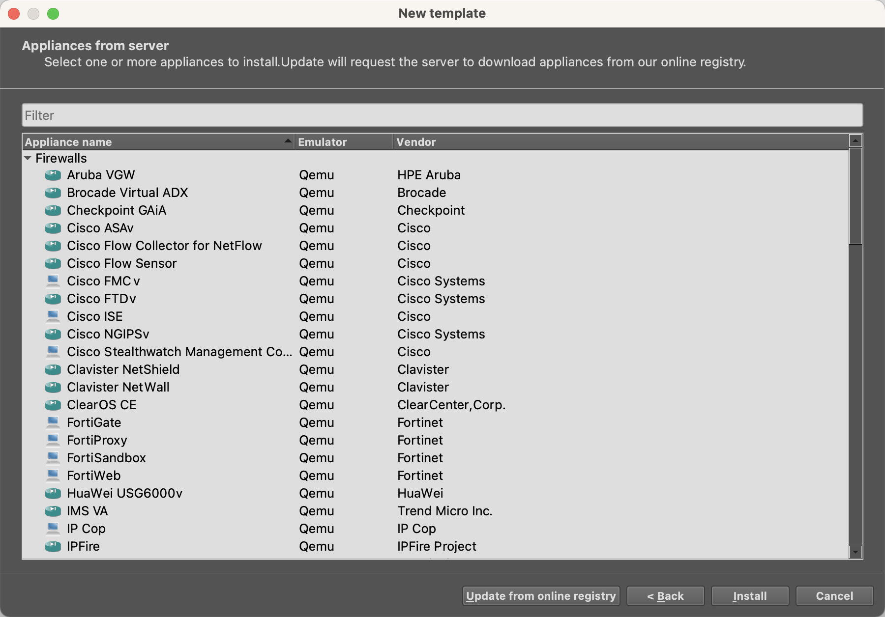</img>
</div>


## demo学习  

### telnet指令

#### 帮助文档  
```shell
PC1> ?

?                        Print help
arp                        Shortcut for: show arp. Show arp table
clear ARG                Clear IPv4/IPv6, arp/neighbor cache, command history
dhcp [OPTION]            Shortcut for: ip dhcp. Get IPv4 address via DHCP
disconnect               Exit the telnet session (daemon mode)
echo TEXT                Display TEXT in output. See also  set echo ?
help                     Print help
history                  Shortcut for: show history. List the command history
ip ARG ... [OPTION]      Configure the current VPC's IP settings. See ip ?
load [FILENAME]          Load the configuration/script from the file FILENAME
ping HOST [OPTION ...]   Ping HOST with ICMP (default) or TCP/UDP. See ping ?
quit                     Quit program
relay ARG ...            Configure packet relay between UDP ports. See relay ?
rlogin [ip] port         Telnet to port on host at ip (relative to host PC)
save [FILENAME]          Save the configuration to the file FILENAME
set ARG ...              Set VPC name and other options. Try set ?
show [ARG ...]           Print the information of VPCs (default). See show ?
sleep [seconds] [TEXT]   Print TEXT and pause running script for seconds
trace HOST [OPTION ...]  Print the path packets take to network HOST
version                  Shortcut for: show version

To get command syntax help, please enter '?' as an argument of the command.
```

#### ip 操作
查看ip `show ip`  
```shell
PC1> show ip

NAME        : PC1[1]
IP/MASK     : 0.0.0.0/0
GATEWAY     : 0.0.0.0
DNS         : 
MAC         : 00:50:79:66:68:00
LPORT       : 20004
RHOST:PORT  : 127.0.0.1:20005
MTU         : 1500
```

设置ip 子网掩码 网关 
`ip 192.168.1.2 24 192.168.1.1`  

```shell
ip ?
ip ARG ... [OPTION]
  Configure the current VPC's IP settings
    ARG ...:
    address [mask] [gateway]
    address [gateway] [mask]
                   Set the VPC's ip, default gateway ip and network mask
                   Default IPv4 mask is /24, IPv6 is /64. Example:
                   ip 10.1.1.70/26 10.1.1.65 set the VPC's ip to 10.1.1.70,
                   the gateway to 10.1.1.65, the netmask to 255.255.255.192.
                   In tap mode, the ip of the tapx is the maximum host ID
                   of the subnet. In the example above the tapx ip would be 
                   10.1.1.126
                   mask may be written as /26, 26 or 255.255.255.192
    auto           Attempt to obtain IPv6 address, mask and gateway using SLAAC
    dhcp [OPTION]  Attempt to obtain IPv4 address, mask, gateway, DNS via DHCP
          -d         Show DHCP packet decode
          -r         Renew DHCP lease
          -x         Release DHCP lease
    dns ip         Set DNS server ip, delete if ip is '0'
    dns6 ipv6      Set DNS server ipv6, delete if ipv6 is '0'
    domain NAME    Set local domain name to NAME
```

输出结果
```shell
PC2> ip 192.168.1.3 24 192.168.1.1
Checking for duplicate address...
PC2 : 192.168.1.3 255.255.255.0 gateway 192.168.1.1
```

pc2 ping pc1 
```shell
PC2> ping 192.168.1.2

84 bytes from 192.168.1.2 icmp_seq=1 ttl=64 time=0.116 ms
84 bytes from 192.168.1.2 icmp_seq=2 ttl=64 time=0.165 ms
```

登录设备
```shell
echo -n -e "\033]0;R1\007"; clear; PATH='/Applications/GNS3.app/Contents/MacOS:/usr/bin:/bin:/usr/sbin:/sbin' telnet 172.16.138.3 5001 ; exit
```

> 不同的设备对应不对的端口.  

### 交换机

#### 默认交换机
配置界面
<div align=center>
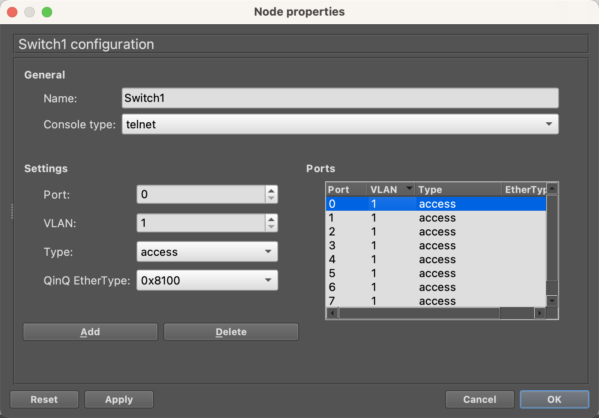</img>
</div>

从图中可以看到交换机的设置，`端口`、`VLAN`、`Type`等  

交换机端口有三种工作模式，分别是`Access`，`Hybrid`，`Trunk`。  
- Access类型的端口只能属于1个VLAN，一般用于连接计算机的端口；
- Trunk类型的端口可以允许多个VLAN通过，可以接收和发送多个VLAN的报文，一般用于交换机之间连接的端口；
- Hybrid类型的端口可以允许多个VLAN通过，可以接收和发送多个VLAN的报文，可以用于交换机之间连接，也可以用于连接用户的计算机。 
- Hybrid端口和Trunk端口在接收数据时，处理方法是一样的，唯一不同之处在于发送数据时：Hybrid端口可以允许多个VLAN的报文发送时不打标签，而Trunk端口只允许缺省VLAN的报文发送时不打标签。

#### GNS3交换机模拟
GNS3 一直都不能使用交换机 IOS 镜像的！如果你想用 GNS3 来模拟交换机，你有两个选择：  
- 请用三层交换机 IOU 镜像（如果关闭了三层交换机的路由功能，那么三层交换机就变成二层交换机了）  
- 请用 3660 、3725 和 3745 系列的路由器加交换模块来模拟交换机（路由器如何模拟交换机？请点击这里）

#### 使用三层交换机IOU 

#### 使用交换机模拟路由器  

1. 删除之前导入的 IOS ；
2. 选择 GNS3 → Preferences → IOS routers → New → 导入 IOS → 勾选 This is an EtherSwitch router → next…… → 默认选择添加了 NM-16ESW（如无则加上）→ 计算 idle 值 → Finish ；
3. 在 GNS3 左侧找到 browse all devices ，选择刚刚新建的 EtherSwitch router 即可；
4. 验证：成功创建 VLAN 。

> Cisco IOS，最早称为互联网操作系统（英语：Internetwork Operating System，简称IOS）是思科公司（Cisco System）为其网络设备开发的操作维护系统。用户可以透过命令行界面对网络设备进行功能设置.  
> IOU 的意思是 IOS On Unix，即是可以在 Unix 系統上運行 IOS。IOU 不但可以模擬 Router，還可以模擬 L3 Switch.  

> CISCO NM-16ESW是一款思科品牌的局域网模块。1个16端口10/100以太交换网络模块  

<div align=center>
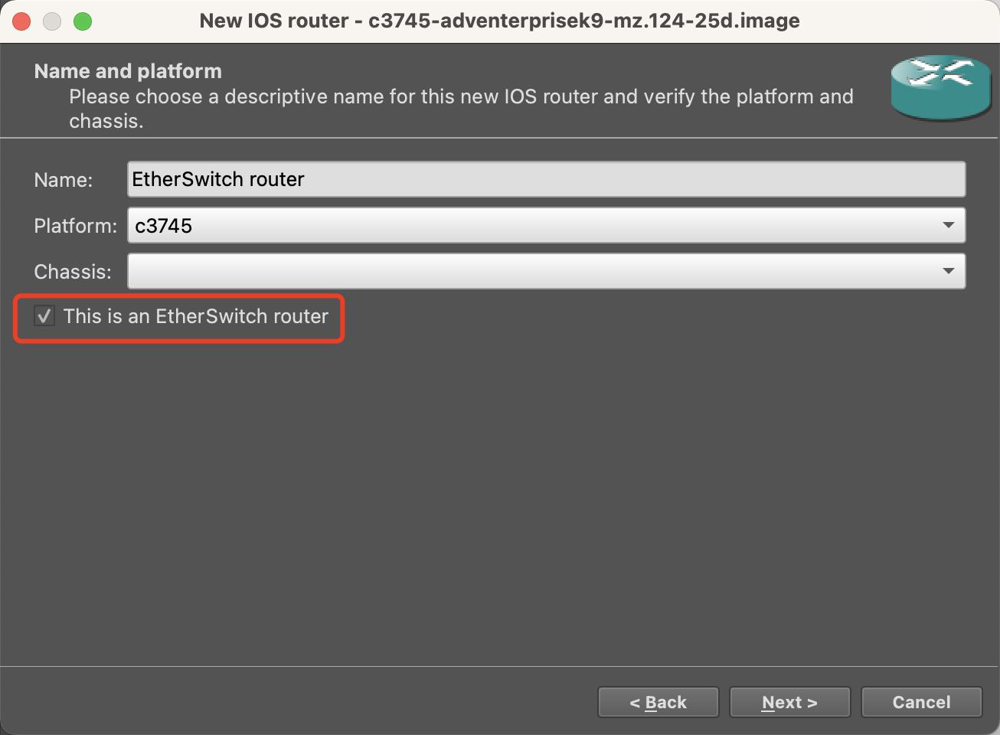</img>
</div>

关闭路由功能
```shell
ESW1(config)#config
Configuring from terminal, memory, or network [terminal]? 
Enter configuration commands, one per line.  End with CNTL/Z.
ESW1(config)#no ip routing
ESW1(config)#exit
ESW1#vlan database
% Warning: It is recommended to configure VLAN from config mode,
as VLAN database mode is being deprecated. Please consult user
documentation for configuring VTP/VLAN in config mode.
ESW1(vlan)#vlan 200
VLAN 200 modified:
 ESW1(vlan)#exit
 APPLY completed.
Exiting....
ESW1#show vlan-switch

VLAN Name                             Status    Ports
---- -------------------------------- --------- -------------------------------
1    default                            active    Fa1/0, Fa1/2, Fa1/3, Fa1/4
                                                  Fa1/5, Fa1/6, Fa1/7, Fa1/8
                                                  Fa1/9, Fa1/10, Fa1/11, Fa1/12
                                                  Fa1/13, Fa1/14, Fa1/15
200  VLAN0200                           active    Fa1/1
1002 fddi-default                    act/unsup
1003 token-ring-default              act/unsup
1004 fddinet-default                 act/unsup
1005 trnet-default                   act/unsup

VLAN Type  SAID       MTU   Parent RingNo BridgeNo Stp  BrdgMode Trans1 Trans2
---- ----- ---------- ----- ------ ------ -------- ---- -------- ------ ------
1    enet   100001     1500   -         -      -      -      -     1002   1003
200  enet   100200     1500   -         -      -      -      -        0      0
1002 fddi   101002     1500   -         -      -      -      -        1   1003
1003 tr     101003     1500  1005       0      -      -    srb        1   1002
1004 fdnet  101004     1500   -         -      1    ibm      -        0      0
1005 trnet  101005     1500   -         -      1    ibm      -        0      0
```

### 路由器  

```
Cisco 7206VXR (NPE400) processor (revision A) with 491520K/32768K bytes of memory.
Processor board ID 4279256517
R7000 CPU at 150MHz, Implementation 39, Rev 2.1, 256KB L2, 512KB L3 Cache
6 slot VXR midplane, Version 2.1
```

帮助文档
```shell
Exec commands:
  access-enable    Create a temporary Access-List entry
  access-profile   Apply user-profile to interface
  access-template  Create a temporary Access-List entry
  alps             ALPS exec commands
  archive          manage archive files
  audio-prompt     load ivr prompt
  auto             Exec level Automation
  beep             Blocks Extensible Exchange Protocol commands
  bfe              For manual emergency modes setting
  calendar         Manage the hardware calendar
  call             Voice call
  call-home        Call-Home commands
  cd               Change current directory
  clear            Reset functions
  clock            Manage the system clock
  cns              CNS agents
  configure        Enter configuration mode
  connect          Open a terminal connection
  copy             Copy from one file to another
  crypto           Encryption related commands.
  debug            Debugging functions (see also 'undebug')
  delete           Delete a file
  dir              List files on a filesystem
  disable          Turn off privileged commands
  disconnect       Disconnect an existing network connection
  emm              Run a configured Menu System
  enable           Turn on privileged commands
  eou              EAPoUDP
  ephone-hunt      ephone hunt exec command
  erase            Erase a filesystem
  ethernet         Ethernet parameters
  event            Event related commands
  exit             Exit from the EXEC
  file-acct        File mode accounting exec command
  flush            File mode accounting flush options
  format           Format a filesystem
  fsck             Fsck a filesystem
  help             Description of the interactive help system
  hw-module        Slot level commands
  if-mgr           IF-MGR operations
  isdn             Run an ISDN EXEC command on an ISDN interface
  lat              Open a lat connection
  lock             Lock the terminal
  login            Log in as a particular user
  logout           Exit from the EXEC
  microcode        microcode commands
  mkdir            Create new directory
  monitor          Monitoring different system events
  more             Display the contents of a file
  mpls             MPLS commands
  mrinfo           Request neighbor and version information from a multicast
                   router
  mrm              IP Multicast Routing Monitor Test
  mstat            Show statistics after multiple multicast traceroutes
  mtrace           Trace reverse multicast path from destination to source
  name-connection  Name an existing network connection
  ncia             Start/Stop NCIA Server
  no               Disable debugging functions
  pad              Open a X.29 PAD connection
  partition        Partition disk
  ping             Send echo messages
  ppp              Start IETF Point-to-Point Protocol (PPP)
  pwd              Display current working directory
  redundancy       Redundancy Facility (RF) exec commands
  release          Release a resource
  reload           Halt and perform a cold restart
  rename           Rename a file
  renew            Renew a resource
  restart          Restart Connection
  resume           Resume an active network connection
  rlogin           Open an rlogin connection
  rmdir            Remove existing directory
  rsh              Execute a remote command
  sdlc             Send SDLC test frames
  send             Send a message to other tty lines
  set              Set system parameter (not config)
  setup            Run the SETUP command facility
  show             Show running system information
  slip             Start Serial-line IP (SLIP)
  spec-file        format spec file commands
  squeeze          Squeeze a filesystem
  ssh              Open a secure shell client connection
  start-chat       Start a chat-script on a line
  systat           Display information about terminal lines
  tarp             TARP (Target ID Resolution Protocol) commands
  tclquit          Quit Tool Command Language shell
  tclsafe          Tool Command Language shell SAFE mode
  tclsh            Tool Command Language shell
  tdm              TDM
  telnet           Open a telnet connection
  terminal         Set terminal line parameters
  test             Test subsystems, memory, and interfaces
  tn3270           Open a tn3270 connection
  traceroute       Trace route to destination
  tunnel           Open a tunnel connection
  udptn            Open an udptn connection
  undebug          Disable debugging functions (see also 'debug')
  undelete         Undelete a file
  upgrade          Upgrade commands
  verify           Verify a file
  voice            Voice Commands
  webvpn           WebVPN exec command
  where            List active connections
  which-route      Do OSI route table lookup and display results
  write            Write running configuration to memory, network, or terminal
  x28              Become an X.28 PAD
  x3               Set X.3 parameters on PAD
  xconnect         Xconnect EXEC commands
```

### 常用指令

#### 模式
```shell
 >enable    #从用户模式切换到特权模式，权限最低，可以说是无功能，啥也不能做。
 #   　　　　#特权模式，可以进行查看端口的IP配置信息，查看主机表等，重启路由器等等操作。 
 
 #configure terminal  　　#从特权模式切换到全局配置模式，权限最高，可以在这里配置vlan等等
 Enter configuration commands, one per line. End with CNTL/Z. (config)#
 
 (config)#exit    　　　　　#从全局配置模式切换到特权模式，如果想要切换到用户模式继续敲击exit即可。
 #
 %SYS-5-CONFIG_I: Configured from console by console
```

#### 修改主机名
```shell
(config)#hostname ymm   #注意：需要在全局配置模式下敲击哟
```

### 查看常用指令
```shell
R1#show hosts # 主机名
Default domain is not set
Name/address lookup uses static mappings

Codes: UN - unknown, EX - expired, OK - OK, ?? - revalidate
       temp - temporary, perm - permanent
       NA - Not Applicable None - Not defined

Host                      Port  Flags      Age Type   Address(es)
R1#
*Nov 29 14:15:46.871: %SYS-5-CONFIG_I: Configured from console by console
R1#show ip interface # 接口及状态
Interface                  IP-Address      OK? Method Status                Protocol
FastEthernet0/0 is administratively down, line protocol is down
  Internet protocol processing disabled
GigabitEthernet1/0 is administratively down, line protocol is down
  Internet protocol processing disabled
GigabitEthernet2/0 is administratively down, line protocol is down
  Internet protocol processing disabled
GigabitEthernet3/0 is administratively down, line protocol is down
  Internet protocol processing disabled

R1#show ip route  # 路由表
Codes: C - connected, S - static, R - RIP, M - mobile, B - BGP
       D - EIGRP, EX - EIGRP external, O - OSPF, IA - OSPF inter area 
       N1 - OSPF NSSA external type 1, N2 - OSPF NSSA external type 2
       E1 - OSPF external type 1, E2 - OSPF external type 2
       i - IS-IS, su - IS-IS summary, L1 - IS-IS level-1, L2 - IS-IS level-2
       ia - IS-IS inter area, * - candidate default, U - per-user static route
       o - ODR, P - periodic downloaded static route

Gateway of last resort is not set

ESW1#show mac-address-table  # 交换机的mac表  
Destination Address  Address Type  VLAN  Destination Port
-------------------  ------------  ----  --------------------
c402.43ab.0000		Self	      1	    Vlan1
```

#### vlan操作
```shell
ESW1#vlan data   # 进入vlan模式
ESW1(vlan)#vlan 300 name vlan-test-300   # 创建
VLAN 300 added:
    Name: vlan-test-300
ESW1(vlan)#no vlan 300     # 删除
Deleting VLAN 300...
ESW1(vlan)#exit
APPLY completed.
Exiting....
ESW1#show vlan-switch        # 查看

VLAN Name                             Status    Ports
---- -------------------------------- --------- -------------------------------
1    default                          active    Fa1/2, Fa1/3, Fa1/4, Fa1/5
                                                Fa1/6, Fa1/7, Fa1/8, Fa1/9
                                                Fa1/10, Fa1/11, Fa1/12, Fa1/13
                                                Fa1/14, Fa1/15
200  VLAN0200                         active    Fa1/0, Fa1/1
1002 fddi-default                     active    
1003 token-ring-default               active    
1004 fddinet-default                  active    
1005 trnet-default                    active    

VLAN Type  SAID       MTU   Parent RingNo BridgeNo Stp  BrdgMode Trans1 Trans2
---- ----- ---------- ----- ------ ------ -------- ---- -------- ------ ------
1    enet  100001     1500  -      -      -        -    -        1002   1003
200  enet  100200     1500  -      -      -        -    -        0      0   
1002 fddi  101002     1500  -      -      -        -    -        1      1003
1003 tr    101003     1500  1005   0      -        -    srb      1      1002
1004 fdnet 101004     1500  -      -      1        ibm  -        0      0   
1005 trnet 101005     1500  -      -      1        ibm  -        0      0  
```

将交换机接口添加到vlan中
```shell
ESW1#configure terminal
Enter configuration commands, one per line.  End with CNTL/Z.
ESW1(config)#interface f1/0
ESW1(config-if)#switchport mode access
ESW1(config-if)#switchport access vlan 200
ESW1(config-if)#exit
ESW1(config)#interface f1/1
ESW1(config-if)#switchport mode access
ESW1(config-if)#switchport access vlan 200
ESW1(config-if)#exit
ESW1(config)#exit
```

将接口从vlan中删除
```shell
ESW1(config)#interface range FastEthernet 1/1
ESW1(config-if-range)#no switchport access vlan 200
ESW1(config-if-range)#exit
ESW1(config)#interface range FastEthernet 1/2
ESW1(config-if-range)#no switchport access vlan 200
ESW1(config-if-range)#exit

ESW1#show vlan-switch

VLAN Name                             Status    Ports
---- -------------------------------- --------- -------------------------------
1    default                          active    Fa1/0, Fa1/1, Fa1/2, Fa1/3
                                                Fa1/4, Fa1/5, Fa1/6, Fa1/7
                                                Fa1/8, Fa1/9, Fa1/10, Fa1/11
                                                Fa1/12, Fa1/13, Fa1/14, Fa1/15
200  VLAN0200                         active    
1002 fddi-default                     active    
1003 token-ring-default               active    
1004 fddinet-default                  active    
1005 trnet-default                    active    
```

添加和删除vlan的管理ip
```shell
ESW1(config)#interface vlan 200
ESW1(config-if)#ip add 192.168.2.1 255.255.255.0 
ESW1(config-if)#no ip address
ESW1(config-if)#exit
```

### 设备间配置

<div align=center>
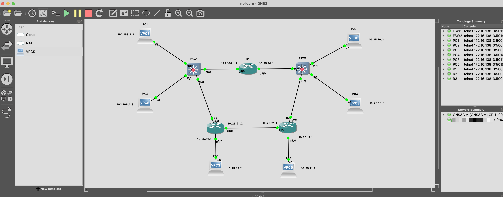</img>
</div>


PC1
```shell
ip 192.168.1.2 24 192.168.1.1

PC1> show ip

NAME        : PC1[1]
IP/MASK     : 192.168.1.2/24
GATEWAY     : 192.168.1.1
DNS         : 
MAC         : 00:50:79:66:68:00
LPORT       : 20028
RHOST:PORT  : 127.0.0.1:20029
MTU         : 1500
```

PC2
```shell
ip 192.168.1.3 24 192.168.1.1
```


PC3
```shell
ip 10.25.1.2 24 10.25.1.1
```


PC4
```shell
ip 10.25.1.3 24 10.25.1.1
```

PC5
```shell
ip 10.25.12.2 24 10.25.12.1
```


PC6
```shell
ip 10.25.11.2 24 10.25.11.1
```


ESW1
```shell
-- 关闭路由
ESW1#config
Configuring from terminal, memory, or network [terminal]? 
Enter configuration commands, one per line.  End with CNTL/Z.
ESW1(config)#no ip routing
ESW1(config)#exit 

-- 查看接口状态 show ip interface brief
ESW1(config)#do show ip int bri
Interface                  IP-Address      OK? Method Status                Protocol
FastEthernet0/0            unassigned      YES NVRAM  administratively down down    
FastEthernet0/1            unassigned      YES NVRAM  administratively down down    
FastEthernet1/0            unassigned      YES unset  up                    up      
FastEthernet1/1            unassigned      YES unset  up                    up      
FastEthernet1/2            unassigned      YES unset  up                    up      
FastEthernet1/3            unassigned      YES unset  up                    up      
FastEthernet1/4            unassigned      YES unset  up                    down    
FastEthernet1/5            unassigned      YES unset  up                    down    
FastEthernet1/6            unassigned      YES unset  up                    down    
FastEthernet1/7            unassigned      YES unset  up                    down    
FastEthernet1/8            unassigned      YES unset  up                    down   


-- 查看vlan  
ESW1#vlan ?
  database  Configure VLAN database
ESW1#vlan database
ESW1(vlan)#show
  VLAN ISL Id: 1
    Name: default
    Media Type: Ethernet
    VLAN 802.10 Id: 100001
    State: Operational
    MTU: 1500
    Translational Bridged VLAN: 1002
    Translational Bridged VLAN: 1003
...

-- 查看vlan帮助
ESW1(vlan)#?
VLAN database editing buffer manipulation commands:
  abort  Exit mode without applying the changes
  apply  Apply current changes and bump revision number
  exit   Apply changes, bump revision number, and exit mode
  no     Negate a command or set its defaults
  reset  Abandon current changes and reread current database
  show   Show database information
  vlan   Add, delete, or modify values associated with a single VLAN
  vtp    Perform VTP administrative functions.

-- 查看vlan
ESW1#show vlan-switch

VLAN Name                             Status    Ports
---- -------------------------------- --------- -------------------------------
1    default                          active    Fa1/0, Fa1/1, Fa1/2, Fa1/3
                                                Fa1/4, Fa1/5, Fa1/6, Fa1/7
                                                Fa1/8, Fa1/9, Fa1/10, Fa1/11
                                                Fa1/12, Fa1/13, Fa1/14, Fa1/15
200  VLAN0200                         active    
1002 fddi-default                     active    
1003 token-ring-default               active    
1004 fddinet-default                  active    
1005 trnet-default                    active    

VLAN Type  SAID       MTU   Parent RingNo BridgeNo Stp  BrdgMode Trans1 Trans2
---- ----- ---------- ----- ------ ------ -------- ---- -------- ------ ------
1    enet  100001     1500  -      -      -        -    -        1002   1003
200  enet  100200     1500  -      -      -        -    -        0      0   
1002 fddi  101002     1500  -      -      -        -    -        1      1003
1003 tr    101003     1500  1005   0      -        -    srb      1      1002
1004 fdnet 101004     1500  -      -      1        ibm  -        0      0   
1005 trnet 101005     1500  -      -      1        ibm  -        0      0 

-- 划分vlan
ESW1#configure terminal
Enter configuration commands, one per line.  End with CNTL/Z.
ESW1(config)#interface f1/0
ESW1(config-if)#switchport mode access
ESW1(config-if)#switchport access vlan 200
ESW1(config-if)#exit
ESW1(config)#interface f1/1
ESW1(config-if)#switchport mode access
ESW1(config-if)#switchport access vlan 200
ESW1(config-if)#exit
ESW1(config)#interface f1/2
ESW1(config-if)#switchport mode access
ESW1(config-if)#switchport access vlan 200
ESW1(config-if)#exit
ESW1(config)#exit

ESW1#show vlan-switch

VLAN Name                             Status    Ports
---- -------------------------------- --------- -------------------------------
1    default                          active    Fa1/2, Fa1/3, Fa1/4, Fa1/5
                                                Fa1/6, Fa1/7, Fa1/8, Fa1/9
                                                Fa1/10, Fa1/11, Fa1/12, Fa1/13
                                                Fa1/14, Fa1/15
200  VLAN0200                         active    Fa1/0, Fa1/1

-- 查看是否生效
ESW1#ping 192.168.1.2
% Unrecognized host or address, or protocol not running.

-- 查看mac地址表
ESW1#show mac-address-table
Destination Address  Address Type  VLAN  Destination Port
-------------------  ------------  ----  --------------------
c402.43ab.0000		Self	      1	    Vlan1

-- 查看配置信息
R1#show run
interface FastEthernet1/0
 switchport access vlan 200
 duplex full
 speed 100
!
interface FastEthernet1/1
 switchport access vlan 200
 duplex full
 speed 100

 interface Vlan200
 ip address 192.168.1.10 255.255.255.0
!
ip forward-protocol nd

```

R1  
在使用路由器前，需要计算`Idle-PC`的值, 减少性能消耗    
> 在计算机系统上运行的每个程序或任务都会占用 CPU 一定的处理时间。如果 CPU 已完成所有任务，则它处于空闲状态。  
```shell
-- show ip 帮助文档
R1#show ip ?
  access-lists            List IP access lists
  accounting              The active IP accounting database
  admission               Network Admission Control information
  aliases                 IP alias table
  arp                     IP ARP table
  as-path-access-list     List AS path access lists
  auth-proxy              Authentication Proxy information
  bgp                     BGP information
  cache                   IP fast-switching route cache
  cef                     Cisco Express Forwarding
  community-list          List community-list
  ddns                    Dynamic DNS
  device                  Show IP Tracking Hosts
  dfp                     DFP information
  dhcp                    Show items in the DHCP database
  dns                     Show DNS information
  drp                     Director response protocol
  dvmrp                   DVMRP information
  eigrp                   IP-EIGRP show commands
  explicit-paths          Show IP explicit paths
  extcommunity-list       List extended-community list
  flow                    NetFlow switching
  helper-address          helper-address table
  host-list               Host list
  http                    HTTP information
  icmp                    ICMP information
  igmp                    IGMP information
  inspect                 CBAC (Context Based Access Control) information
  interface               IP interface status and configuration
  ips                     IPS (Intrusion Prevention System) information
  irdp                    ICMP Router Discovery Protocol
  local                   IP local options
  masks                   Masks associated with a network
  mcache                  IP multicast fast-switching cache
  mobile                  IP Mobility information
  mpacket                 Display possible duplicate multicast packets
  mrm                     IP Multicast Routing Monitor information
  mroute                  IP multicast routing table
  msdp                    Multicast Source Discovery Protocol (MSDP)
  multicast               Multicast global information
  nat                     IP NAT information
  nbar                    Network-Based Application Recognition
  nhrp                    NHRP information
  ospf                    OSPF information
  pgm                     PGM Reliable Transport Protocol
  pim                     PIM information
  policy                  Policy routing
  policy-list             List IP Policy list
  port-map                Port to Application Mapping (PAM) information
  prefix-list             List IP prefix lists
  protocols               IP routing protocol process parameters and statistics
  redirects               IP redirects
  rip                     IP RIP show commands
  route                   IP routing table
  rpf                     Display RPF information for multicast source
  rsvp                    RSVP information
  rtp                     RTP/UDP/IP header-compression statistics
  sap                     Session Announcement Protocol cache
  sdee                    SDEE (Security Device Event Exchange) information
  sla                     Service Level Agreement (SLA)
  slb                     SLB information
  snat                    IP NAT SNAT information
  ssh                     Information on SSH
  tcp                     TCP/IP header-compression statistics
  traffic                 IP protocol statistics
  traffic-export          Show ip traffic-export statistics
  trigger-authentication  Trigger-authentication host table
  urlfilter               IOS URL Filtering Information
  virtual-reassembly      IP Virtual Fragment Reassembly (VFR) information
  vrf                     VPN Routing/Forwarding instance information
  wccp                    WCCP information
  
-- 查看路由表

-- 添加ip
R1#config t
R1(config)#interface GigabitEthernet 1/0  
R1(config-if)#ip address 192.168.1.1 255.255.255.0
R1(config-if)#no shutdown
R1(config-if)#exit
R1(config)#interface GigabitEthernet 2/0  
R1(config-if)#ip address 10.25.1.1 255.255.255.0
R1(config-if)#no shutdown

-- 配置动态路由
R1(config)#router rip
R1(config-router)#version 2
R1(config-router)#no auto-summary 
R1(config-router)#network 192.168.1.0
R1(config-router)#network 10.25.1.0  

R1(config-if)#do show ip route
Codes: C - connected, S - static, R - RIP, M - mobile, B - BGP
       D - EIGRP, EX - EIGRP external, O - OSPF, IA - OSPF inter area 
       N1 - OSPF NSSA external type 1, N2 - OSPF NSSA external type 2
       E1 - OSPF external type 1, E2 - OSPF external type 2
       i - IS-IS, su - IS-IS summary, L1 - IS-IS level-1, L2 - IS-IS level-2
       ia - IS-IS inter area, * - candidate default, U - per-user static route
       o - ODR, P - periodic downloaded static route

Gateway of last resort is not set

     10.0.0.0/24 is subnetted, 1 subnets
C       10.25.1.0 is directly connected, GigabitEthernet2/0
C    192.168.1.0/24 is directly connected, GigabitEthernet1/0
R1(config-if)#

-- 查看arp表
R1#show ip arp
Protocol  Address          Age (min)  Hardware Addr   Type   Interface
Internet  10.25.1.1               -   ca01.151a.0038  ARPA   GigabitEthernet2/0
Internet  192.168.1.1             -   ca01.151a.001c  ARPA   GigabitEthernet1/0

-- 查看配置信息
R1#show run
interface FastEthernet0/0
 no ip address
 shutdown
 duplex half
!
interface GigabitEthernet1/0
 ip address 192.168.1.12 255.255.255.0
 negotiation auto
!
interface GigabitEthernet2/0
 ip address 10.25.1.12 255.255.255.0
 negotiation auto
!         
interface GigabitEthernet3/0
 no ip address
 shutdown
 negotiation auto
```


R2
```shell
R2#config t
R2(config)#interface GigabitEthernet 3/0  
R2(config-if)#ip address 10.25.12.1 255.255.255.0
R2(config-if)#no shutdown
R2(config-if)#exit
R2(config)#interface GigabitEthernet 1/0  
R2(config-if)#ip address 10.25.21.2 255.255.255.0
R2(config-if)#no shutdown
R2(config-if)#do show ip int bri
Interface                  IP-Address      OK? Method Status                Protocol
FastEthernet0/0            unassigned      YES unset  administratively down down    
GigabitEthernet1/0         10.25.21.2      YES manual up                    up      
GigabitEthernet3/0         10.25.12.1      YES manual up                    up   
R2(config)#ip route 10.25.10.1 255.255.255.0 GigabitEthernet1/0
%Inconsistent address and mask
-- 要添加网络的网络号
R2(config)#ip route 10.25.10.0 255.255.255.0 GigabitEthernet1/0
-- 删除静态路由
R2(config)#no ip route 10.25.10.0 255.255.255.0 GigabitEthernet1/0
-- 目的网段，下个设备/下一跳
R2(config)#ip route 10.25.11.0 255.255.255.0 10.25.21.1
R2(config)#do show ip route                               
Codes: C - connected, S - static, R - RIP, M - mobile, B - BGP
       D - EIGRP, EX - EIGRP external, O - OSPF, IA - OSPF inter area 
       N1 - OSPF NSSA external type 1, N2 - OSPF NSSA external type 2
       E1 - OSPF external type 1, E2 - OSPF external type 2
       i - IS-IS, su - IS-IS summary, L1 - IS-IS level-1, L2 - IS-IS level-2
       ia - IS-IS inter area, * - candidate default, U - per-user static route
       o - ODR, P - periodic downloaded static route

Gateway of last resort is not set

     10.0.0.0/24 is subnetted, 3 subnets
C       10.25.21.0 is directly connected, GigabitEthernet1/0
S       10.25.11.0 [1/0] via 10.25.21.1
C       10.25.12.0 is directly connected, GigabitEthernet3/0
```

R3
```shell
R3#config t
R3(config)#interface GigabitEthernet 3/0  
R3(config-if)#ip address 10.25.11.1 255.255.255.0
R3(config-if)#no shutdown
R3(config-if)#exit
R3(config)#interface GigabitEthernet 1/0  
R3(config-if)#ip address 10.25.21.1 255.255.255.0
R3(config-if)#no shutdown
R3(config-if)#exit
R3(config)#ip route 10.25.11.0 255.255.255.0 GigabitEthernet1/0
R3(config)#do show ip route
Codes: C - connected, S - static, R - RIP, M - mobile, B - BGP
       D - EIGRP, EX - EIGRP external, O - OSPF, IA - OSPF inter area 
       N1 - OSPF NSSA external type 1, N2 - OSPF NSSA external type 2
       E1 - OSPF external type 1, E2 - OSPF external type 2
       i - IS-IS, su - IS-IS summary, L1 - IS-IS level-1, L2 - IS-IS level-2
       ia - IS-IS inter area, * - candidate default, U - per-user static route
       o - ODR, P - periodic downloaded static route

Gateway of last resort is not set

     10.0.0.0/24 is subnetted, 2 subnets
C       10.25.21.0 is directly connected, GigabitEthernet1/0
C       10.25.11.0 is directly connected, GigabitEthernet3/0
R3(config)#ip route 10.25.12.0 255.255.255.0 10.25.21.1
%Invalid next hop address (it's this router) -- 下一跳不能是自己
R3(config)#do show ip route
Codes: C - connected, S - static, R - RIP, M - mobile, B - BGP
       D - EIGRP, EX - EIGRP external, O - OSPF, IA - OSPF inter area 
       N1 - OSPF NSSA external type 1, N2 - OSPF NSSA external type 2
       E1 - OSPF external type 1, E2 - OSPF external type 2
       i - IS-IS, su - IS-IS summary, L1 - IS-IS level-1, L2 - IS-IS level-2
       ia - IS-IS inter area, * - candidate default, U - per-user static route
       o - ODR, P - periodic downloaded static route

Gateway of last resort is not set

     10.0.0.0/24 is subnetted, 3 subnets
C       10.25.21.0 is directly connected, GigabitEthernet1/0
C       10.25.11.0 is directly connected, GigabitEthernet3/0
S       10.25.12.0 [1/0] via 10.25.21.2
R3#ping 10.25.12.2

Type escape sequence to abort.
Sending 5, 100-byte ICMP Echos to 10.25.12.2, timeout is 2 seconds:
!!!!!
Success rate is 100 percent (5/5), round-trip min/avg/max = 20/36/88 ms
```

> 要以二层转发的思维去思考，ip 、 arp 、 mac, 路由器收到目的mac是自己的数据包后，查询路由表和发送arp协议，重新封装源mac和目的mac。  

### 动态路由配置
R2
```
R2#config t
R2(config)#interface GigabitEthernet 3/0  
R2(config-if)#ip address 10.25.12.1 255.255.255.0
R2(config-if)#no shutdown
R2(config-if)#exit
R2(config)#interface GigabitEthernet 1/0  
R2(config-if)#ip address 10.25.21.2 255.255.255.0
R2(config-if)#no shutdown
R2(config)#router rip
R2(config-router)#version 2
R2(config-router)#no auto-summary 
R2(config-router)#network 10.25.12.1
R2(config-router)#network 10.25.21.2  
R2(config)#do show ip route
Codes: C - connected, S - static, R - RIP, M - mobile, B - BGP
       D - EIGRP, EX - EIGRP external, O - OSPF, IA - OSPF inter area 
       N1 - OSPF NSSA external type 1, N2 - OSPF NSSA external type 2
       E1 - OSPF external type 1, E2 - OSPF external type 2
       i - IS-IS, su - IS-IS summary, L1 - IS-IS level-1, L2 - IS-IS level-2
       ia - IS-IS inter area, * - candidate default, U - per-user static route
       o - ODR, P - periodic downloaded static route

Gateway of last resort is not set

     10.0.0.0/24 is subnetted, 3 subnets
C       10.25.21.0 is directly connected, GigabitEthernet1/0
R       10.25.11.0 [120/1] via 10.25.21.1, 00:00:08, GigabitEthernet1/0
C       10.25.12.0 is directly connected, GigabitEthernet3/0
```

R3
```
R3#config t
R3(config)#interface GigabitEthernet 3/0  
R3(config-if)#ip address 10.25.11.1 255.255.255.0
R3(config-if)#no shutdown
R3(config-if)#exit
R3(config)#interface GigabitEthernet 1/0  
R3(config-if)#ip address 10.25.21.1 255.255.255.0
R3(config-if)#no shutdown
R3(config-if)#exit
R3(config)#router rip
R3(config-router)#version 2
R3(config-router)#no auto-summary 
R3(config-router)#network 10.25.11.1
R3(config-router)#network 10.25.21.1  
R3(config)#do show ip route                               
Codes: C - connected, S - static, R - RIP, M - mobile, B - BGP
       D - EIGRP, EX - EIGRP external, O - OSPF, IA - OSPF inter area 
       N1 - OSPF NSSA external type 1, N2 - OSPF NSSA external type 2
       E1 - OSPF external type 1, E2 - OSPF external type 2
       i - IS-IS, su - IS-IS summary, L1 - IS-IS level-1, L2 - IS-IS level-2
       ia - IS-IS inter area, * - candidate default, U - per-user static route
       o - ODR, P - periodic downloaded static route

Gateway of last resort is not set

     10.0.0.0/24 is subnetted, 3 subnets
C       10.25.21.0 is directly connected, GigabitEthernet1/0
C       10.25.11.0 is directly connected, GigabitEthernet3/0
S       10.25.12.0 [1/0] via 10.25.21.2
```

PC5与PC6可以ping通的
```shell
PC6> ping 10.25.12.2

84 bytes from 10.25.12.2 icmp_seq=1 ttl=62 time=50.108 ms
84 bytes from 10.25.12.2 icmp_seq=2 ttl=62 time=55.092 ms
84 bytes from 10.25.12.2 icmp_seq=3 ttl=62 time=30.493 ms
```

## 设备操作
### 华为交换机操作界面
[华为官方文档](https://support.huawei.com/hedex/hdx.do?docid=EDOC1100276020&lang=zh&idPath=24030814%7C21782164%7C21782167%7C22318634%7C6635912)  
设备概览
<div align=center>
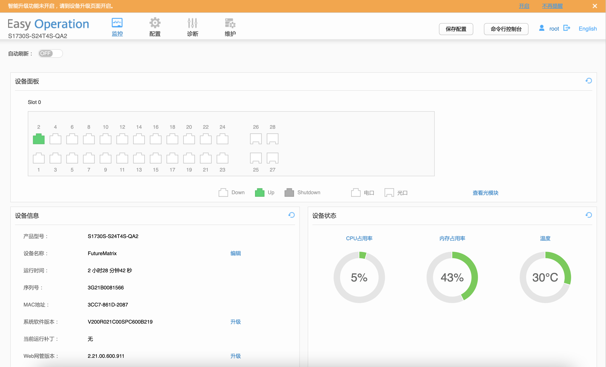</img>
</div>

进阶配置->镜像口配置
<br>
<div align=center>
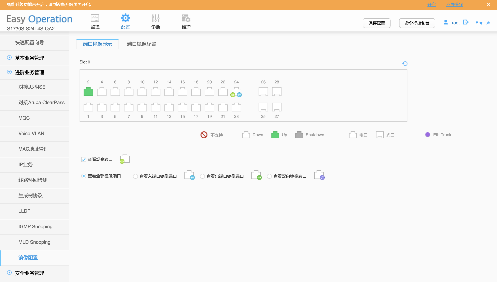</img>
</div>

辅助配置->Trace Route
<br>
<div align=center>
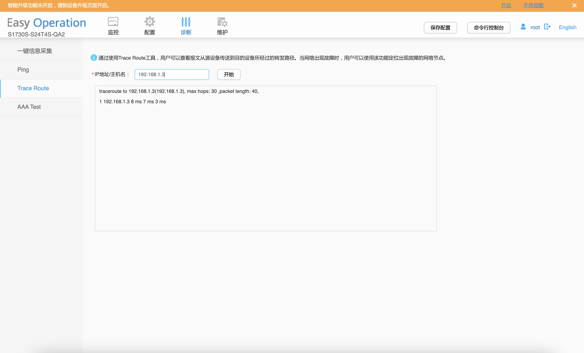</img>
</div>


## 思科指令汇总
```shell
基本配置命令

enable 从用户模式进入特权模式

configure terminal 进入配置模式 

interface g0/0 进入千兆以太网接口模式

ip address 172.16.0.1 255.255.0.0 配置接口的ip 地址     

no shutdown 打开接口

line vty 0 4 进入虚拟终端vty 0 - vty 4             

password CISCO 配置密码

login 用户要进入路由器，需要先进行登录 

exit 退回到上一级模式

enable password CISCO 配置进入特权模式的密码，密码不加密  

end 直接回到特权模式

show int g0/0 显示g0/0 接口的信息   

hostname Terminal-Server 配置路由器的主机名

enable secret ccielab 配置进入特权模式的密码，密码加密

no ip domain-lookup 路由器不使用DNS 服务器解析主机的IP 地址

logging synchronous 路由器上的提示信息进行同步，防止信息干扰我们输入命令

no ip routing 关闭路由器的路由功能

ip default-gateway 10.1.14.254 配置路由器访问其他网段时所需的网关

show line 显示各线路的状态     line 33 48 进入33-48 线路模式

transport input all 允许所有协议进入线路 

int loopback0 进入loopback0 接口

ip host R1 2033 1.1.1.1 为1.1.1.1 主机起一个主机名

alias exec cr1 clear line 33 为命令起一个别名

privilege exec level 0 clear line 把命令clear line 的等级改为0,在用户模式下也可以执行它

banner motd 设置用户登录路由器时的提示信

clock set 设置路由器的时间

show clock 显示路由器的时间

show history 显示历史命令

terminal no editing 关闭CLI 的编辑功能

terminal editing 打开CLI 的编辑功能

terminal history size 50 修改历史命令缓冲区的大小

copy running-config startup-config 把内存中的配置文件保存到NVRAM 中

clock rate 128000 配置串口上的时钟(DCE 端)

show version 显示路由器的IOS 版本等信息

show running-config 显示内存中的配置文件

show startup-config 显示NVRAM 中的配置文件   

show interface s0/0/0 显示接口的信息

show flash 显示flash 的有关信息  

show controllers s0/0/0 显示s0/0/0 的控制器信息

show ip arp 显示路由器中的arp 表

copy running-config tftp 把内存中的配置文件拷贝到tftp 服务器上

copy tftp running-config 把tftp 服务器上的配置文件拷贝到内存中

copy flash:c2800nm-adventerprisek9-mz.124-11.T1.bin tftp 把flash 中的IOS 拷贝到tftp 服务器上

confreg 0x2142 在rommon 模式下修改配置寄存器值

i 在rommon 模式下重启路由器

copy startup-config running-config 把NVRAM 中的配置文件拷贝到内存中

config-register 0x2102 修改配置寄存器值 

reload 重启路由器

delete flash:c2800nm-adventerprisek9-mz.124-11.T1.bin删除flash 中的IOS

copy tftp flash 从tftp 服务器上拷贝IOS 到flash 中

tftpdnld rommon 模式下，从tftp 服务器下载IOS

show cdp 显示CDP 运行信息    

show cdp interface 显示CDP 在各接口的运行情况

show cdp neighbors 显示CDP 邻居信息

show cdp entry R2 显示CDP 邻居R2 的详细信息

clear cdp table 清除CDP 邻居表    

no cdp enable 接口下关闭CDP

no cdp run/ cdp run 关闭/打开整个路由器的CDP

cdp timer 30 CDP 每30 秒发送一次

cdp holdtime 120 让邻居为本设备发送的CDP 消息保持120 秒

静态路由相关配置

ip route X.X.X.X 掩码 接口或者下一条ip地址 配置静态路由 

show ip route 查看路由表

ip classless/ no ip classless 打开/关闭有类路由功能

ping 2.2.2.2 source loopback 0 指定源端口进行ping 测试

RIP命令汇总

show ip route 查看路由表

show ip protocols 查看IP 路由协议配置和统计信息

show ip rip database 查看RIP 数据库

debug ip rip 动态查看RIP 的更新过程  

clear ip route * 清除路由表

router rip 启动RIP 进程  

network 通告网络 

version 定义RIP 的版本

no auto-summary 关闭自动汇总 

ip rip send version 配置RIP 发送的版本

ip rip receive version 配置RIP 接收的版本   

passive-interface 配置被动接口

neighbor 配置单播更新的目标 

ip summary-address rip 配置RIP 手工汇总

key chain 定义钥匙链 

key key-id 配置Key ID     

key-string 配置Key ID 的密匙

ip rip triggered 配置触发更新 

ip rip authentication mode 配置认证模式

ip rip authentication key-chain 配置认证使用的钥匙链 

timers basic 配置更新的计时器

maximum-paths 配置等价路径的最大值 

ip default-network 向网络中注入默认路由

EIGRP相关配置命令

show ip eigrp neighbors 查看EIGRP 邻居表

show ip eigrp topology 查看EIGRP 拓扑结构数据库

show ip eigrp interface 查看运行EIGRP 路由协议的接口的状况

show ip eigrp traffic 查看EIGRP 发送和接收到的数据包的统计情况

debug eigrp neighbors 查看EIGRP 动态建立邻居关系的情况

debug eigrp packets 显示发送和接收的EIGRP 数据包

ip hello-interval eigrp 配置EIGRP 的HELLO 发送周期

ip hold-time eigrp 配置EIGRP 的HELLO hold 时间

router eigrp XX启动EIGRP 路由进程   

no auto-summary 关闭自动汇总

ip authentication mode eigrp 配置EIGRP 的认证模式

ip authentication key-chain eigrp在接口上调用钥匙链

variance 配置非等价负载均衡 

delay 配置接口下的延迟

bandwidth 配置接口下的带宽 

ip summary-address eigrp 手工路由汇总

OSPF相关配置命令

show ip route 查看路由表

show ip ospf neighbor 查看OSPF 邻居的基本信息

show ip ospf database 查看OSPF 拓扑结构数据库

show ip ospf interface 查看OSPF 路由器接口的信息

show ip ospf 查看OSPF 进程及其细节

debug ip ospf adj 显示OSPF 邻接关系创建或中断的过程

debug ip ospf events 显示OSPF 发生的事件

debug ip ospf packet 显示路由器收到的所有的OSPF 数据包

router ospf 启动OSPF 路由进程                  

router-id 配置路由器ID

network 通告网络及网络所在的区域 

ip ospf network 配置接口网络类型

ip ospf cost 配置接口cost 值                     

ip ospf hello-interval 配置hello 间隔

ip ospf dead-interval 配置OSPF 邻居的死亡时间    

ip ospf priority 配置接口优先级

auto-cost reference-bandwidth 配置参考带宽

clear ip ospf process 清除OSPF 进程    

area area-id authentication 启动区域简单口令认证

ip ospf authentication-key  cisco配置认证密码

area area-id authentication message-digest启动区域MD5 认证

ip ospf message-digest-key key-id md5 key 配置key ID 及密匙

ip ospf authentication 启用链路简单口令认证

ip ospf authentication message-digest启用链路MD5 认证

default-information originate 向OSPF 区域注入默认路由

二层链路封装

encapsulation hdlc 把接口的封装改为hdlc

encapsulation ppp 把接口的封装改为ppp

ppp pap sent-username R1 password 123456 pap 认证时，向对方发送用户名R1 和密码123456

ppp authentication pap PPP 的认证方式为pap

username R1 password 123456 为对方创建用户R1，密码为123456

debug ppp authentication 打开ppp 的认证调试过程

ppp authentication chap PPP 的认证方式为chap

帧中继相关配置命令

frame-relay switching 把路由器当成帧中继交换机

encapsulation frame-relay 接口封装成帧中继 

frame-relay lmi-type cisco 配置LMI 的类型

frame-relay intf-type dce 配置接口是帧中继的DCE 还是DTE

frame-relay route 配置帧中继交换表

show frame-relay route 显示帧中继交换表 

show frame pvc 显示帧中继PVC 状态

show frame lmi 显示帧中继LMI 信息    

show frame-relay map 查看帧中继映射

no frame-relay inverse-arp 关闭帧中继自动映射

ip split-horizon 打开水平分割 

int s0/0/0.1 multipoint 创建点到多点子接口

int s0/0/0.3 point-to-point 创建点到点子接口

frame-relay interface-dlci 104 在点到点子接口上配置DLCI

它可以实现如下的功能：

1. 拒绝或允许流入（或流出）的数据流通过特定的接口；

2. 为DDR 应用定义感兴趣的数据流；3. 过滤路由更新的内容；

4. 控制对虚拟终端的访问；5. 提供流量控制。

【技术要点】

（1）ACL 定义好，可以在很多地方应用，接口上应用只是其中之一，其它的常用应用

包括在route map 中的match 应用（21 章介绍）和在vty 下用“access-class”命令调用，

来控制telnet 的访问；

（2）访问控制列表表项的检查按自上而下的顺序进行，并且从第一个表项开始，所以

必须考虑在访问控制列表中定义语句的次序；

（3）路由器不对自身产生的IP 数据包进行过滤；

（4）访问控制列表最后一条是隐含的拒绝所有；

（5）每一个路由器接口的每一个方向，每一种协议只能创建一个ACL；

（6）“access-class”命令只对标准ACL 有效。

（1）参数“log”会生成相应的日志信息，用来记录经过ACL 入口的数据包的情况；

（2）尽量考虑将扩展的访问控制列表放在靠近过滤源的位置上，这样创建的过滤器就

不会反过来影响其它接口上的数据流。另外，尽量使标准的访问控制列表靠近目的，由于标

准访问控制列表只使用源地址，如果将其靠近源会阻止数据包流向其他端口。

4.实验调试

（1分别在PC2 上访问路由器R2 的TELNET 和WWW 服务，然后查看访问控制列表100：

ACL 相关配置命令

show ip access-lists 查看所定义的IP 访问控制列表

clear access-list counters 将访问控制列表计数器清零 

access-list 定义ACL

ip access-group 在接口下应用ACL   

access-class 在vty 下应用ACL

ip access-list 定义命名的ACL   

time-range time 定义时间范围 

username username password password建立本地数据库

autocommand 定义自动执行的命令

DHCP 相关配置命令

show ip dhcp pool 查看DHCP 地址池的信息

show ip dhcp binding 查看DHCP 的地址绑定情况

show ip dhcp database 查看DHCP 数据库     

show ip interface 查看接口信息

debug ip dhcp server events 动态查看DHCP 服务器的事件

service dhcp 开启DHCP 服务      

no ip dhcp conflict logging 关闭DHCP 冲突日志

ip dhcp pool 配置DHCP 分配的地址池      

network DHCP 服务器要分配的网络和掩码

default-router 默认网关domain-name 域名netbios-name-server WINS 服务器      dns-server 域名服务器  option 150 ip FTP 服务器     lease 配置租期

ip dhcp excluded-address 排除地址段 

ip helper-address 配置DHCP 中继的地址

NAT 相关配置命令

clear ip nat translation * 清除动态NAT 表

show ip nat translation 查看NAT 表      

show ip nat statistics 查看NAT 转换的统计信息

debug ip nat 动态查看NAT 转换过程     

ip nat inside source static 配置静态NAT

ip nat inside 配置NAT 内部接口

ip nat outside 配置NAT 外部接口

ip nat pool 配置动态NAT 地址池

ip nat inside source list access-list-number pool name        配置动态NAT

ip nat inside source list access-list-number pool name overload  配置PAT

交换机基本配置命令

duplex { full | half | auto } 配置以太口的双工属性

speed { 10 | 100 | 1000 | auto } 配置以太口的速率

ip default-gateway 172.16.0.254 配置缺省网关

switch mode access 把端口改为访问模式

switch port-securitiy 打开交换机的端口安全功能

switch port-securitiy maximum 1 允许该端口下的MAC 条目最大数量为1

switch port-securitiy violation{ protect | shutdown | restrict }配置交换机端口安全

switchport port-security mac-address  0019.5535.b828

允许MAC 为0019.5535.b828 的设备接入本接口show mac-address-table 显示MAC 地址表

mac-address 12.12.12 改变接口的MAC 地址

rename flash:config.text

flash:config.old

把flash 中的文件改名

copy xmodem:

flash:c2950-i6q4l2-mz.121-22.EA5a.bin

通过Xmodem 模式把文件拷贝到flash 中         boot 重启交换机

VLAN与VTP配置命令

vlan database 进入到vlan database 配置模式

vlan 2 name VLAN2 创建vlan 2       

switch access vlan 2 把端口划分到VLAN 2 中

interface range f0/2 - 3 批量配置接口的属性       

show vlan 查看VLAN 的信息

switchport trunk encanpsulation 配置trunk 链路的封装类型

switch mode trunk 把接口配置为trunk

show interface f0/13 trunk 查看交换机端口的trunk 状态

switchport nonegotiate Trunk 链路上不发送trunk 协商包

vtp mode server 配置交换机为VTP server

vtp domain VTP-TEST 配置VTP 域名         

vtp password cisco 配置VTP 的密码

vtp mode client 配置交换机为VTP client     

vtp transparent 配置交换机为VTP transparent

show vtp status 显示vtp 的状态     

vtp pruning 启用VTP 修剪

vtp version 2 VTP 版本为2      

interface port-channel 1 创建以太通道

channel-group 1 mode on 把接口加入到以太网通道中，并指明以太通道模式

port-channel load-balance dst-mac 配置etherChannel 的负载平衡方式

show etherchannel summary 查看etherchannel 的简要信息

生成树STP配置命令

show spanning-tree 查看STP 树信息

spanning-tree vlan 1 priority 4096 配置VLAN1 的桥优先级

spanning-tree portfast 配置接口为portfast，当有设备接入时立即进入转发状态

spanning-tree uplinkfast 配置uplinkfast 特性

spanning-tree backbonefast 配置backbonefast 特性

spanning-tree mode rapid-pvst 把STP 的运行模式设为RSTP+PVST

spanning-tree link-type point-to-point 把接口的链路类型改为点对点

spanning-tree mode mst 把生成树的模式改为MST

spanning-tree mst configuration 进入MST 的配置模式

name TEST-MST 命名MST 的名字    

revision 1 配置MST 的revision 号

instance 1 vlan 1-2 把VLAN 1 和VLAN 2 的生成树映射到实例1

spanning-tree guard root 在接口上配置root guard 特性

spanning-tree bpduguard enable 在接口上配置bpduguard 特性

trunk基本配置

int g0/0.1 创建子接口

encapture dot1q 1 native 指明子接口承载哪个VLAN 的流量以及封装类

型，同时该VLAN 是native vlan          

ip routing 打开路由功能

no switchport 接口不作为交换机接口 

ip cef 开启CEF 功能

HSRP 基本配置命令

standby 1 ip 192.168.13.254 启用 HSRP 功能，并设置虚拟IP 地址

standby 1 priority 120 配置本路由器的HSRP 优先级

standby 1 preempt 配置HSRP 抢占

standby 1 timers 3 10 设置HSRP 的HELLO time 和HOLD time

standby 1 authentication md5 key-string   cisco 配置HSRP 认证密码，认证方式为MD5

show standby brief 查看HSRP 的简要情况

standby 1 track Serial0/0/0 30 跟踪s0/0/0 接口，当接口故障时，HSRP 优先级降低30

vrrp 1 ip 192.168.13.254 启用 VRRP 功能，并设置虚拟IP 地址

vrrp 1 priority 120 配置本路由器的VRRP 优先级

vrrp 1 preempt 配置VRRP 抢占

vrrp 1 authentication md5 key-string   cisco 配置VRRP 认证密码，认证方式为MD5

track 100 interface Serial0/0/0 定义一个跟踪目标号，被跟踪对象为s0/0/0

line-protocol 接口

vrrp 1 track 100 decrement 30 跟踪目标100，当目标故障时，优先级降低30

show vrrp brief 查看VRRP 的简要情况

glbp 1 ip 192.168.1.254 启用 GLBP 功能，并设置虚拟IP 地址

glbp 1 priority 200 配置本路由器的GLBP 优先级

glbp 1 preempt 配置GLBP 抢占      

glbp 1 authentication md5 key-string  cisco配置GLBP 认证密码，认证方式为MD5       

 show glbp 查看GLBP 情况

OSPF配置命令

show ip route 查看路由表 

show ip ospf interface 查看运行OSPF 的接口的相关信息

show ip ospf neighbor detail 查看OSPF 邻居路由器的详细信息

ip ospf network 配置OSPF 网络类型    

encapsulation frame-relay 接口封装帧中继

no frame-relay inverse-arp 关闭帧中继逆向ARP 解析

frame-relay interface-dlci 帧中继映射 

frame-relay map ip 帧中继映射

show ip route 查看路由表 

show ip ospf neighbor 查看OSPF 邻居的基本信息

show ip ospf database 查看OSPF 拓扑结构数据库

show ip ospf interface 查看OSPF 路由器接口的信息

show ip ospf 查看OSPF 进程及其细节

show ip ospf database router 查看类型1 的LSA 的全部信息   

redistribute 路由协议重分布

area area-id range 区域间路由汇总 

summary-address 外部路由汇总

area area-id stub 把某区域配置成末节区域

area area-id stub no-summary 把某区域配置成完全末节区域

area area-id nssa 把某区域配置成NSSA 区域

area area-id virtual-link 配置虚链路

IS-IS基本配置命令

show clns neighbors 查看CLNS 邻居

show clns protocols 查看CLNS 路由协议相关的信息

show clns interface 查看CLNS 接口状态的信息

show clns route 查看CLNS L2 路由      

clear clns route 清除CLNS 路由表

clear isis * 清除IS-IS 链路状态数据库

show clns traffic 查看CLNS 协议的统计信息

show isis hostname 查看主机名和系统ID 的动态对应关系

show isis database 查看IS-IS 链路状态数据库

show isis topology 查看IS-IS 拓扑结构信息

show isis route 查看CLNS L1 的路由表      

show frame-relay map 查看帧中继映射

show ip protocols 查看和IP 路由协议相关的信息

router isis 启动IS-IS 路由进程         net 配置NET 地址

ip router isis 接口下启用IS-IS          is-type 配置IS-IS 路由器类型

area-password 配置区域认证      isis password 配置邻居认证

domain-password domain 配置域认证

default-information originate 向IS-IS 网络注入默认路由

summary-address 配置区域间路由汇总

isis circuit-type 配置接口电路类型

frame-relay map clns 配置CLNS 映射

重分布

show ip route 查看路由表 

show ip protocols 查看和路由协议相关的信息

redistribute 配置路由协议重分布

default-metric 配置默认种子度量值  ip prefix-list 定义前缀列表

distance eigrp 配置EIGRP 默认管理距离

router-map基本配置命令

show ip policy 查看策略路由及作用的接口

show route-map 查看定义的所有路由策略及路由策略匹配的情况

debug ip policy 动态查看策略路由的匹配情况

passive-interface 配置被动接口distribute-list 配置分布控制列表

route-map 定义路由策略

match 定义匹配的条件

set 定义对符合匹配条件的语句采取的行为 

ip policy route-map 应用路由策略

ip local policy route-map 本地应用路由策略

IPv6基本配置命令

show ipv6 route 查看IPv6 路由表     show ipv6 interface 查看IPv6 接口信息

show ipv6 protocols 查看和IPv6 路由协议相关的信息

show ipv6 rip next-hops 

debug ipv6 rip 查看RIPng 的下一跳地址

show ipv6 rip database 查看RIPng 的数据库

show ipv6 ospf neighbor 查看OSPFv3 邻居的基本信息

show ipv6 ospf interface 查看OSPFv3 路由器接口的信息

show ipv6 ospf database 查看OSPFv3 拓扑结构数据库

show ipv6 ospf 查看OSPFv3 进程及其细节

show ipv6 route eigrp 查看IPv6 EIGRP 的路由

show ipv6 eigrp topology 查看IPv6 EIGRP 的拓扑结构信息

show ipv6 eigrp neighbors 查看IPv6 EIGRP 的邻居

debug ipv6 rip 动态查看RIPng 的更新

ipv6 unicast-routing 启动IPv6 流量转发

ipv6 address 在接口下配置IPv6 地址   ipv6 route 配置IPv6 静态路由

ipv6 router rip 启动IPv6 RIPng 进程   split-horizon 启用水平分割

poison-reverse 启用毒化反转     ipv6 rip tag enable 在接口上启用RIPng

ipv6 rip tag default-information originate   向IPv6 RIPng 区域注入一条默认路由

ipv6 router ospf 启动OSPFv3 路由进程    router-id 配置路由器ID

default-information originate 向OSPFv3 网络注入一条默认路由

ipv6 ospf process-id area area-id 接口上启用OSPFv3，并声明接口所在区域

ipv6 router eigrp 配置IPv6 EIGRP 路由协议   ipv6 eigrp 接口下启用IPv6 EIGRP

maximum-paths 配置能支持的等价路径的条数

本章命令汇总命令 作用

ip multicast-routing 启用组播路由功能

ip pim dense 在接口上运行pim dense 协议

ip igmp join-group 237.0.0.1 该接口加入到237.0.0.1 组中

show ip pim neighbor 显示了pim 邻居

show ip mroute 显示组播路由表

show ip igmp groups 显示组成员

ip igmp snooping 在交换机上配置IGMP Snopping 功能

show ip igmp snooping 显示交换机上的IGMP Snooping 运行情况

show ip igmp snooping groups 交换机上显示各组的成员在什么接口上

ip pim sparse-dense 在接口上运行pim sparse-dense 协议

ip pim spt-threshold infinity 静止从基于RP 的树切换到基于源的树

ip pim send-rp-discovery loopback 0scope 255

把路由器设为映射代理，其Loopback0 为代理地址

ip pim send-rp-announce Loopback0 scope255

把路由器设为候选RP，其Loopback0 为RP地址

BGP基本配置命令

show tcp brief 查看TCP 连接信息摘要

show ip bgp neighbors 查看邻居的TCP 和BGP 连接的详细信息

show ip bgp summary 查看BGP 连接的摘要信息

show ip bgp 查看BGP 表的信息           

show ip bgp community 查看BGP 团体属性

clear ip bgp * 重置BGP 连接  

router bgp 启动BGP 进程    

no synchronization 关闭同步

synchronization 打开同步 

bgp router-id 配置BGP 路由器ID

neighbor ip-address remote-as 配置邻居路由器及所在的AS

neighbor ip-address update-source 指定更新源

neighbor ip-address next-hop-self 配置下一跳自我

neighbor ip-address

route-reflector-client 配置RR 客户端

network 通告网络

aggregate-address 配置地址聚合

ip prefix-list 配置前缀列表

set origin egp 设置起源代码为EGP

set as-path prepend 配置追加AS-PATH

set local-preference 设置本地优先级属性值

bgp default local-preference 设置默认本地优先级属性值

bgp confederation identifier 配置联邦ID

bgp confederation peers 配置联邦EBGP 对等的成员

set community local-AS 设置团体属性

neighbor ip-address send-community 开启发送团体属性的能力

本章命令汇总

priority-list 1 protocol ip high tcp telnet

创建优先级队列，标号为1。把telnet 流量放在高优先级队列中

priority-list 1 queue-limit 20 30 40 50 定义优先级队列高、中、普通、低队列中的长度

priority-group 1 把定义好的优先级队列应用接口上

show queueing priority 查看优先级队列情况

debug priority 调试优先级队列

queue-list 1 protocol ip 1 tcp telnet 创建自定义队列，标号为1。把telnet 流量放在队列1 中

queue-list 1 queue 1 limit 40 定义队列1 的深度为40，

custom-queue-list 1 把定义好的自定义队列应用接口上

fair-queue 512 1024 10 在接口上启用WFQ，512 是丢弃值，1024 是

最大的会话数，10 是RSVP 可预留队列

class-map match-any CLASS-MAP1 定义class-map，名为CLASS-MAP1

match protocol http 匹配http 协议

bandwidth 10 配置CLASS-MAP 流量的带宽为60K

service-policy output MY-POLICY 把定义好的策略应用在接口的output 方向上

show class-map 显示class-map 信息

show policy-map 显示policy-map 信息

show policy-map interface s0/0/0 显示接口s0/0/0 上的policy-map 配置

priority 15 配置LLQ，带宽为15k

random-detect 在接口上启用WRED

random-detect precedence 0 18 42 12 配置WRED，对于IP 优先级为0 的队列，最低

阀值为18，最大阀值为42，按照1/12 的最

大比例丢弃数据包

show queueing random-detect 显示WRED 的配置情况

rate-limit output access-group 101 64000

12000 16000 conform-action

set-prec-transmit 3 exceed-action

set-prec-transmit 0

在接口上启用CAR，限制符合ACL 101 的流量

show interfaces rate-limit 显示各接口上CAR 的情况

drop 丢弃数据包

variance 配置IPv6 EIGRP 非等价负载均衡
```
