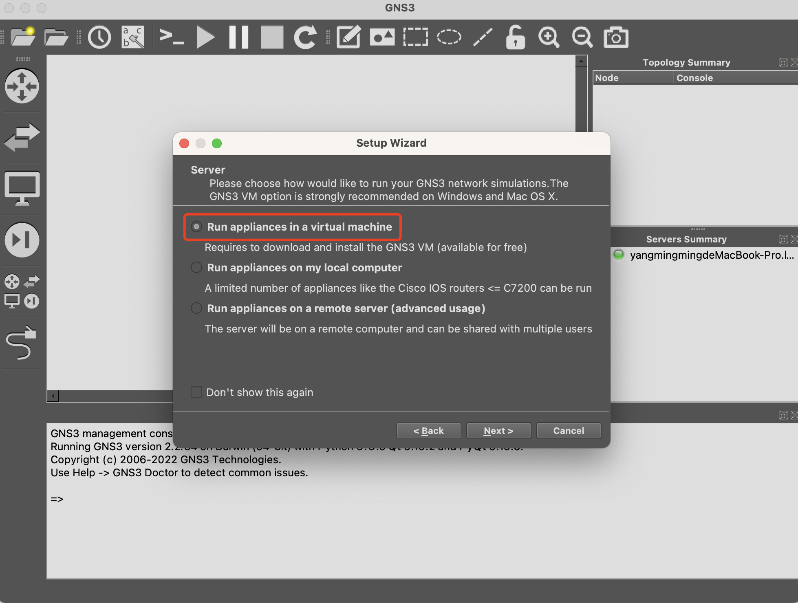

- # 网络模拟工具GNS3学习  
- [环境搭建](#环境搭建)
  - [安装镜像](#安装镜像)
  - [添加模版](#添加模版)
- [demo学习](#demo学习)
  - [telnet指令](#telnet指令)
    - [帮助文档](#帮助文档)
    - [ip 操作](#ip-操作)
  - [交换机](#交换机)
    - [默认交换机](#默认交换机)
    - [GNS3交换机模拟](#gns3交换机模拟)
    - [使用三层交换机IOU](#使用三层交换机iou)
    - [使用交换机模拟路由器](#使用交换机模拟路由器)
  - [路由器](#路由器)


## 环境搭建 

安装界面

<div align=center>
</img>
</div>

<div align=center>
</img>
</div>

下载GNS3 VM https://www.gns3.com/software/download-vm  

<div align=center>
</img>
</div>

> 文件名: GNS3.VM.VMware.Workstation.2.2.35.1.zip  

```shell
ls -l /Users/ymm/work/vmware/GNS3\ VM
total 1953656
-rw-r--r--@ 1 ymm  staff        272 11 10 22:56 GNS3 VM.mf
-rw-r--r--@ 1 ymm  staff       8292 11 10 22:56 GNS3 VM.ovf
-rw-r--r--@ 1 ymm  staff  989713920 11 10 22:57 GNS3_VM-disk1.vmdk
-rw-r--r--@ 1 ymm  staff    1951744 11 10 22:59 GNS3_VM-disk2.vmdk
```

<div align=center>
</img>
</div>

可以直接访问web界面  

<div align=center>
</img>
</div>

### 安装镜像
华为的需要使用ensp, 指定虚拟机版本，现在更新需要授权，还是使用cisco的镜像吧!  


### 添加模版  

<div align=center>
</img>
</div>


<div align=center>
</img>
</div>


## demo学习  

### telnet指令

#### 帮助文档  
```shell
PC1> ?

?                        Print help
arp                        Shortcut for: show arp. Show arp table
clear ARG                Clear IPv4/IPv6, arp/neighbor cache, command history
dhcp [OPTION]            Shortcut for: ip dhcp. Get IPv4 address via DHCP
disconnect               Exit the telnet session (daemon mode)
echo TEXT                Display TEXT in output. See also  set echo ?
help                     Print help
history                  Shortcut for: show history. List the command history
ip ARG ... [OPTION]      Configure the current VPC's IP settings. See ip ?
load [FILENAME]          Load the configuration/script from the file FILENAME
ping HOST [OPTION ...]   Ping HOST with ICMP (default) or TCP/UDP. See ping ?
quit                     Quit program
relay ARG ...            Configure packet relay between UDP ports. See relay ?
rlogin [ip] port         Telnet to port on host at ip (relative to host PC)
save [FILENAME]          Save the configuration to the file FILENAME
set ARG ...              Set VPC name and other options. Try set ?
show [ARG ...]           Print the information of VPCs (default). See show ?
sleep [seconds] [TEXT]   Print TEXT and pause running script for seconds
trace HOST [OPTION ...]  Print the path packets take to network HOST
version                  Shortcut for: show version

To get command syntax help, please enter '?' as an argument of the command.
```

#### ip 操作
查看ip `show ip`  
```shell
PC1> show ip

NAME        : PC1[1]
IP/MASK     : 0.0.0.0/0
GATEWAY     : 0.0.0.0
DNS         : 
MAC         : 00:50:79:66:68:00
LPORT       : 20004
RHOST:PORT  : 127.0.0.1:20005
MTU         : 1500
```

设置ip 子网掩码 网关 
`ip 192.168.1.2 24 192.168.1.1`  

```shell
ip ?
ip ARG ... [OPTION]
  Configure the current VPC's IP settings
    ARG ...:
    address [mask] [gateway]
    address [gateway] [mask]
                   Set the VPC's ip, default gateway ip and network mask
                   Default IPv4 mask is /24, IPv6 is /64. Example:
                   ip 10.1.1.70/26 10.1.1.65 set the VPC's ip to 10.1.1.70,
                   the gateway to 10.1.1.65, the netmask to 255.255.255.192.
                   In tap mode, the ip of the tapx is the maximum host ID
                   of the subnet. In the example above the tapx ip would be 
                   10.1.1.126
                   mask may be written as /26, 26 or 255.255.255.192
    auto           Attempt to obtain IPv6 address, mask and gateway using SLAAC
    dhcp [OPTION]  Attempt to obtain IPv4 address, mask, gateway, DNS via DHCP
          -d         Show DHCP packet decode
          -r         Renew DHCP lease
          -x         Release DHCP lease
    dns ip         Set DNS server ip, delete if ip is '0'
    dns6 ipv6      Set DNS server ipv6, delete if ipv6 is '0'
    domain NAME    Set local domain name to NAME
```

输出结果
```shell
PC2> ip 192.168.1.3 24 192.168.1.1
Checking for duplicate address...
PC2 : 192.168.1.3 255.255.255.0 gateway 192.168.1.1
```

pc2 ping pc1 
```shell
PC2> ping 192.168.1.2

84 bytes from 192.168.1.2 icmp_seq=1 ttl=64 time=0.116 ms
84 bytes from 192.168.1.2 icmp_seq=2 ttl=64 time=0.165 ms
```

登录设备
```shell
echo -n -e "\033]0;R1\007"; clear; PATH='/Applications/GNS3.app/Contents/MacOS:/usr/bin:/bin:/usr/sbin:/sbin' telnet 172.16.138.3 5001 ; exit
```

> 不同的设备对应不对的端口.  

### 交换机

#### 默认交换机
配置界面
<div align=center>
</img>
</div>

从图中可以看到交换机的设置，`端口`、`VLAN`、`Type`等  

交换机端口有三种工作模式，分别是`Access`，`Hybrid`，`Trunk`。  
- Access类型的端口只能属于1个VLAN，一般用于连接计算机的端口；
- Trunk类型的端口可以允许多个VLAN通过，可以接收和发送多个VLAN的报文，一般用于交换机之间连接的端口；
- Hybrid类型的端口可以允许多个VLAN通过，可以接收和发送多个VLAN的报文，可以用于交换机之间连接，也可以用于连接用户的计算机。 
- Hybrid端口和Trunk端口在接收数据时，处理方法是一样的，唯一不同之处在于发送数据时：Hybrid端口可以允许多个VLAN的报文发送时不打标签，而Trunk端口只允许缺省VLAN的报文发送时不打标签。

#### GNS3交换机模拟
GNS3 一直都不能使用交换机 IOS 镜像的！如果你想用 GNS3 来模拟交换机，你有两个选择：  
- 请用三层交换机 IOU 镜像（如果关闭了三层交换机的路由功能，那么三层交换机就变成二层交换机了）  
- 请用 3660 、3725 和 3745 系列的路由器加交换模块来模拟交换机（路由器如何模拟交换机？请点击这里）

#### 使用三层交换机IOU 

#### 使用交换机模拟路由器  

1. 删除之前导入的 IOS ；
2. 选择 GNS3 → Preferences → IOS routers → New → 导入 IOS → 勾选 This is an EtherSwitch router → next…… → 默认选择添加了 NM-16ESW（如无则加上）→ 计算 idle 值 → Finish ；
3. 在 GNS3 左侧找到 browse all devices ，选择刚刚新建的 EtherSwitch router 即可；
4. 验证：成功创建 VLAN 。

> Cisco IOS，最早称为互联网操作系统（英语：Internetwork Operating System，简称IOS）是思科公司（Cisco System）为其网络设备开发的操作维护系统。用户可以透过命令行界面对网络设备进行功能设置.  
> IOU 的意思是 IOS On Unix，即是可以在 Unix 系統上運行 IOS。IOU 不但可以模擬 Router，還可以模擬 L3 Switch.  

<div align=center>
</img>
</div>

关闭路由功能
```shell
ESW1(config)#config
Configuring from terminal, memory, or network [terminal]? 
Enter configuration commands, one per line.  End with CNTL/Z.
ESW1(config)#no ip routing
ESW1(config)#exit
ESW1#vlan database
% Warning: It is recommended to configure VLAN from config mode,
as VLAN database mode is being deprecated. Please consult user
documentation for configuring VTP/VLAN in config mode.
ESW1(vlan)#vlan 200
VLAN 200 modified:
 ESW1(vlan)#exit
 APPLY completed.
Exiting....
ESW1#show vlan-switch

VLAN Name                             Status    Ports
---- -------------------------------- --------- -------------------------------
1    default                            active    Fa1/0, Fa1/2, Fa1/3, Fa1/4
                                                  Fa1/5, Fa1/6, Fa1/7, Fa1/8
                                                  Fa1/9, Fa1/10, Fa1/11, Fa1/12
                                                  Fa1/13, Fa1/14, Fa1/15
200  VLAN0200                           active    Fa1/1
1002 fddi-default                    act/unsup
1003 token-ring-default              act/unsup
1004 fddinet-default                 act/unsup
1005 trnet-default                   act/unsup

VLAN Type  SAID       MTU   Parent RingNo BridgeNo Stp  BrdgMode Trans1 Trans2
---- ----- ---------- ----- ------ ------ -------- ---- -------- ------ ------
1    enet   100001     1500   -         -      -      -      -     1002   1003
200  enet   100200     1500   -         -      -      -      -        0      0
1002 fddi   101002     1500   -         -      -      -      -        1   1003
1003 tr     101003     1500  1005       0      -      -    srb        1   1002
1004 fdnet  101004     1500   -         -      1    ibm      -        0      0
1005 trnet  101005     1500   -         -      1    ibm      -        0      0
```

### 路由器  

```
Cisco 7206VXR (NPE400) processor (revision A) with 491520K/32768K bytes of memory.
Processor board ID 4279256517
R7000 CPU at 150MHz, Implementation 39, Rev 2.1, 256KB L2, 512KB L3 Cache
6 slot VXR midplane, Version 2.1
```

帮助文档
```shell
Exec commands:
  access-enable    Create a temporary Access-List entry
  access-profile   Apply user-profile to interface
  access-template  Create a temporary Access-List entry
  alps             ALPS exec commands
  archive          manage archive files
  audio-prompt     load ivr prompt
  auto             Exec level Automation
  beep             Blocks Extensible Exchange Protocol commands
  bfe              For manual emergency modes setting
  calendar         Manage the hardware calendar
  call             Voice call
  call-home        Call-Home commands
  cd               Change current directory
  clear            Reset functions
  clock            Manage the system clock
  cns              CNS agents
  configure        Enter configuration mode
  connect          Open a terminal connection
  copy             Copy from one file to another
  crypto           Encryption related commands.
  debug            Debugging functions (see also 'undebug')
  delete           Delete a file
  dir              List files on a filesystem
  disable          Turn off privileged commands
  disconnect       Disconnect an existing network connection
  emm              Run a configured Menu System
  enable           Turn on privileged commands
  eou              EAPoUDP
  ephone-hunt      ephone hunt exec command
  erase            Erase a filesystem
  ethernet         Ethernet parameters
  event            Event related commands
  exit             Exit from the EXEC
  file-acct        File mode accounting exec command
  flush            File mode accounting flush options
  format           Format a filesystem
  fsck             Fsck a filesystem
  help             Description of the interactive help system
  hw-module        Slot level commands
  if-mgr           IF-MGR operations
  isdn             Run an ISDN EXEC command on an ISDN interface
  lat              Open a lat connection
  lock             Lock the terminal
  login            Log in as a particular user
  logout           Exit from the EXEC
  microcode        microcode commands
  mkdir            Create new directory
  monitor          Monitoring different system events
  more             Display the contents of a file
  mpls             MPLS commands
  mrinfo           Request neighbor and version information from a multicast
                   router
  mrm              IP Multicast Routing Monitor Test
  mstat            Show statistics after multiple multicast traceroutes
  mtrace           Trace reverse multicast path from destination to source
  name-connection  Name an existing network connection
  ncia             Start/Stop NCIA Server
  no               Disable debugging functions
  pad              Open a X.29 PAD connection
  partition        Partition disk
  ping             Send echo messages
  ppp              Start IETF Point-to-Point Protocol (PPP)
  pwd              Display current working directory
  redundancy       Redundancy Facility (RF) exec commands
  release          Release a resource
  reload           Halt and perform a cold restart
  rename           Rename a file
  renew            Renew a resource
  restart          Restart Connection
  resume           Resume an active network connection
  rlogin           Open an rlogin connection
  rmdir            Remove existing directory
  rsh              Execute a remote command
  sdlc             Send SDLC test frames
  send             Send a message to other tty lines
  set              Set system parameter (not config)
  setup            Run the SETUP command facility
  show             Show running system information
  slip             Start Serial-line IP (SLIP)
  spec-file        format spec file commands
  squeeze          Squeeze a filesystem
  ssh              Open a secure shell client connection
  start-chat       Start a chat-script on a line
  systat           Display information about terminal lines
  tarp             TARP (Target ID Resolution Protocol) commands
  tclquit          Quit Tool Command Language shell
  tclsafe          Tool Command Language shell SAFE mode
  tclsh            Tool Command Language shell
  tdm              TDM
  telnet           Open a telnet connection
  terminal         Set terminal line parameters
  test             Test subsystems, memory, and interfaces
  tn3270           Open a tn3270 connection
  traceroute       Trace route to destination
  tunnel           Open a tunnel connection
  udptn            Open an udptn connection
  undebug          Disable debugging functions (see also 'debug')
  undelete         Undelete a file
  upgrade          Upgrade commands
  verify           Verify a file
  voice            Voice Commands
  webvpn           WebVPN exec command
  where            List active connections
  which-route      Do OSI route table lookup and display results
  write            Write running configuration to memory, network, or terminal
  x28              Become an X.28 PAD
  x3               Set X.3 parameters on PAD
  xconnect         Xconnect EXEC commands
```


