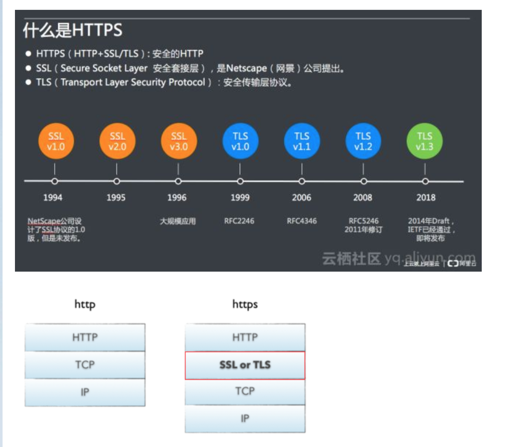

- ssl与https  

参考文章: https://www.cnblogs.com/xdyixia/p/11610102.html  

<div align=center>
</img>
</div>

## SSL

`SSL证书，用于加密HTTP协议，也就是HTTPS`。  

SSL(`Secure Socket Layer` 安全套接层)是基于HTTPS下的一个协议加密层，最初是由网景公司（Netscape）研发，后被IETF（The Internet Engineering Task Force - 互联网工程任务组）标准化后写入（RFCRequest For Comments 请求注释），RFC里包含了很多互联网技术的规范！  

TLS（传输层安全）是更为安全的升级版 SSL。由于 SSL 这一术语更为常用，因此我们仍然将我们的安全证书称作 SSL。但当您从赛门铁克购买 SSL 时，您真正购买的是最新的 TLS 证书，有 ECC、RSA 或 DSA 三种加密方式可以选择。  

`nginx`https配置  https://nginx.org/en/docs/http/ngx_http_ssl_module.html  
```sh
    ssl_protocols  TLSv1.2;
    ssl_ciphers 'ECDHE-RSA-AES128-GCM-SHA256:ECDHE-ECDSA-AES128-GCM-SHA256:ECDHE-RSA-AES256-GCM-SHA384:ECDHE-ECDSA-AES256-GCM-SHA384:DHE-RSA-AES128-GCM-SHA256:DHE-DSS-AES128-GCM-SHA256:kEDH+AESGCM:ECDHE-RSA-AES128-SHA256:ECDHE-ECDSA-AES128-SHA256:ECDHE-RSA-AES128-SHA:ECDHE-ECDSA-AES128-SHA:ECDHE-RSA-AES256-SHA384:ECDHE-ECDSA-AES256-SHA384:ECDHE-RSA-AES256-SHA:ECDHE-ECDSA-AES256-SHA:DHE-RSA-AES128-SHA256:DHE-RSA-AES128-SHA:DHE-DSS-AES128-SHA256:DHE-RSA-AES256-SHA256:DHE-DSS-AES256-SHA:DHE-RSA-AES256-SHA:AES128-GCM-SHA256:AES256-GCM-SHA384:AES128-SHA256:AES256-SHA256:AES128-SHA:AES256-SHA:AES:CAMELLIA:!DES-CBC3-SHA:!aNULL:!eNULL:!EXPORT:!DES:!RC4:!MD5:!PSK:!aECDH:!EDH-DSS-DES-CBC3-SHA:!EDH-RSA-DES-CBC3-SHA:!KRB5-DES-CBC3-SHA';

    #gzip  on;

    #include /etc/nginx/conf.d/*.conf;

    client_max_body_size 1024m;
    proxy_connect_timeout 3600; #单位秒
    proxy_send_timeout 3600; #单位秒
    proxy_read_timeout 3600; #单位秒

    server {
        listen       443  ssl;
        server_name  localhost;
        root  /opt/firewall/frontend;

        # ssl证书
        ssl_certificate /etc/nginx/crt/ssl.crt;
        ssl_certificate_key /etc/nginx/crt/ssl.key;
        ssl_ciphers ECDHE-RSA-AES128-GCM-SHA256:HIGH:!aNULL:!MD5:!DES:!3DES;
```


## HTTPS

HTTPS协议需要到证书颁发机构(Certificate Authority，简称`CA`)申请证书，一般免费证书很少，需要交费

请求`https://10.25.10.126/api/resourceObj/resourceAddress/address/pageQuery`  
payload:  
```sh
{name: "", ip: "", page: 1, pageSize: 10}
```

响应:  
```sh
{"code":0,"data":{"list":[],"total":0,"page":1,"pageSize":10},"msg":"获取成功"}
```

wireshark抓包工具:  
```sh
117	2.766338	10.25.16.201	10.25.10.126	TLSv1.2	1337	Application Data
121	2.785157	10.25.10.126	10.25.16.201	TCP	66	443 → 59597 [ACK] Seq=1 Ack=1272 Win=501 Len=0 TSval=1337643395 TSecr=2833206283

123	2.800672	10.25.10.126	10.25.16.201	TLSv1.2	356	Application Data
124	2.800716	10.25.16.201	10.25.10.126	TCP	66	59597 → 443 [ACK] Seq=1272 Ack=291 Win=7733 Len=0 TSval=2833206316 TSecr=1337643414
```

请求的报文:  
```sh
Frame 117: 1337 bytes on wire (10696 bits), 1337 bytes captured (10696 bits) on interface en1, id 0
Ethernet II, Src: Apple_9a:5a:6a (5c:52:30:9a:5a:6a), Dst: HuaweiTe_7a:25:30 (c4:a4:02:7a:25:30)
Internet Protocol Version 4, Src: 10.25.16.201, Dst: 10.25.10.126
Transmission Control Protocol, Src Port: 59597, Dst Port: 443, Seq: 1, Ack: 1, Len: 1271
Transport Layer Security
    TLSv1.2 Record Layer: Application Data Protocol: Hypertext Transfer Protocol
        Content Type: Application Data (23)
        Version: TLS 1.2 (0x0303)
        Length: 1266
        Encrypted Application Data: 000000000000003dceeb6f7e58bab7754879dcaf54f5b2b51f5cf3ec436588d5784d6148…
        [Application Data Protocol: Hypertext Transfer Protocol]
```

我们从浏览器导出公钥，名为`*.cer`  

加解密流程:  
1. 获得加密通信的数据：你可以使用网络抓包工具（例如 Wireshark）来捕获 HTTPS 请求和响应的数据包。这些工具允许你查看网络流量并提供了详细的数据包信息。

1. 获得服务器的`公钥`：在 TLS 握手过程中，服务器会向客户端发送其公钥。你可以从捕获的数据包中提取服务器的公钥。通常，服务器的公钥会以 X.509 证书的形式存在。

1. 验证服务器的证书：使用服务器的公钥，你需要`验证服务器的证书是否有效和可信`。这可能涉及到检查证书链、验证证书的有效期、检查颁发机构的信任等。

1. 获得会话密钥：在 TLS 握手过程中，客户端会生成一个用于会话加密的对称密钥，称为会话密钥（`Session Key`）。这个密钥用于加密和解密实际的数据传输。

1. 解密数据：使用会话密钥，你可以对捕获的数据包中的加密数据进行解密。这通常需要对加密算法和模式进行正确配置，并且需要正确处理加密块的填充。


会话密钥报文:
```sh
Frame 12214: 222 bytes on wire (1776 bits), 222 bytes captured (1776 bits) on interface en1, id 0
Ethernet II, Src: HuaweiTe_7a:25:30 (c4:a4:02:7a:25:30), Dst: Apple_9a:5a:6a (5c:52:30:9a:5a:6a)
Internet Protocol Version 4, Src: 10.25.10.126, Dst: 10.25.16.81
Transmission Control Protocol, Src Port: 443, Dst Port: 51269, Seq: 1, Ack: 518, Len: 156
Transport Layer Security
    TLSv1.2 Record Layer: Handshake Protocol: Server Hello
        Content Type: Handshake (22)
        Version: TLS 1.2 (0x0303)
        Length: 100
        Handshake Protocol: Server Hello
            Handshake Type: Server Hello (2)
            Length: 96
            Version: TLS 1.2 (0x0303)
            Random: 94b2a77dfd51855a16a388fa4682b3e6437f1f62d8bc9d65ff24b28def4eda4a
            Session ID Length: 32
            Session ID: 8187f0b83309d5225691f6c04bbfbe96736b01bbc282102cb0db8ae780d181d7
            Cipher Suite: TLS_ECDHE_RSA_WITH_AES_128_GCM_SHA256 (0xc02f)
            Compression Method: null (0)
            Extensions Length: 24
            Extension: renegotiation_info (len=1)
                Type: renegotiation_info (65281)
                Length: 1
                Renegotiation Info extension
            Extension: application_layer_protocol_negotiation (len=11)
                Type: application_layer_protocol_negotiation (16)
                Length: 11
                ALPN Extension Length: 9
                ALPN Protocol
            Extension: extended_master_secret (len=0)
                Type: extended_master_secret (23)
                Length: 0
            [JA3S Fullstring: 771,49199,65281-16-23]
            [JA3S: 4cf820cab8f5a2bf61be14f5493233ae]
    TLSv1.2 Record Layer: Change Cipher Spec Protocol: Change Cipher Spec
        Content Type: Change Cipher Spec (20)
        Version: TLS 1.2 (0x0303)
        Length: 1
        Change Cipher Spec Message
    TLSv1.2 Record Layer: Handshake Protocol: Encrypted Handshake Message
        Content Type: Handshake (22)
        Version: TLS 1.2 (0x0303)
        Length: 40
        Handshake Protocol: Encrypted Handshake Message

```

