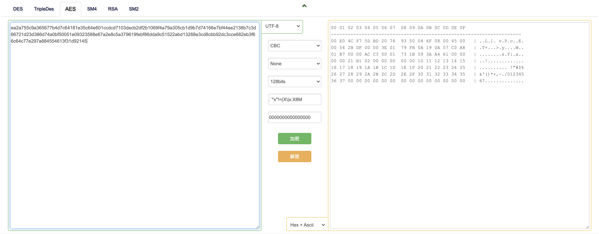

# AES 加解密  
## [在线网站](https://the-x.cn/cryptography/Aes.aspx)  
  

## Java代码
[参考网站](https://blog.csdn.net/rexueqingchun/article/details/86606376)  

> 注意输入和输出数据的类型, 比如加密后是16进制，解码时需要把16进制转成Byte，而不是直接当做字符转Byte 

```
import java.security.MessageDigest;
import java.security.NoSuchAlgorithmException;
import java.util.ArrayList;
import java.util.Collections;
import java.util.HashMap;
import java.util.List;
import java.util.Map;
 
import javax.crypto.Cipher;
import javax.crypto.spec.IvParameterSpec;
import javax.crypto.spec.SecretKeySpec;
 
import sun.misc.BASE64Decoder;
import sun.misc.BASE64Encoder;
 
/**
 * AES加密128位CBC模式工具类
 */
public class AESUtils {
	
    //解密密钥(自行随机生成)
    public static final String KEY = "qxhzngy266a186ke";//密钥key
    public static final String IV  = "1ci5crnda6ojzgtr";//向量iv
	
    //认证密钥(自行随机生成)
    public static final String AK = "s2ip9g3y3bjr5zz7ws6kjgx3ysr82zzw";//AccessKey
    public static final String SK = "uv8zr0uen7aim8m7umcuooqzdv8cbvtf";//SecretKey
	
    //加密
    public static String Encrypt(String content) throws Exception {  
        byte[] raw = KEY.getBytes("utf-8");  
        SecretKeySpec skeySpec = new SecretKeySpec(raw, "AES");  
        Cipher cipher = Cipher.getInstance("AES/CBC/PKCS5Padding");//"算法/模式/补码方式"
        //使用CBC模式，需要一个向量iv，可增加加密算法的强度    
        IvParameterSpec ips = new IvParameterSpec(IV.getBytes());
        cipher.init(Cipher.ENCRYPT_MODE, skeySpec, ips);  
        byte[] encrypted = cipher.doFinal(content.getBytes());  
        return new BASE64Encoder().encode(encrypted);
    }  
	
    //解密  
    public static String Decrypt(String content) throws Exception {  
        try {   
            byte[] raw = KEY.getBytes("utf-8");  
            SecretKeySpec skeySpec = new SecretKeySpec(raw, "AES");  
            Cipher cipher = Cipher.getInstance("AES/CBC/PKCS5Padding");  
            IvParameterSpec ips = new IvParameterSpec(IV.getBytes());  
            cipher.init(Cipher.DECRYPT_MODE, skeySpec, ips);  
            byte[] encrypted1 = new BASE64Decoder().decodeBuffer(content);
            try {  
                byte[] original = cipher.doFinal(encrypted1);  
                String originalString = new String(original);  
                return originalString;  
            } catch (Exception e) {  
                System.out.println(e.toString());  
                return null;  
            }  
        } catch (Exception ex) {  
            System.out.println(ex.toString());  
            return null;  
        }  
    } 
	
    //获取认证签名(身份认证需要)
    public static String getSign(String currentTime) throws Exception { 
	String sign = "";
	Map<String, Object> map=new HashMap<String,Object>();
        map.put("ak",AK);
        map.put("sk",SK);
        map.put("ts",currentTime);
	//获取 参数字典排序后字符串  
        String decrypt = getOrderMap(map);
	try {  
            //指定sha1算法  
            MessageDigest digest = MessageDigest.getInstance("SHA-1");  
            digest.update(decrypt.getBytes());  
            //获取字节数组  
            byte messageDigest[] = digest.digest();  
            // Create Hex String  
            StringBuffer hexString = new StringBuffer();  
            // 字节数组转换为十六进制数  
            for (int i = 0; i < messageDigest.length; i++) {  
                String shaHex = Integer.toHexString(messageDigest[i] & 0xFF);  
                if (shaHex.length() < 2) {  
                    hexString.append(0);  
                }  
                hexString.append(shaHex);  
            }  
            sign = hexString.toString();  
        } catch (NoSuchAlgorithmException e) {  
            e.printStackTrace();  
        } 
		return sign;
    } 
	
    //获取参数的字典排序  
    private static String getOrderMap(Map<String,Object> maps){  
    	List<String> paramNames = new ArrayList<String>();  
        for(Map.Entry<String,Object> entry : maps.entrySet()){  
            paramNames.add(entry.getValue().toString());  
        }  
        Collections.sort(paramNames); 
        StringBuilder paramStr = new StringBuilder();  
        for(String paramName : paramNames){  
            paramStr.append(paramName);    
        }  
        return paramStr.toString();  
    }  
 
}
```