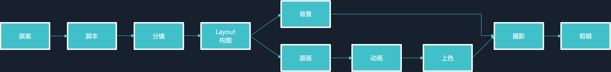

# animate学习
[官方指南](https://helpx.adobe.com/cn/animate/user-guide.html)  

## 基础知识  
像 Animate（以前名为 Flash Professional CC）中的大部分工作一样，动画不需要任何 ActionScript。然而，如果您愿意，您可以使用 ActionScript 创建动画。 

### 动画类型  
- 补间动画  
使用补间动画可设置对象的属性，如一个帧中以及另一个帧中的位置和 Alpha 透明度。然后 Animate 在中间内插帧的属性值。对于由对象的连续运动或变形构成的动画，补间动画很有用。补间动画在时间轴中显示为连续的帧范围，默认情况下可以作为单个对象进行选择。补间动画功能强大，易于创建。  

- 传统补间  
传统补间与补间动画类似，但是创建起来更复杂。传统补间允许一些特定的动画效果，使用基于范围的补间不能实现这些效果。  

- 反向运动姿势（Animate 中已弃用）  
反向运动姿势用于伸展和弯曲形状对象以及链接元件实例组，使它们以自然方式一起移动。在将骨骼添加到形状或一组元件之后，可以在不同的关键帧中更改骨骼或符号的位置。Animate 将这些位置内插到中间的帧中。  

- 补间形状  
在形状补间中，可在时间轴中的特定帧绘制一个形状，然后更改该形状或在另一个特定帧绘制另一个形状。然后，Animate 为这两帧之间的帧内插这些中间形状，创建出从一个形状变形为另一个形状的动画效果。  

- 逐帧动画  
使用此动画技术，可以为时间轴中的每个帧指定不同的艺术作品。使用此技术可创建与快速连续播放的影片帧类似的效果。对于每个帧的图形元素必须不同的复杂动画而言，此技术非常有用。  

### 关于帧频  
帧频是动画播放的速度，以每秒播放的帧数 (fps) 为度量单位。帧频太慢会使动画看起来一顿一顿的，帧频太快会使动画的细节变得模糊。24 fps 的帧速率是新 Animate 文档的默认设置，通常在 Web 上提供最佳效果。标准的动画速率也是 24 fps。  

动画的复杂程度和播放动画的计算机的速度会影响播放的流畅程度。若要确定最佳帧速率，请在各种不同的计算机上测试动画。  

因为只给整个 Animate 文档指定一个帧频，因此请在开始创建动画之前先设置帧频。  

### 在时间轴中标识动画  

### 二维动画制作流程  

整体流程:  

 

1. 原案故事大纲，基本的人物设定、场景设定等。  
2. 脚本交代故事的具体内容。包括所发生的时间、地点、角色、事件，以及角色的台词动作等要素。例如：那个角色是怎什么时间在那里出现的，怎样和其他角色互动，说了什么话等等。一般脚本完成后就可以开始各个设计工作了。  
3. 分镜分镜的工作是将文字变为画面，添加各类指示（摄影指示、作画指示等等）以及标注秒数（要精确到1/24秒）。而脚本虽然交代了故事的内容，但并不具体。例如，脚本中描写了“A和B在河边见面，A说了什么，B说了什么”。而A和B是在河的哪一边，A和B又各自是怎样表情，说话时镜头的怎样的移动等等，这些都是需要分镜来表现的。  
4. LayoutLayout是分镜到原画的过渡环节。Layout是分镜稿中每一个镜头的具体和细化版本，决定一个镜头中所有细节和背景，也关系到人物动作。需要根据分镜来细化画面中人物与背景的位置关系（透视）。透视和比例关系都要画准确。而Layout之后的就可以多线同时进行了。  
5. 原画原画师需要根据Layout，画出所有的关键张（中间的部分由动画补全）。原画师就相当于演员，所以一个人的演技很重要。现在动画ed里都会分第一原画和第二原画。第一原画画的就是只有描绘简单的动作的原画，而第二原画就负责将一原细化到可以让动画做中割参考的原画。  
6. 动画动画需要根据原画画出中间过渡的画面（中割），使得动作更为流畅。另外动画师还要负责将原画变为能上色的线。所以咱们看的动画的线实际上是动画师勾出来的线。  
7. 上色根据色彩设计对动画进行上色。  
8. 背景人物和背景是分开来画的。背景不仅需要描绘出人物所在的场景，周边的景物，还要通过背景来表现当时的氛围，对于角色心情的表现也有很大影响。  
9. 摄影（后期）使用软件将人物与背景进行合成，添加后期效果。镜头的移动、特殊效果的制作都是这个阶段进行的。  
10. 编集剪辑导出的视频。  

## 帧动画制作    
### 传统补间动画  
首先创建一个图形，在某一帧(比如60帧)之后插入`关键帧`，这就形成一个帧范围。选中帧范围并右击，选择`创建传统补间动画`，在60帧时拖动图形，期间就会自动生成补间动画。如果期间有变动，可以再30帧再插入一个`关键帧`，并移动位置。  

> 元件是指在 Animate 创作环境中或使用 SimpleButton (AS 3.0) 和 MovieClip 类一次性创建的图形、按钮或影片剪辑。然后，您可在整个文档或其他文档中重复使用该元件。  

### 补间动画  
首先创建一个图形，选择一个帧范围，右键选择创建补间动画。补间动画需要更多的关键帧，选择范围的某一帧，直接拖动图形，会显示路径，可以直接编辑路径。  

