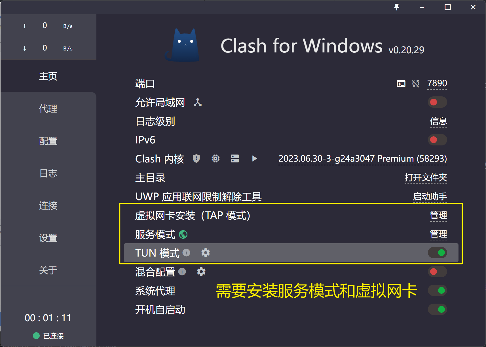

- # win 个性化配置  

- [装机](#装机)
  - [系统](#系统)
  - [U盘启动盘](#u盘启动盘)
  - [常用软件](#常用软件)
  - [主题美化](#主题美化)
  - [开发软件](#开发软件)
- [常用设置及配置](#常用设置及配置)
  - [autohotkey 配置](#autohotkey-配置)
    - [使用特定快捷键粘贴](#使用特定快捷键粘贴)
  - [clash](#clash)


## 装机  
### 系统  
https://www.microsoft.com/software-download/windows11  
选择多版本->语言即可下载  


### U盘启动盘  

- U启动  http://www.uqidong.com/  

### 常用软件  

- `科学软件`  https://nf.nfcloud.net/  
- `clash` https://github.com/zzzgydi/clash-verge/tree/main  汉化: https://github.com/Z-Siqi/Clash-for-Windows_Chinese  `Clash for Windows\resources\app.asar`
- `chrome` https://www.google.com/chrome  
- `WinRAR`  WinRAR v7.0beta2 汉化版.zip  
- `sogou输入法`  https://shurufa.sogou.com/  
- `everything` https://www.voidtools.com/zh-cn/downloads/  
- `OTP`  Office Tool Plus v10.4.2.4  
- `激活软件`  https://github.com/zbezj/HEU_KMS_Activator  
- `N卡驱动`  GeForce_Experience  https://www.nvidia.cn/geforce/geforce-experience/download/  
- `window 设置工具`  Dism++10.1.1002.1B.zip  https://github.com/Chuyu-Team/Dism-Multi-language  
- `Beyond Compare`  Beyond Compare v4.4.7.28397 修改版  
- `snipaste`  截图、固定工具  https://www.snipaste.com/  
- `FileZilla`  开源FTP工具 FileZilla Pro v3.66.2 绿色版.7z  
- `ScreenToGif` 录屏录像转gif，很好用 https://github.com/NickeManarin/ScreenToGif  

### 主题美化  
- `PowerToys`  用作按键映射
- `mydockfinder`  https://github.com/mydockfinder/mydockfinder-for-Win10-Win11  
- `WindowBlinds`  https://www.stardock.com/products/windowblinds/  
- `RocketDock`  类似于macOS的Dock，用于替换或增强标准的Windows任务栏  https://punklabs.com/rocketdock  
- `Wallpaper Engine`  https://store.steampowered.com/app/431960/Wallpaper_Engine/  

###  开发软件  
- `vscode`  https://code.visualstudio.com/download  修改地址: **https://vscode.cdn.azure.cn**
- `process-explorer`  https://learn.microsoft.com/zh-cn/sysinternals/downloads/process-explorer  
- `Wireshark`  https://www.wireshark.org/  
- `VMware`  离线安装包  
- `Obsidian`  笔记工具  https://obsidian.md/download  
- `AutoHotkey`  自动化工具  https://www.autohotkey.com/  
vscode autohotkey2 插件: https://github.com/thqby/vscode-autohotkey2-lsp  

## 常用设置及配置  
### autohotkey 配置  
#### 使用特定快捷键粘贴  

`test.ahk2`  
```sh

```


### clash  

增强模式: 

<br>
<div align=center>
</img>  
</div>
<br>


### macos/windows/iphone 共享文件  

macos在共享中打开文件共享,windows使用`\\:ip` 访问  
windows打开文件共享,macos或者iphone使用`smb://ip`访问  

