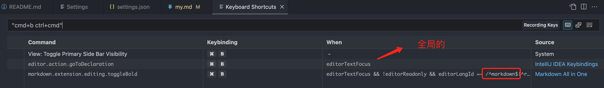

- # 个性化配置

- [vscode](#vscode)
  - [vscode 插件管理器连接失败](#vscode-插件管理器连接失败)
  - [setting.json](#settingjson)
  - [快捷键](#快捷键)
    - [Import keymaps XML](#import-keymaps-xml)
  - [插件](#插件)
  - [主题](#主题)
    - [ubuntu bash 主题](#ubuntu-bash-主题)
  - [快捷键](#快捷键-1)
- [软件安装](#软件安装)
  - [Homebrew](#homebrew)
  - [git](#git)
  - [OhMySh](#ohmysh)
  - [终端主题](#终端主题)
    - [OhMySh主题](#ohmysh主题)
  - [nvm](#nvm)
  - [node/npm](#nodenpm)
  - [Idea](#idea)
  - [python](#python)
  - [Go](#go)
  - [Java](#java)
  - [**BetterTouchTool**](#bettertouchtool)
- [macos 常用功能](#macos-常用功能)
  - [磁盘清理](#磁盘清理)


## vscode

### vscode 插件管理器连接失败  

具体错误:`XHR failed` 

```
sudo chown $USER ~/Library/Caches/com.microsoft.VSCode.ShipIt/
```


### setting.json

```
{
    "workbench.colorTheme": "One Dark Pro Darker",
    "editor.suggestSelection": "first",
    "vsintellicode.modify.editor.suggestSelection": "automaticallyOverrodeDefaultValue",
    "files.exclude": {
        "**/.classpath": true,
        "**/.project": true,
        "**/.settings": true,
        "**/.factorypath": true
    },
    "editor.fontSize": 14,
    "window.zoomLevel": 0.5,
    "redhat.telemetry.enabled": true,
    "terminal.integrated.fontSize": 14,
    "maven.terminal.useJavaHome": true,
    "security.workspace.trust.untrustedFiles": "open",
    "terminal.integrated.env.linux": {
        "GRAALVM_HOME": ""
    },
    "netbeans.jdkhome": "",
    "terminal.integrated.env.osx": {
        "GRAALVM_HOME": ""
    },
    "extensions.ignoreRecommendations": true,
    "cmake.configureOnOpen": false,
    "go.toolsManagement.autoUpdate": true,
    "workbench.editor.enablePreview": false,
    "markdown.extension.toc.updateOnSave": false,
    "git.ignoreLegacyWarning": true,
    "explorer.confirmDragAndDrop": false,
    "remote.SSH.connectTimeout": 30,
    "debug.javascript.autoAttachFilter": "disabled",
    "code-runner.fileDirectoryAsCwd": true,
    "formatFiles.excludedFolders": [
        "node_modules",
        ".vscode",
        ".git",
        "dist",
        ".chrome",
        ".js",
        "public"
    ],
    "[shellscript]": {
        "editor.formatOnSave": true,
        "files.eol": "\n"
    },
    "gitlens.advanced.messages": {
        "suppressGitVersionWarning": true
    },
    "java.jdt.ls.vmargs": "-XX:+UseParallelGC -XX:GCTimeRatio=4 -XX:AdaptiveSizePolicyWeight=90 -Dsun.zip.disableMemoryMapping=true -Xmx1G -Xms100m -javaagent:\"/Users/ymm/.vscode/extensions/vscjava.vscode-lombok-1.0.1/server/lombok.jar\"",
    "[markdown]": {
        "editor.defaultFormatter": "yzhang.markdown-all-in-one"
    },
    "sonarlint.rules": {
        "python:S1542": {
            "level": "off"
        }
    },
    "editor.renderWhitespace": "all",
    "hardhat.telemetry": false,
    "netbeans.javaSupport.enabled": false,
    "debug.onTaskErrors": "abort",
    "ansible.validation.lint.enabled": false,
    "[python]": {
        "editor.formatOnType": true
    },
    "solidity.telemetry": false,
    "diffEditor.ignoreTrimWhitespace": false,
    "C_Cpp.loggingLevel": "Debug",
}
```


### 快捷键

这的的快捷键不是自带的，而是idea导出并转为vscode格式的

首先安装插件: `IntelliJ IDEA Keybindings`  

#### Import keymaps XML

1. Launch Code
2. Open command pallet `Ctrl`-`Shift`-`P` (Windows) or `Cmd`-`Shift`-`P` (macOS)
3. Choose `Import IntelliJ Keybindings (XML)`
4. Copy & Paste it into `keybindings.json` 

```sh
```


### 插件

- Markdown All in One
- Bash Debug
- C/C++
- GO
- Hex Editor
- One Dark Pro 
- Python
- SFTP
- vue
- XML
- YAML
- Remote SSH

### 主题

使用 `One Dark Pro`  
idea的相同主题地址:  https://plugins.jetbrains.com/plugin/11938-one-dark-theme/versions/stable  

#### ubuntu bash 主题

https://github.com/Bash-it/bash-it  

```sh
git clone --depth=1 https://github.com/Bash-it/bash-it.git

cd bash-it/ && ./install.sh
```

输出
```sh
Profile 'default' enabled!

Installation finished successfully! Enjoy bash-it!
To start using it, open a new tab or 'source ~/.bashrc'.
```

修改主题:
```sh
sudo vim ~/.bashrc

# # location /.bash_it/themes/
# powerline-plain    oh-my-posh
export BASH_IT_THEME='powerline-plain'
```

> 主题列表 https://bash-it.readthedocs.io/en/latest/themes-list/  

### 快捷键  

很多情况下会遇到快捷键冲突，如何解决呢？ 比如我使用`Markdown`的插件为`yzhang.markdown-all-in-one`, 文件关联选项:  

可以查看用户设置`settings.json`, 通过`code`->`Preferences`->`Profiles`->`Show Centents`查看，另外可以通过快捷栏搜索，查看，有关markdown的配置如下:  

```json
{
      "markdown.extension.toc.updateOnSave": false,
      "[markdown]": {
        "editor.defaultFormatter": "yzhang.markdown-all-in-one"
      },
}
```

这说明编辑markdown是，默认编辑器是`yzhang.markdown-all-in-one`, 但是目前加粗`ctrl+B`，和右键中的`Go to Renferences`冲突, 那我们先查看快捷键`Keyboard Shortcuts`

<div align=center>
  </img>
</div>

> Intellij IDEA的快捷键是全局的，没有限制  

我还是使用vscode(macos)的快捷键吧，把idea的快捷键也替换成vscode的，这样markdown的也能用。  

- 注释：`cmd+/` 
- 移动行：`cmd+up/down`  
- 复制当前行：`shift + alt +up/down`  
- 删除当前行：`shift + cmd + k`  
- 控制台终端显示与隐藏：`ctrl + j` 
- 查找文件/安装vs code 插件地址：`cmd + p` 
- 导航栏: `shift + cmd + p`  
- 代码格式化：`shift + alt +f` 
- 新打开一个窗口 `shift + cmd + n`  
- 切换同一的不同tab页 : `cmd + 1/2/3`
- 切换窗口: `cmd + 1/2/3`, 临时打开窗口使用，很好用  
- 全局查找文件：`cmd + shift + f`  
- - 全局替换：`ctrl + shift + h`
- 删除行 ： `cmd + shift + k`, 可以使用`cmd + del` 
- 格式化选定代码 ：`shift + alt + f`
- 打开最近打开的文件：`ctrl + r` 
- 后退(返回上一处光标)：`ctrl+-` 前进(返回下一处光标)：`ctrl+shift+-`  

## 软件安装  

### Homebrew

```sh
/bin/bash -c "$(curl -fsSL https://gitee.com/ineo6/homebrew-install/raw/master/install.sh)"
```


> 可以开启增强模式，科学上网!  


### git  

首先安装自动补全依赖

```
brew install bash-completion
```


> Add the following line to your ~/.bash_profile:
>
>  [[ -r "/usr/local/etc/profile.d/bash_completion.sh" ]] && . "/usr/local/etc/profile.d/bash_completion.sh"


查看安装状态

```sh
$ brew info bash-completion

==> bash-completion: stable 1.3 (bottled)
Programmable completion for Bash 3.2
https://salsa.debian.org/debian/bash-completion
Conflicts with:
  bash-completion@2 (because each are different versions of the same formula)
/usr/local/Cellar/bash-completion/1.3_3 (189 files, 608.3KB) *
  Poured from bottle using the formulae.brew.sh API on 2023-03-06 at 16:53:11
From: https://github.com/Homebrew/homebrew-core/blob/HEAD/Formula/bash-completion.rb
==> Caveats
Add the following line to your ~/.bash_profile:
  [[ -r "/usr/local/etc/profile.d/bash_completion.sh" ]] && . "/usr/local/etc/profile.d/bash_completion.sh"
```


删除之前预装的git

```
sudo rm -fr /usr/bin/git*
Password:
rm: git: Operation not permitted
rm: git-receive-pack: Operation not permitted
rm: git-shell: Operation not permitted
rm: git-upload-archive: Operation not permitted
rm: git-upload-pack: Operation not permitted
```


To delete a file in /usr/bin/, you need to disable SIP (System Integrity Protection) by following below steps:

Turn off your Mac (Apple > Shut Down).
Hold down Command-R and press the Power button. Keep holding Command-R until the Apple logo appears. Wait for OS X to boot into the OS X Utilities window.
Choose Utilities > Terminal. Enter `csrutil disable`. Enter `reboot`.
To enable SIP again, repeating the above steps (2 first steps), enter csrutil enable and reboot your Mac OS.


查看状态

```sh
csrutil status
System Integrity Protection status: disabled.
```


关闭`SIP`之后，仍然无法删除

```sh
sudo rm -fr git*
Password:
rm: git: Read-only file system
rm: git-receive-pack: Read-only file system
rm: git-shell: Read-only file system
rm: git-upload-archive: Read-only file system
rm: git-upload-pack: Read-only file system
```


安装git

```sh
brew install git
```


> if \[ -f ~/.git-completion.bash \]; then
>
>   . ~/.git-completion.bash
>
> fi


git自动补全

> 只要安装`OhMySh`后就可以自动补全了.  


### OhMySh 

https://ohmyz.sh/

安装

```sh
sh -c "$(curl -fsSL https://raw.githubusercontent.com/ohmyzsh/ohmyzsh/master/tools/install.sh)"
```


### 终端主题 

先安装基础主题,比如现在使用的`OneHalfDark`主题  

访问:  https://github.com/mbadolato/iTerm2-Color-Schemes/tree/master/terminal 然后通过终端导入主题， 并设置为默认   


#### OhMySh主题

主题目录为`~/.oh-my-zsh/themes`

选择主题，通过修改文件`~/.zshrc`  

```sh
ZSH_THEME="robbyrussell"
```


> 另外有些主题，需要特殊字体的。  


**终端vim支持复制**

Mac自带的terminal也会有这个问题，在 **View > Allow Mouse Reporting** 去掉勾选即可


内置的不是很好看，我替换为: https://github.com/romkatv/powerlevel10k  

设置: `ZSH_THEME="powerlevel10k/powerlevel10k"`  ， `p10k configure` 配置详情  

恢复默认配置: https://github.com/ohmyzsh/ohmyzsh/blob/master/templates/zshrc.zsh-template  


### nvm

```sh
# 安装
brew install nvm

# You should create NVM's working directory if it doesn't exist:
mkdir ~/.nvm

# Add the following to your shell profile e.g. ~/.bash_profile or ~/.zshrc:
  export NVM_DIR="$HOME/.nvm"
  [ -s "/usr/local/opt/nvm/nvm.sh" ] && \. "/usr/local/opt/nvm/nvm.sh"  # This loads nvm
  [ -s "/usr/local/opt/nvm/etc/bash_completion.d/nvm" ] && \. "/usr/local/opt/nvm/etc/bash_completion.d/nvm"  # This loads nvm bash_completion
```


### node/npm

```sh
# 查看发行版本
nvm ls-remote 

# 安装指定版本
nvm install v12.22.12

# 使用该版本
nvm use v12.22.12
```


查看版本

```sh
nvm ls
->    v12.22.12
default -> v12.22.12
iojs -> N/A (default)
unstable -> N/A (default)
node -> stable (-> v12.22.12) (default)
stable -> 12.22 (-> v12.22.12) (default)
lts/* -> lts/hydrogen (-> N/A)
lts/argon -> v4.9.1 (-> N/A)
lts/boron -> v6.17.1 (-> N/A)
lts/carbon -> v8.17.0 (-> N/A)
lts/dubnium -> v10.24.1 (-> N/A)
lts/erbium -> v12.22.12
lts/fermium -> v14.21.3 (-> N/A)
lts/gallium -> v16.19.1 (-> N/A)
lts/hydrogen -> v18.14.2 (-> N/A)
```


- #### npm 替换源

  ```sh
  npm config set registry http://registry.npm.taobao.org/
  ```

  

### Idea

官网下载升级包安装之后，需要安装插件

- go
- python
- vue.js
- Markdown


另外需要导入idea配置及按键映射

```sh
```


### python 

macospython版本管理`pyenv`:
```sh
# 查看版本
pyenv versions                                                                                                       ✔  at 11:05:43  
  system
  3.6.15
  3.7.16
* 3.8.16 (set by /Users/ymm/.pyenv/version)

# 可用版本
pyenv install --list

# 安装版本
pyenv install/uninstall 3.6.15

# 对所有的Shell全局有效，会把版本号写入到~/.pyenv/version文件中
pyenv global 3.6.3

# 只对当前目录有效，会在当前目录创建.python-version文件
pyenv local 3.6.3

# 只在当前会话有效
pyenv shell 3.6.3

# 可通过配置PYENV_VERSION环境变量或编辑~/.python-version文件设置会话默认使用的python版本
echo "3.6.3" > ~/.python-version
# or
echo 'export PYENV_VERSION="3.6.3"' >> ~/.zshrc && source ~/.zshrc
```

ubuntu管理python版本:  
```sh
update-alternatives --list python

# 设置优先级
sudo update-alternatives --install /usr/bin/python python /usr/bin/python2.7 1 
sudo update-alternatives --install /usr/bin/python python /usr/bin/python3.5 2

# 选择版本
sudo update-alternatives --config python

# 查看版本
python --version
```


### Go

https://go.dev/


修改代理:

```sh
$ go env -w GO111MODULE=on
$ go env -w GOPROXY=https://goproxy.cn,direct
```


### Java

安装jdk8，下载安装包时，需要登录账号  

### **BetterTouchTool**

需要设置开机启动!  


## macos 常用功能
### 磁盘清理  

`du -sh * | sort -rh`   

```sh
du -sh * | sort -rh                                                             INT|255 ✘  took 33s   at 20:23:11  
du: Library/Saved Application State/net.maxon.cinema4d.installer.savedState: Permission denied
142G    Library
 22G    work
5.8G    Documents
3.5G    go
1.3G    Movies
899M    Pictures
 30M    Applications
7.4M    GNS3
4.0M    Downloads
1.3M    Applications (Parallels)
184K    Music
100K    Cisco Packet Tracer 8.2.1
 20K    pprof
8.0K    Desktop
4.0K    cosign.pub
4.0K    Sunlogin
```

根目录:
```sh

```

