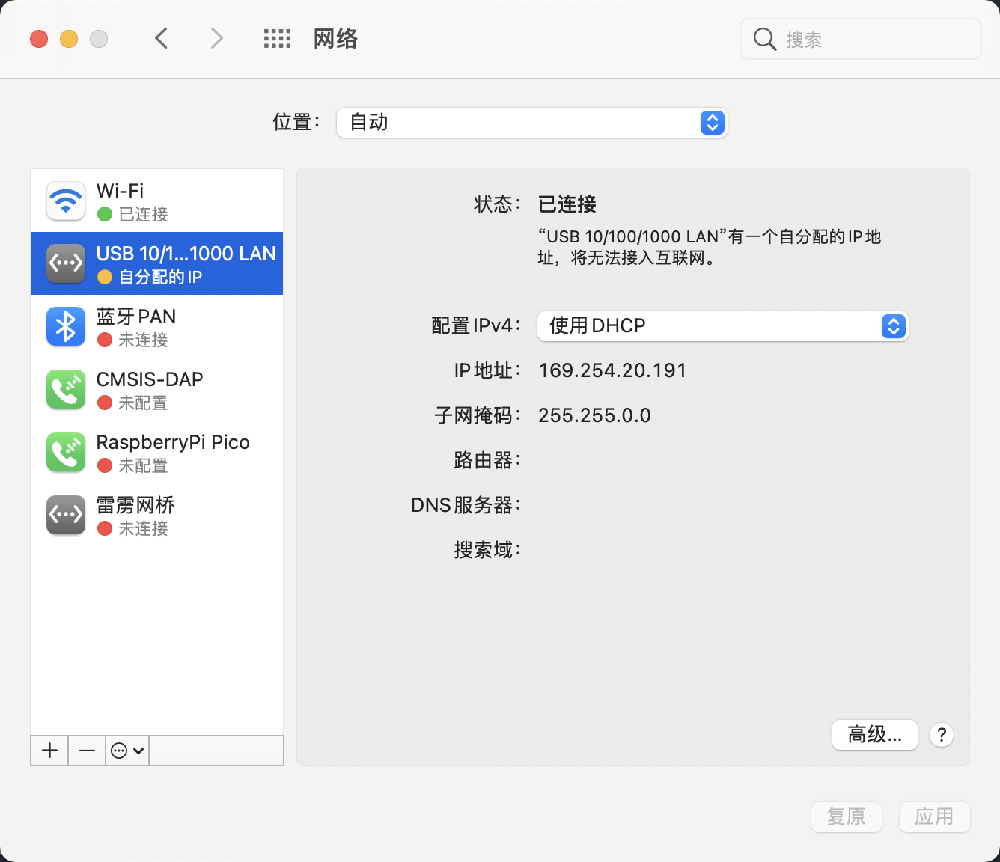
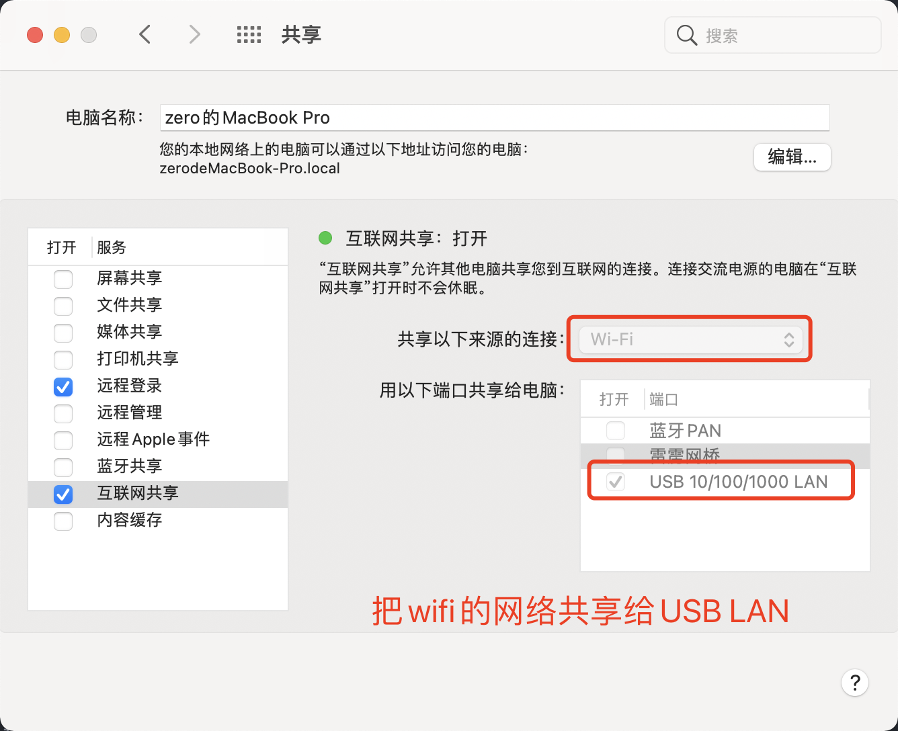
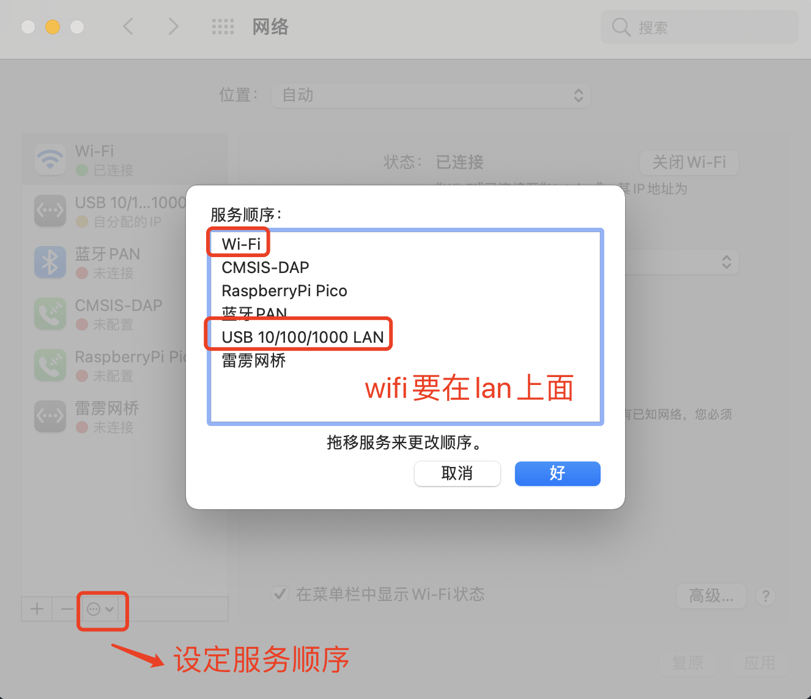

# macos wifi共享网络给有线  
现在有两台设备:一台mac笔记本，另一台centos台式机。现在mac通过wifi已连接到网外,目前现在centos台式机无法通过网线连接外网。  
于是就像通过一根网线把mac笔记本与centos台式机直连，然后台式机通过mac笔记本共享wifi网络。  


首先mac的LAN配置成DHCP,截图如下: 
<br>
<div align=center>
<span>mac中网卡配置</span><br>
</img>  
</div>
<br>


然后在mac笔记本上把wifi的网络共享给LAN:  
<br>
<div align=center>
<span>wifi共享网络给USB LAN</span><br>
</img>  
</div>
<br>

> 这里需要注意网络顺序的问题，要优先wifi,其次才是LAN才行!  
> 在网络界面找到"设定服务顺序",wifi要优先与LAN  
> <div align=center>
> </img>  
> </div>
> <br>


最终把centos配置成dhcp,配置如下:  
```
TYPE=Ethernet
BOOTPROTO=dhcp
DEFROUTE=yes
NAME=p2p1
UUID=07824319-9254-4bea-8992-3726b98db5df
DEVICE=p2p1
ONBOOT=yes
```  
  
接着重启服务`service network restart`,centos台式机就可以连接外网了!  

