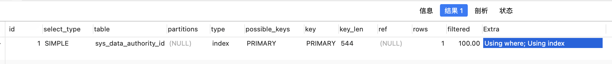

## java和web基础知识
- 静态代理和动态代理(JDK动态代理和CGLIB动态代理)
- 对象池和线程池()
- 锁相关
- springboot 注解 AOP mybatis
- Java反射 

## 数据结构
- 队列
- 链表

## docker 基础操作
- 网络模式 –net=bridge(默认) –net=host net=container:NAME_or_ID –net=none  
- 挂载 -v
- 内存设定 docker inspect 修改容器json配置

## Netty
- 使用场景: 私有协议、RPC、GRPC(http2) 
- NIO模型: 多生产者单消费者

## 数据库
- mysql 慢日志   
  show variables like 'slow_query%'; SET GLOBAL slow_query_log=ON/OFF;SET GLOBAL long_query_time=n;
- 性能分析  
    EXPLAIN  SELECT * FROM `sys_data_authority_id` WHERE `sys_data_authority_id`.`sys_authority_authority_id` IN ('100','200')

      
- sql优化 

## linux基本命令
- df -h 磁盘相关
- ln -s 
- tar 
- shell 脚本