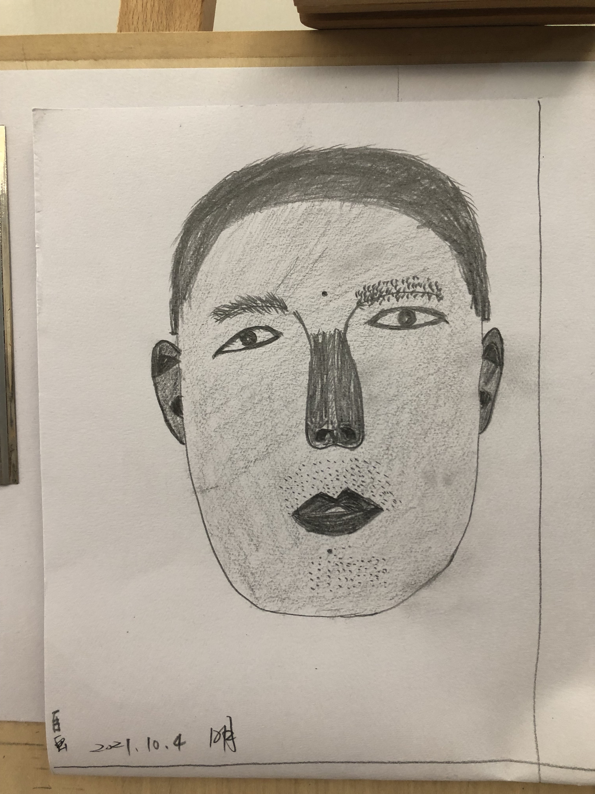
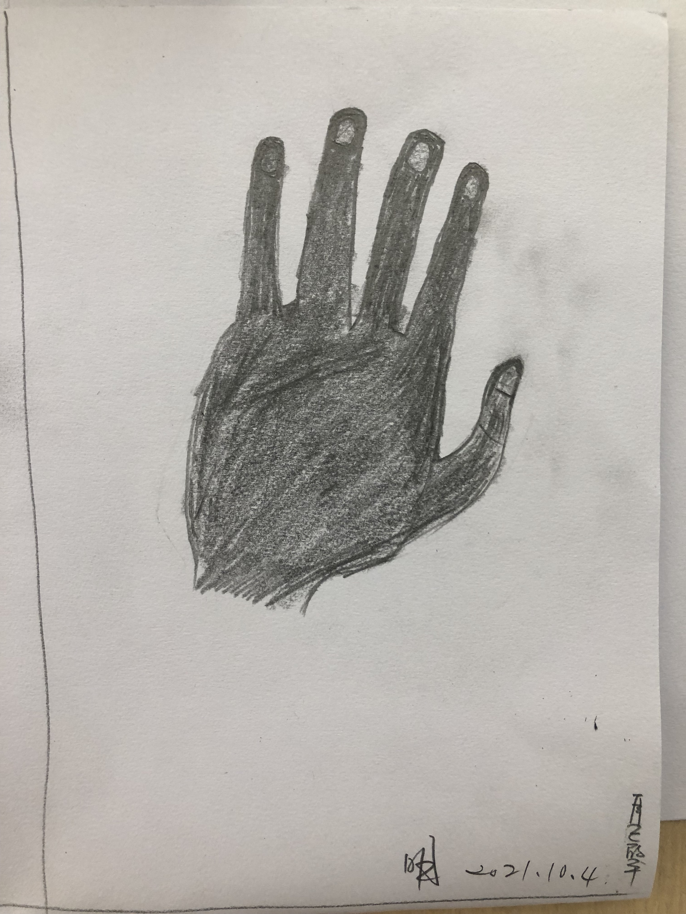
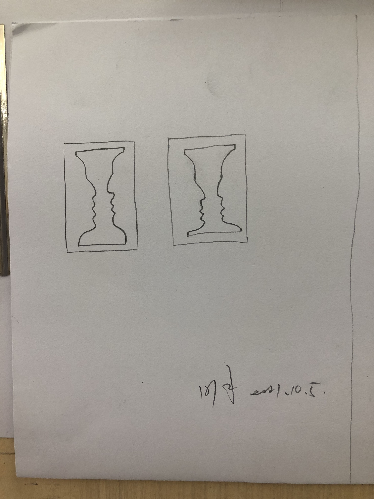
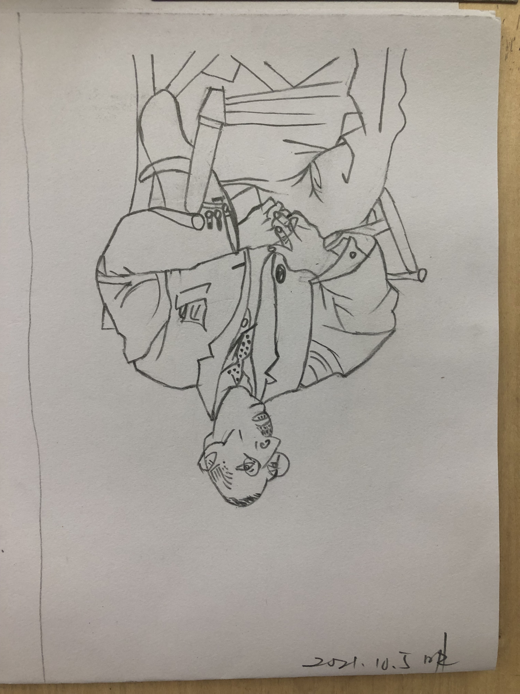
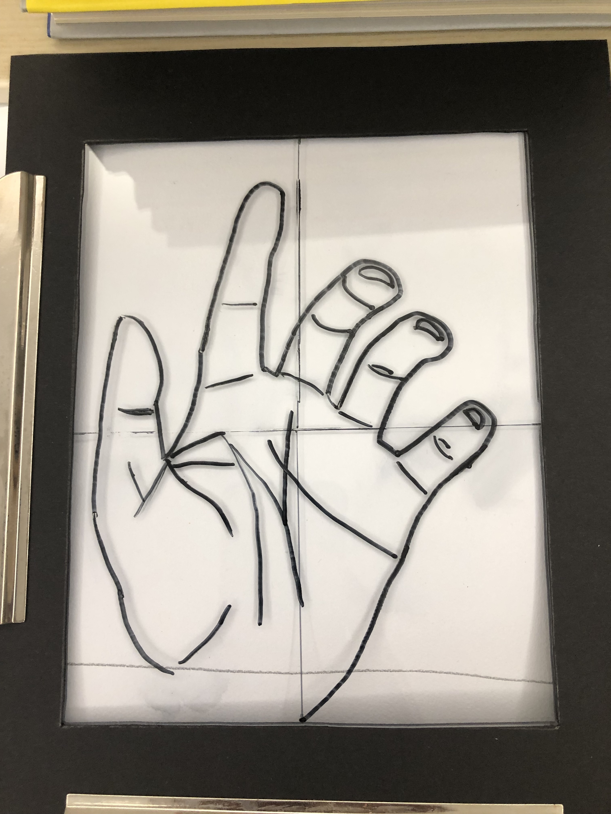
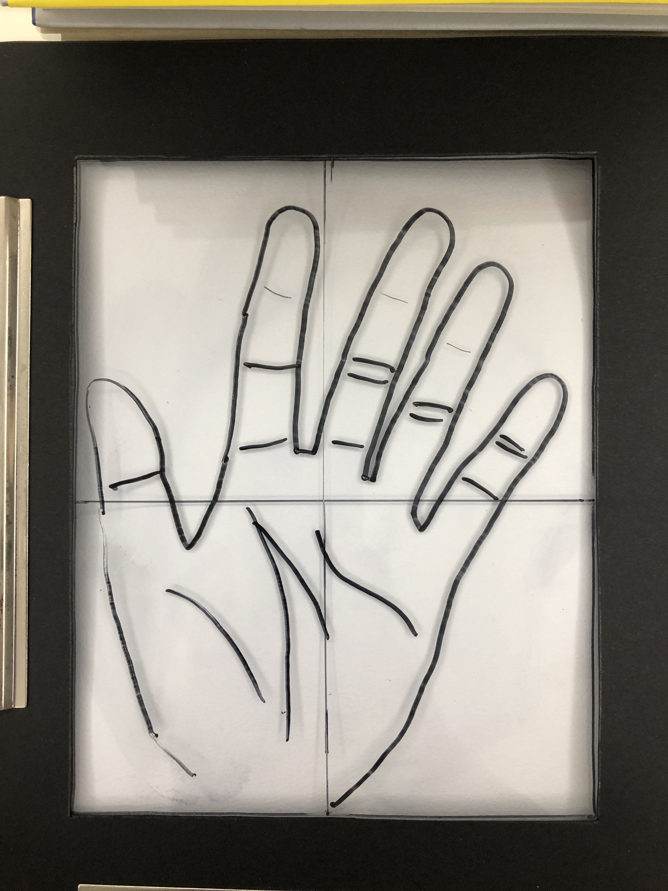
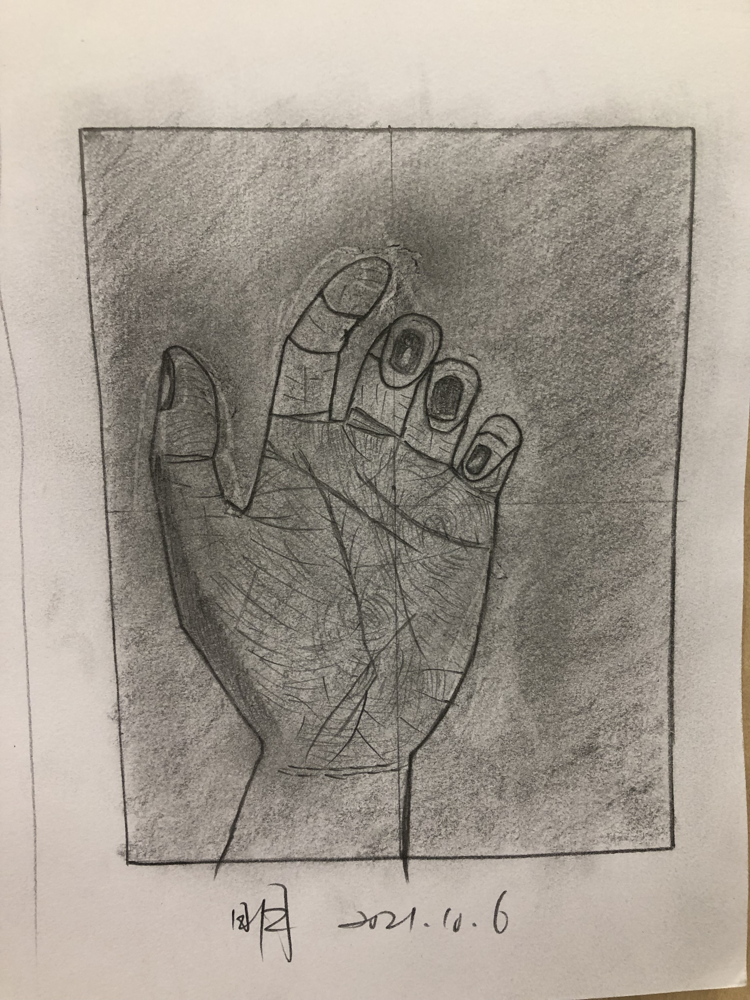

## 《五天学会绘画》札记  

### 首先记录的是自己的自画像和手

 

自己自画像 
</img>  

 

 

自画自己手 
</img>  

 

### 开启右脑模式
 

酒杯 
</img>  

 

 

倒绘,左脑退出,右脑完全参与 
</img>  

 

 

透明板手型绘画1 
</img>  

 

 

透明板手型绘画2 
</img>  

 

### 画自己的手:边缘与轮廓

 

</img>  

 