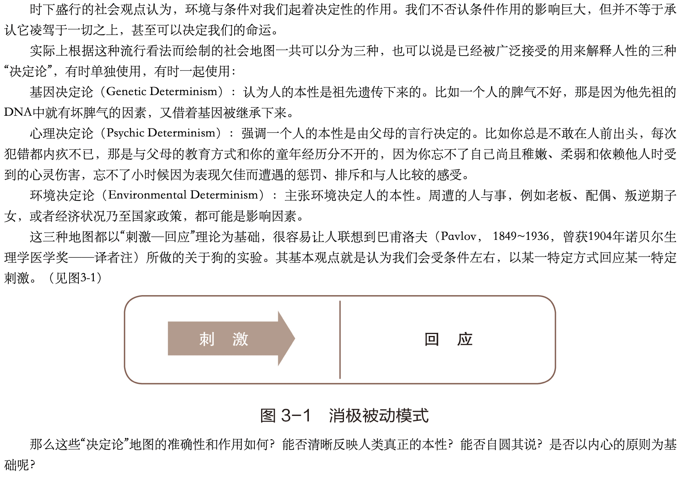

### 刺激与回应之间存在一段距离，成长和幸福的关键就在那里 

英文原文(Mindful Athlete):
> Between stimulus and response there is a space. In that space is our power to choose our response. In our response lies our growth and our freedom.

其中《高效能人士的七个习惯》在习惯一:积极主动中提到  

</img>

  
那么接下来我想分享一下我的思考过程及个人建议！  

在七个习惯中提到的三种"决定论",在我看来就是三个观念，如果你相信，或者被自己的经验/生活经历验证过并深信的话，每次遇到同样情景时(外接刺激)，你的反应或者行为基本都是一致的，根本用不着思考，相同情境下的刺激与回应已经强强绑定，形成一种习惯，牢牢束缚着你的行为。  

刺激到回应的过程是什么？观念是如何影响行为的？如何给自己或者别人"植入"观念？如何在刺激与回应之间增加空间？为什么人的行为习惯会这么稳定呢？行为习惯到底由什么决定呢？人对外接事件的响应过程是什么样的？到底是问题出在哪里？如何才能真正养成一种“好”习惯？为什么听了/学了这么多道理，仍然过不好这一生？哇，头好痛呀！！！  

先拿出我的藏宝图：  

  
这些图是阅读过的书籍+自己的理解绘制而成的，从其中可以了解到每天人靠行为习惯回应外界的占95%，经过思考处理的只有5%。行为习惯和思考响应外界的差别在哪里呢？

如果你有个问题解决不了，那你需要冷静下来认清现状，而不是盲目的一遍遍尝试！:trollface:  
  
如果你的输入没变，处理过程也没变，并且想通过多次重试后得到期望的结果，我只能说你在逗我！:rage3: 因为这很不“物理”。 大家可以冷静的看看这一过程:  

你期望是得到个“锤子”:

如果一个问题你尝试多次，仍然解决不了, 那你可能需要换种思维方式(聚焦思维、发散思维)，或者干脆“换个脑子”！！

显微镜调整过程，

什么是评价？什么是事实？“我很菜”就是评价，“这个知识点没有get到”这是事实！