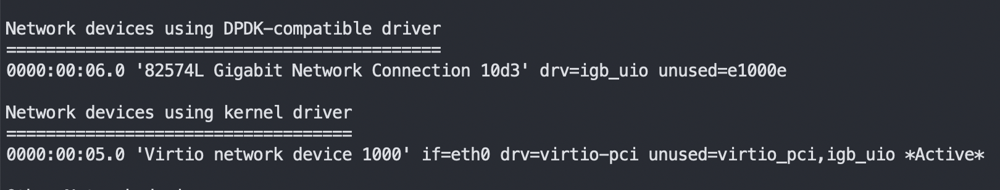
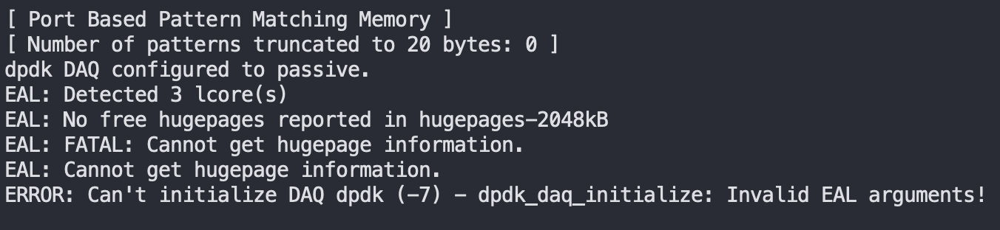

- ## 环境搭建

- [相关工具及使用](#相关工具及使用)
    - [tcpdump抓包](#tcpdump抓包)
    - [sendip](#sendip)
    - [tcpreplay \& tcprewrite](#tcpreplay--tcprewrite)
    - [样本检测网站](#样本检测网站)
- [snort](#snort-1)
    - [snort规则](#snort规则)
    - [snort主要工作流程](#snort主要工作流程)
    - [snort告警事件落库](#snort告警事件落库)
- [daq模块](#daq模块)
    - [daq模块主要工作流程](#daq模块主要工作流程)
    - [基于dpdk的daq模块](#基于dpdk的daq模块)


#### 基础环境
系统版本:centos7.10  
首先安装基础依赖
```
#基础环境
sudo yum install -y gcc flex bison zlib libpcap pcre libdnet tcpdump

#snort 2依赖
sudo yum install -y zlib-devel libpcap-devel pcre-devel libdnet-devel openssl-devel libnghttp2-devel luajit-devel libtool.x86_64 automake mysql-devel

#yum install libdnet
sudo yum install -y http://mirror.centos.org/centos/7/os/x86_64/Packages/libdnet-1.12-13.1.el7.x86_64.rpm
sudo yum install -y http://mirror.centos.org/centos/7/os/x86_64/Packages/libdnet-devel-1.12-13.1.el7.x86_64.rpm
```
#### dap
- 默认daq模块  
```
wget https://www.snort.org/downloads/snort/daq-2.0.7.tar.gz
tar -zxvf daq-2.0.7.tar.gz
# 进入源码目录
./configure && make && sudo make install
```

使用dpdk daq模块  
首先需要安装dpdk模块,可以使用脚本、源码安装  
[脚本快速安装dpdk](https://dpdk-docs.readthedocs.io/en/latest/linux_gsg/quick_start.html)  
[源码安装dpdk](https://dpdk-docs.readthedocs.io/en/latest/linux_gsg/build_dpdk.html)

> 安装完成时,需要确认内存页是否设置成功，另外基于dpdk的网卡有没有绑定成功:

如果安装失败,会出现dpdk_daq初始化失败:

 

- 基于dpdk的daq模块安装
```
wget https://www.snort.org/downloads/snort/daq-2.0.7.tar.gz
tar -zxvf daq-2.0.7.tar.gz
# 进入源码目录
./configure --with-dpdk-includes=dpdk-stable-xx.xx.xx/x86_64-native-linuxapp-gcc/include --with-dpdk-libraries=dpdk-stable-xx.xx.xx/x86_64-native-linuxapp-gcc/lib

make && sudo make install
```

#### snort
```
wget https://www.snort.org/downloads/snort/snort-2.9.18.tar.gz
tart -zxvf snort-2.9.18.tar.gz

#进入源码目录
./configure && make && sudo make install
```
#### barnyard2
```
wget https://github.com/firnsy/barnyard2/archive/refs/tags/v2-1.13.tar.gz -O barnyard2.tar.gz
tar -zxvf barnyard2.tar.gz

#编译
./autogen.sh
./configure --with-mysql --with-mysql-libraries=/usr/lib64/mysql && make && make install
```

#### vscode调试
## 相关工具及使用
#### tcpdump抓包
#### sendip
#### tcpreplay & tcprewrite
#### 样本检测网站
## snort
#### snort规则
[快速了解snort规则](../resources/files/snort/snort_rules_desc.pdf)  
[snort2规则说明-官方文档](http://manual-snort-org.s3-website-us-east-1.amazonaws.com/)

可以通过一下图片简要理解snort规则
![[../resources/images/snort/snort_rules_pic1.png]]
  
![[../resources/images/snort/snort_rules_pic2.png]]
  
![[../resources/images/snort/snort_rules_pic3.png]]
  

#### snort主要工作流程
![[../resources/images/snort/snort_working_flow.jpg]]
  
#### snort告警事件落库
## daq模块
#### daq模块主要工作流程
![[./../resources/images/hello-world.png]]
  
#### 基于dpdk的daq模块
![[./../resources/images/hello-world.png]]
  
