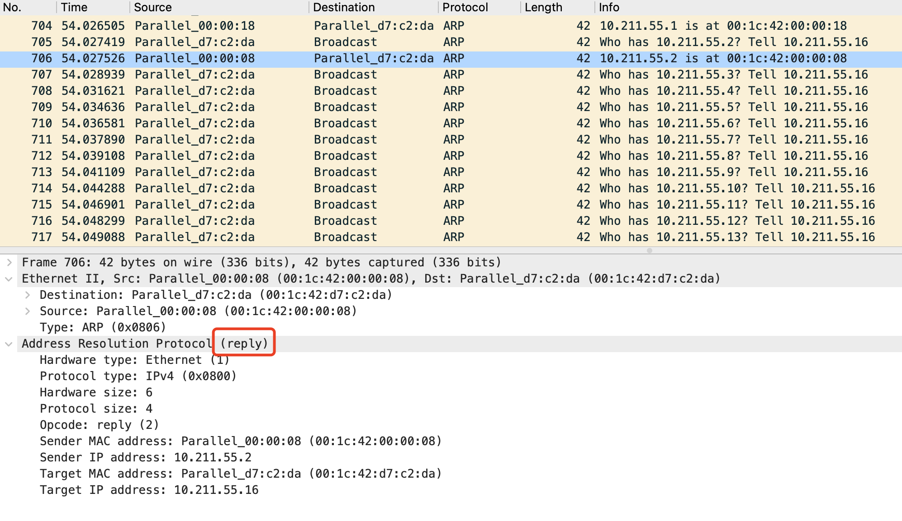

# arp
## 安装
安装依赖:
- libpcap  
  **yum install libpcap-devel**  
  Running transaction    
  正在安装    : 14:libpcap-1.5.3-12.el7.x86_64  
  正在安装    : 14:libpcap-devel-1.5.3-12.el7.x86_64  

安装arp-scan   
下载源码:wget https://github.com/royhills/arp-scan/releases/download/1.9/arp-scan-1.9.tar.gz  
./configure && make && make install  

用于更新MAC地址，便于在扫描时知道使用的是那个厂商的网卡
`get-oui -v`  
Fetching OUI data from http://standards.ieee.org/develop/regauth/oui/oui.txt  
get-oui -u http://standards-oui.ieee.org/oui/oui.txt  

扫描结果
```

```


参考: [arpme](https://github.com/lrstanley/arpme)

## arp指令
[arp指令总结](http://www.royhills.co.uk/wiki/index.php/Arp-scan_option_summary)

## [arp扫描简介](http://www.royhills.co.uk/wiki/index.php/Arp-scan_User_Guide)  
arp-scan是一个用于系统发现和指纹识别的命令行工具。它构造并向指定的 IP 地址发送 ARP 请求，并显示收到的任何响应。  

arp-scan允许您：  
- 使用可配置的输出带宽或数据包速率将 ARP 数据包发送到任意数量的目标主机。
这对于系统发现很有用，您可能需要扫描大地址空间。  
- 灵活构造出局ARP报文。
arp-scan控制 ARP 数据包中的所有字段和以太网帧头中的字段。  
- 解码并显示任何返回的数据包。
arp-scan将解码并显示任何接收到的 ARP 数据包，并使用 MAC 地址查找供应商。  
- 使用arp-fingerprint工具对 IP 主机进行指纹识别。

## arp协议简介
ARP（地址解析协议）是为给定的网络层（第 3 层）地址确定链路层（第 2 层）地址的协议。ARP 在 RFC 826以太网地址解析协议中定义。  

ARP 协议旨在允许它用于任何链路层和网络层协议。然而，实际上它仅用于以太网（包括 802.11 无线）和 IPv4，我们在整个文档中假设这些协议。IPv6 使用 NDP（邻居发现协议）来代替，这是一种不同的协议。  

ARP 是一种不可路由的协议，因此只能在同一以太网网络上的系统之间使用。  

## arp数据包分析  

以太网帧包含MAC标头，后跟ARP 数据包数据。MAC 报头和 ARP 数据包数据均由多个字段组成，每个字段都包含十六进制样本数据和一个字段名称。ARP 数据包数据中的字段名称来自 RFC 826。多字节字段中的数字按网络字节顺序或大端顺序排列，高位字节在前。

在图中，数据包是 IP 地址 10.0.0.2 (ar$tpa) 的 ARP 请求 (ar$op = 0001)。它是从 MAC 地址为 00:C0:9F:09:B8:DB（MAC 源地址和 ar$sha）和 IP 地址 10.0.0.1 (ar$spa) 的系统发送的。数据包发送到所有站广播地址FF:FF:FF:FF:FF:FF（MAC 目的地址）。
  


tcpdump显示这个数据包如下：  
```
00:c0:9f:09:b8:db > ff:ff:ff:ff:ff:ff, ethertype ARP (0x0806), length 42: arp who-has 10.0.0.2 tell 10.0.0.1
```

arp包数据查看  
  


# nmap 
## 安装  
`sudo yum install nmap`   

## nmap调用及xml解析  
[nmap调用](https://github.com/Ullaakut/nmap)  
[nmap xml解析](https://github.com/lair-framework/go-nmap)   


