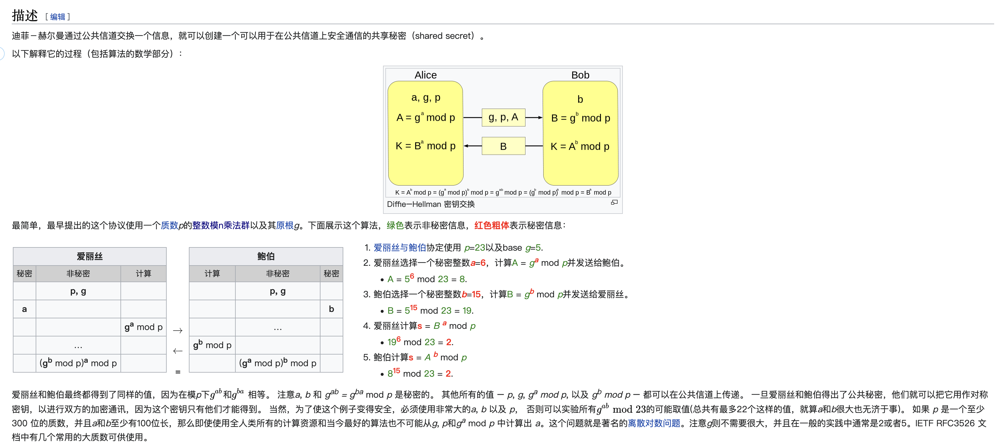

# 迪菲-赫尔曼（DH）密钥交换 
## [原理](https://zh.wikipedia.org/wiki/%E8%BF%AA%E8%8F%B2-%E8%B5%AB%E7%88%BE%E6%9B%BC%E5%AF%86%E9%91%B0%E4%BA%A4%E6%8F%9B)  

[维基百科] 迪菲-赫尔曼密钥交换（英语：Diffie–Hellman key exchange，缩写为D-H） 是一种安全协议。它可以让双方在完全没有对方任何预先信息的条件下通过不安全信道创建起一个密钥。
这个密钥可以在后续的通讯中作为对称密钥来加密通讯内容。
公钥交换的概念最早由瑞夫·墨克（Ralph C. Merkle）提出，而这个密钥交换方法，由惠特菲尔德·迪菲（Bailey Whitfield Diffie）和马丁·赫尔曼（Martin Edward Hellman）在1976年首次发表。
马丁·赫尔曼曾主张这个密钥交换方法，应被称为迪菲-赫尔曼-墨克密钥交换（英语：Diffie–Hellman–Merkle key exchange）。

    


## Java实现

```

```