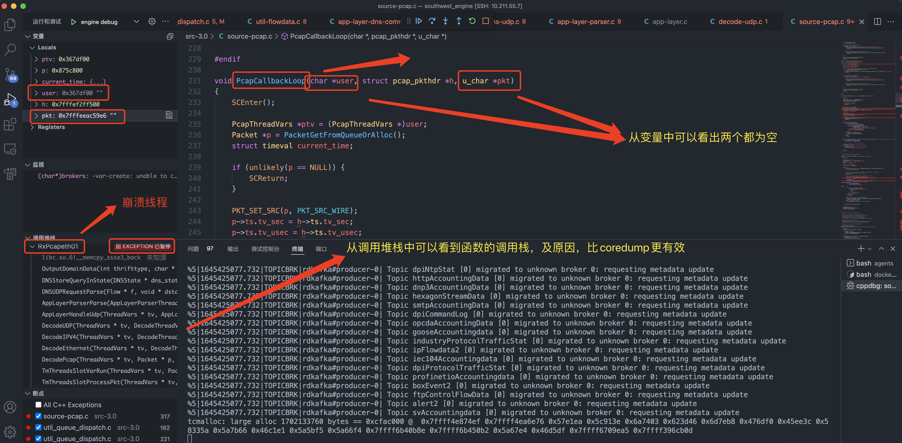
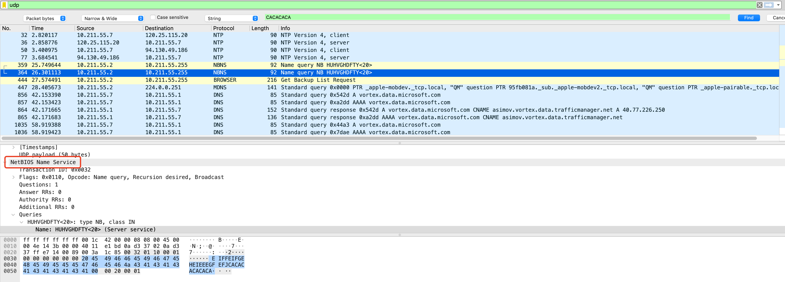
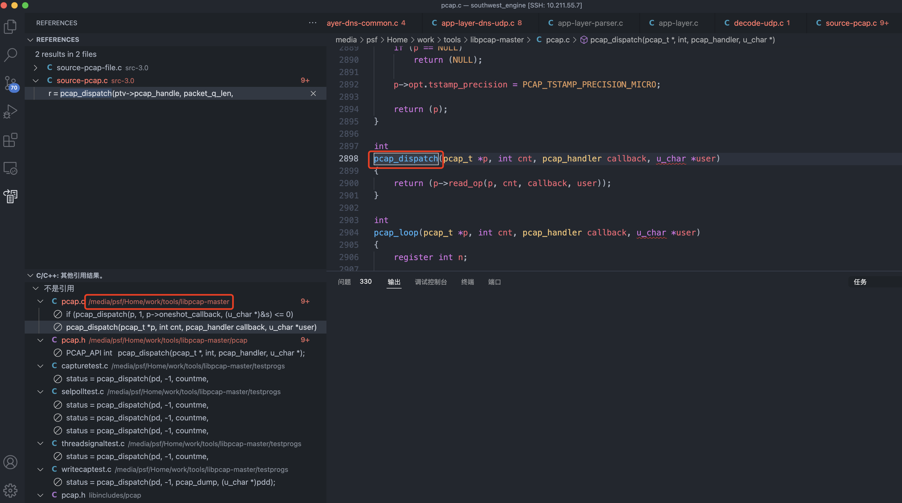
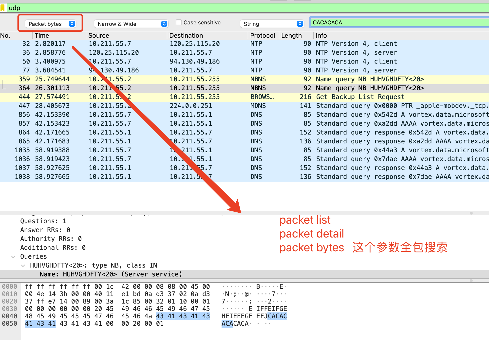

- # 审计项目Debug记录

- [RxPcapeth01 线程段错误](#rxpcapeth01-线程段错误)
  - [gdb 调试](#gdb-调试)
- [vscode 导入其他库的源码文件](#vscode-导入其他库的源码文件)
- [wireshark 搜索的条件](#wireshark-搜索的条件)
- [vscode flask 调试](#vscode-flask-调试)


## RxPcapeth01 线程段错误  

```shell
[26461] 21/2/2022 -- 14:27:34 - (southwest-watchdog.c:42) <Warning> (watchDog_checkDogFood) -- [ERRCODE: SC_WARN_UNCOMMON(233)] - WATCHDOG : A small dog died, thread name = RxPcapeth01, thread id = 140439948564224.
[26461] 21/2/2022 -- 14:27:36 - (southwest-watchdog.c:42) <Warning> (watchDog_checkDogFood) -- [ERRCODE: SC_WARN_UNCOMMON(233)] - WATCHDOG : A small dog died, thread name = RxPcapeth01, thread id = 140439948564224.
[26461] 21/2/2022 -- 14:27:38 - (southwest-watchdog.c:42) <Warning> (watchDog_checkDogFood) -- [ERRCODE: SC_WARN_UNCOMMON(233)] - WATCHDOG : A small dog died, thread name = RxPcapeth01, thread id = 140439948564224.
[26461] 21/2/2022 -- 14:27:40 - (southwest-watchdog.c:42) <Warning> (watchDog_checkDogFood) -- [ERRCODE: SC_WARN_UNCOMMON(233)] - WATCHDOG : A small dog died, thread name = RxPcapeth01, thread id = 140439948564224.
tcmalloc: large alloc 1702133760 bytes == 0xd9ea000 @  0x7fbabef744ef 0x7fbabef93e76 0x57e1ea 0x5c913e 0x6a7403 0x623d46 0x6d7eb8 0x476df0 0x45ee3c 0x58335a 0x5a7b66 0x46c1e1 0x5a5bf5 0x5a66f4 0x7fbac0c2db8e 0x7fbac0c320b2 0x5a67e4 0x46d5df 0x7fbac07f6ea5 0x7fbabda59b0d
段错误(吐核)
```

vscode 界面错误  

  

```c
    if (TmThreadsSlotProcessPkt(ptv->tv, ptv->slot, p) != TM_ECODE_OK) {
        pcap_breakloop(ptv->pcap_handle);
        ptv->cb_result = TM_ECODE_FAILED;
    }
```

目前错误出在数据输出模块，涉及到`libthrift`, 可以参考官方 [demo](https://github.com/apache/thrift/tree/master/tutorial/c_glib)  

一种方式是基于内存共享的，不是socket`THRIFT_TYPE_SERVER_SOCKET`  
```c
static void struct_constants_read_write() {
  GError* error = NULL;
  ThriftTransport* transport
      = THRIFT_TRANSPORT(g_object_new(THRIFT_TYPE_MEMORY_BUFFER, "buf_size", 4096, NULL));
  ThriftProtocol* protocol
      = THRIFT_PROTOCOL(g_object_new(THRIFT_TYPE_BINARY_PROTOCOL, "transport", transport, NULL));
  TTestCompactProtoTestStruct* src = T_TEST_COMPACT_TEST;
  TTestCompactProtoTestStruct* dst = g_object_new(T_TEST_TYPE_COMPACT_PROTO_TEST_STRUCT, NULL);
  TTestCompactProtoTestStructClass* cls = T_TEST_COMPACT_PROTO_TEST_STRUCT_GET_CLASS(src);
  int write_len;
  int read_len;

  write_len = THRIFT_STRUCT_CLASS(cls)->write(THRIFT_STRUCT(src), protocol, &error);
  g_assert(!error);
  g_assert(write_len > 0);

  read_len = THRIFT_STRUCT_CLASS(cls)->read(THRIFT_STRUCT(dst), protocol, &error);
  g_assert(!error);
  g_assert_cmpint(write_len, ==, read_len);

  g_object_unref(dst);
  g_object_unref(protocol);
  g_object_unref(transport);
}
```

NetBios 协议界面  

  

可以使用离线模式，直接读取已有数据包pcap  
```
./src-3.0/southwest_engine -c config/southwest_engine_3_0.yaml -r /root/work/tcpdump3-nbns.pcap --runmode single
```

现在要看具体的逻辑:  
```c
 case thrift_domain:
        {
            com_istuary_common_idlDpiDomain *tdata;
            com_istuary_common_idlDpiDomainClass *tClass;
            tdata = handler->data;
            tClass = COM_ISTUARY_COMMON_IDL_DPI_DOMAIN_GET_CLASS(tdata);
            if(tClass)
            {
                tClass->parent.write(&tdata->parent, handler->tProtocol, &tError);
            }
        }
        break;
```

`tClass->parent.write`是一个函数指针，需要跳入查看函数: `static gint32 com_istuary_common_idl_dpi_domain_write (ThriftStruct *object, ThriftProtocol *protocol, GError **error)`  

```c
typedef struct
{
    libthrift_type type;
    ThriftMemoryBuffer* tMemBuf;
    ThriftProtocol* tProtocol;
    void* data;
    gint32 id;
}libthrift_handler;
```

`libthrift_handler`的结构是自己调用的，发现最终调用函数`thrift_protocol_write_string`时，buf的值被修改，目前无法调试，需要增加`-g`参数重新编译  
```
https://github.com/apache/thrift

./bootstrap.sh
./configure --with-boost=/usr/local CFLAGS='-g -O2' 
make 
make install
```

现在可以调试thrift，发现可以拿到这个tMemBuf，通过转换  
```c
gboolean
thrift_memory_buffer_write (ThriftTransport *transport,
                            const gpointer buf,     
                            const guint32 len, GError **error)
{
  THRIFT_UNUSED_VAR (error);

  // t->buf_size 是 tMemBuf->buf_size ， t->buf->len 就是 tMemBuf->buf->len
  ThriftMemoryBuffer *t = THRIFT_MEMORY_BUFFER (transport);   // 这个就是tMemBuf  


/*!
 * ThriftMemoryBuffer instance.
 */
struct _ThriftMemoryBuffer
{
  ThriftTransport parent;

  /* private */
  GByteArray *buf;
  guint32 buf_size;
};
```


### gdb 调试  
```shell
$ gdb src-3.0/southwest_engine
(gdb) set args -c config/southwest_engine_3_0.yaml -i eth0 
(gdb) r 
Program received signal SIGSEGV, Segmentation fault.
[Switching to Thread 0x7fffef304700 (LWP 21143)]
0x00007ffff39c46a6 in __memcpy_ssse3_back () from /lib64/libc.so.6
Missing separate debuginfos, use: debuginfo-install bzip2-libs-1.0.6-13.el7.x86_64 elfutils-libelf-0.176-5.el7.x86_64 elfutils-libs-0.176-5.el7.x86_64 file-libs-5.11-37.el7.x86_64 glib2-2.56.1-9.el7_9.x86_64 glibc-2.17-325.el7_9.x86_64 gperftools-libs-2.6.1-1.el7.x86_64 libattr-2.4.46-13.el7.x86_64 libcap-2.22-11.el7.x86_64 libcap-ng-0.7.5-4.el7.x86_64 libffi-3.0.13-19.el7.x86_64 libgcc-4.8.5-44.el7.x86_64 libgcrypt-1.5.3-14.el7.x86_64 libgpg-error-1.12-3.el7.x86_64 libmnl-1.0.3-7.el7.x86_64 libnet-1.1.6-7.el7.x86_64 libnetfilter_queue-devel-1.0.2-2.el7_2.x86_64 libnfnetlink-devel-1.0.1-4.el7.x86_64 libpcap-1.5.3-12.el7.x86_64 libselinux-2.5-15.el7.x86_64 libstdc++-4.8.5-44.el7.x86_64 libtalloc-2.1.16-1.el7.x86_64 libtevent-0.9.39-1.el7.x86_64 libyaml-0.1.4-11.el7_0.x86_64 lz4-1.8.3-1.el7.x86_64 ncurses-libs-5.9-14.20130511.el7_4.x86_64 nss-softokn-freebl-3.67.0-3.el7_9.x86_64 openssl-libs-1.0.2k-22.el7_9.x86_64 pcre-8.32-17.el7.x86_64 readline-6.2-11.el7.x86_64 samba-client-libs-4.10.16-17.el7_9.x86_64 samba-common-libs-4.10.16-17.el7_9.x86_64 sqlite-3.7.17-8.el7_7.1.x86_64 systemd-libs-219-78.el7_9.3.x86_64 thrift-glib-0.9.1-15.el7.x86_64 xz-libs-5.2.2-1.el7.x86_64 zlib-1.2.7-19.el7_9.x86_64

(gdb) bt    // 能够打印出崩溃线程的调用栈(异常终止)  
#0  0x00007ffff39c46a6 in __memcpy_ssse3_back () at /lib64/libc.so.6
#1  0x000000000057e43c in OutputDomainData (thrifttype=27, domain_name=0x7fffef2fd960 "7.55.211.10.in-addr.arpa", type=0) at util-flowdata.c:1163
#2  0x00000000005c913e in DNSStoreQueryInState (dns_state=0xca8a000, fqdn=0x7fffef2fd960 "7.55.211.10.in-addr.arpa", fqdn_len=24, type=12, class=1, tx_id=34502) at app-layer-dns-common.c:583
#3  0x00000000006a7403 in DNSUDPRequestParse (f=0x317c780, dstate=0xca8a000, pstate=0x4926d20, input=0x875d84a "\206\306\001", input_len=42, local_data=0x0) at app-layer-dns-udp.c:222
#4  0x0000000000623d46 in AppLayerParserParse (alp_tctx=0x4624000, f=0x317c780, alproto=3, flags=4 '\004', input=0x875d84a "\206\306\001", input_len=42) at app-layer-parser.c:1100
#5  0x00000000006d7f96 in AppLayerHandleUdp (tv=0x13e6a20, tctx=0x3638bd0, p=0x875c800, f=0x317c780) at app-layer.c:574
#6  0x0000000000476df0 in DecodeUDP (tv=0x13e6a20, dtv=0x140d2c0, p=0x875c800, pkt=0x875d842 "\245\006", len=50, pq=0x140c540) at decode-udp.c:97
#7  0x000000000045ee3c in DecodeIPV4 (tv=0x13e6a20, dtv=0x140d2c0, p=0x875c800, pkt=0x875d82e "E", len=70, pq=0x140c540) at decode-ipv4.c:575
#8  0x000000000058335a in DecodeEthernet (tv=0x13e6a20, dtv=0x140d2c0, p=0x875c800, pkt=0x875d820 "", len=84, pq=0x140c540) at decode-ethernet.c:70
#9  0x00000000005a7b66 in DecodePcap (tv=0x13e6a20, p=0x875c800, data=0x140d2c0, pq=0x140c540, postpq=0x0) at source-pcap.c:719
#10 0x000000000046c1e1 in TmThreadsSlotVarRun (tv=0x13e6a20, p=0x875c800, slot=0x140c500) at tm-threads.c:140
#11 0x00000000005a5bf5 in TmThreadsSlotProcessPkt (tv=0x13e6a20, s=0x140c500, p=0x875c800) at tm-threads.h:150
#12 0x00000000005a66f4 in PcapCallbackLoop (user=0x367df00 "", h=0x7fffef2ff500, pkt=0x7fffee964486 "") at source-pcap.c:277
#13 0x00007ffff6b40b8e in pcap_handle_packet_mmap () at /lib64/libpcap.so.1
#14 0x00007ffff6b450b2 in pcap_read_linux_mmap_v3 () at /lib64/libpcap.so.1
#15 0x00000000005a67e4 in ReceivePcapLoop (tv=0x13e6a20, data=0x367df00, slot=0x140c3c0) at source-pcap.c:317
#16 0x000000000046d5df in TmThreadsSlotPktAcqLoop (td=0x13e6a20) at tm-threads.c:454
#17 0x00007ffff6709ea5 in start_thread () at /lib64/libpthread.so.0
#18 0x00007ffff396cb0d in clone () at /lib64/libc.so.6


```


## vscode 导入其他库的源码文件  
比如使用到`libpcap`库，从github下载源码，路径为`/media/psf/Home/work/tools/libpcap-master/`  

通过全局搜索框，找到`C/C++:编辑配置(JSON)`,增加源码路径:   
```
{
    "configurations": [
        {
            "name": "Linux",
            "includePath": [
                "${workspaceFolder}/**",
                "/media/psf/Home/work/tools/libpcap-master/"
            ],
            "defines": [],
            "compilerPath": "/usr/bin/gcc",
            "cStandard": "c89",
            "cppStandard": "gnu++98",
            "intelliSenseMode": "linux-gcc-x64"
        }
    ],
    "version": 4
}
```

通过引用视图可以看到实现:  

  


## wireshark 搜索的条件
- packet list
- packet detail
- packet bytes

  

## vscode flask 调试  

首先需要选择python版本及路径: `Python: Select Interpreter` , 然后配置文件:  
```
{
    "name": "Python: Flask",
    "type": "python",
    "request": "launch",
    "module": "flask",
    "env": {
        "FLASK_APP": "app.py",
        "FLASK_ENV": "development",
        "FLASK_DEBUG": "0"
    },
    "args": [
        "run",
        "--no-debugger",
        "--no-reload"
    ],
    "jinja": true
}
```


